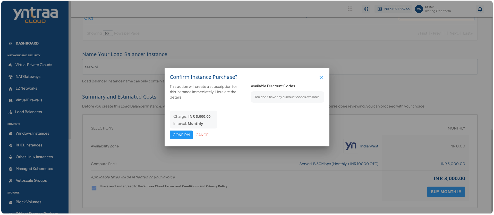

# Creating a Load Balancer Instance

Creating a load balancer instance provisions a dedicated load balancing appliance within your virtual network to distribute application traffic across multiple backend resources. Create a load balancer instance to improve application availability, optimize traffic distribution, and enhance performance by directing client requests to healthy backend servers.

To a create a load balancer instance, follow these steps:

1. Navigate to **Network and Security > Load Balancers**. The following screen appears: 
   
 2. Click the **+ New Load Balancer Instance** button. The following screen appears:
   
   
   
3. Select an availability zone, which is the geographical region where your instance will be deployed.
4. In the **Select Network Destination**, specify the VPC and subnet.
5. **Select Load Balancer Version**.
6. Under the **Choose an Appliance Configuration**, select a load balancer appliance pack.
7. Enter name in **Name Your Load Balancer Instance**.
8. Select the **I have read and agreed to the End User License Agreement and Privacy Policy** option, and click the **Buy Monthly** button. The following screen appears: 
   
9. Click the **Confirm** button. 

