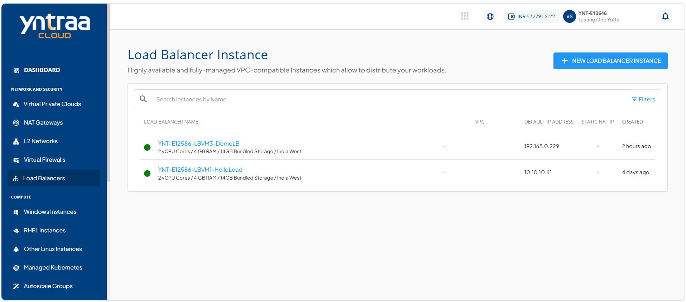
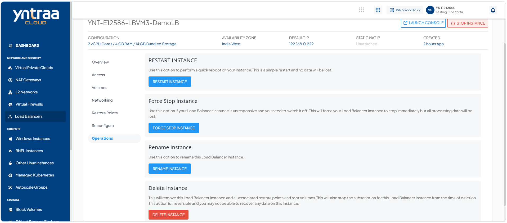
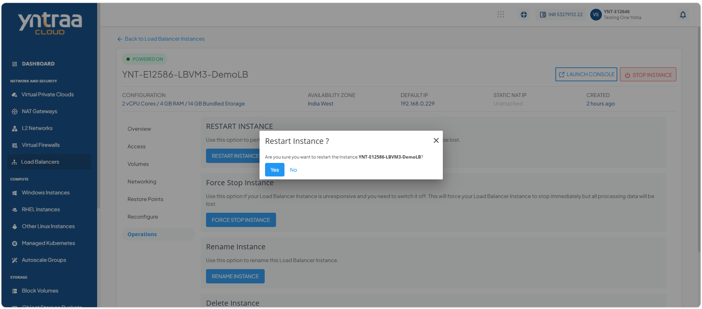
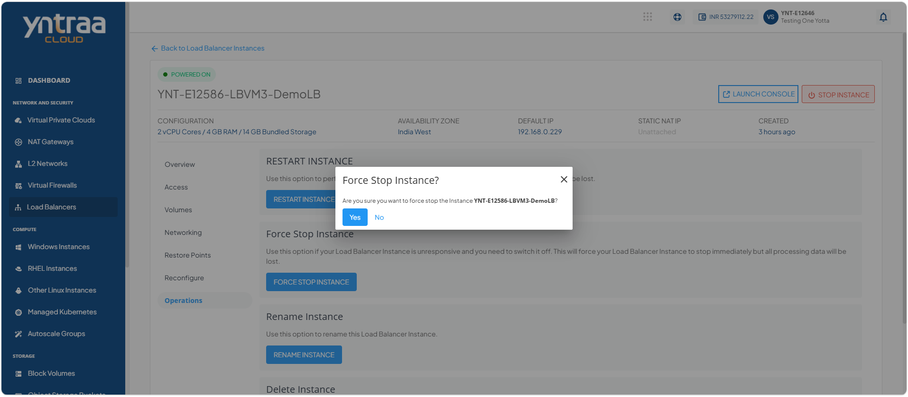
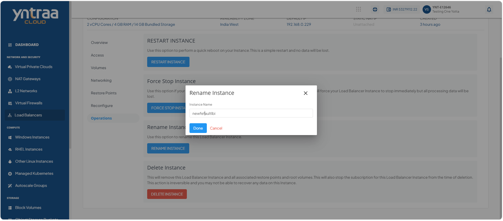
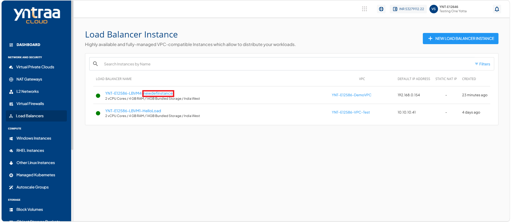
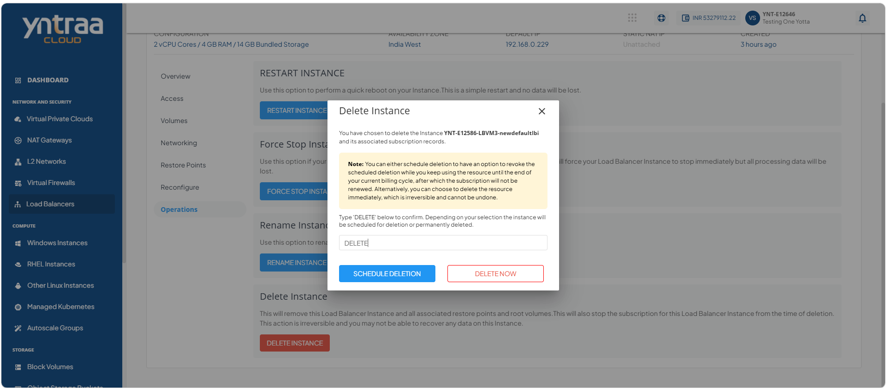

# Managing Load Balance Instance Operations

You can manage the lifecycle of load balancer by restarting, force stopping, renaming, or deleting. These operations help you maintain service availability, resolve operational issues, organize resources, and manage your cloud infrastructure efficiently.

Yntraa Cloud provides the following operations on load balancer instances:

  
- [Restarting an Instance](#restarting-an-instance)
- [Force Stop an Instance](#force-stop-an-instance)
- [Renaming an Instance](#renaming-an-instance)
- [Deleting an Instance](#deleting-an-instance)

## Restarting an Instance

Restart a load balancer instance to refresh its operating state, apply certain configuration changes, or resolve temporary issues without changing its existing settings. This action helps restore normal operation, improve service reliability, and ensure efficient traffic distribution across backend resources.

To restart an instance, follow these steps: 

1. Navigate to the **Network and Security > Load Balancers**. The following screen appears:
   
2. Click on your created load balancer instance name from the list, and click **Operations**. The following screen appears:
   
3. Click the **Restart Instance** button. The following screen appears: 
   
4. Click the **Yes** button.
   
## Force Stop an Instance

Force stop a load balancer instance to immediately terminate its operations when it becomes unresponsive or cannot be shut down through a normal stop operation. This action helps recover from critical issues, restore control of the instance, and prepare it for troubleshooting or restart. 

To force stop an instance, follow these steps: 

1. Navigate to the **Network and Security > Load Balancers**. The following screen appears:
   
2. Click on your created load balancer instance name from the list, and click **Operations**. The following screen appears:
   
3. Click the **Force Stop Instance** button. The following screen appears: 
   
 4. Click the **Yes** button. 

## Renaming an Instance

Rename a load balancer instance to assign a more meaningful or recognizable name without affecting its configuration or functionality. This action helps improve resource identification, simplifies instance management, and makes it easier to locate the instance in cloud environment. 

To rename an instance, follow these steps: 

1. Navigate to **Network and Security > Load Balancers**. The following screen appears:
   
2. Click on your created load balancer instance name from the list, and click **Operations**. The following screen appears:
   
3. Click the **Rename Instance** button. The following screen appears where you can update the LBI name in Instance Name.
   
4. Click the **Done** button. The new instance name appears (highlighted in red). 
   

## Deleting an Instance

Delete a load balancer instance when it is no longer required to remove it permanently from cloud environment. This action helps free up resources, reduce unnecessary costs, and keep your infrastructure organized by eliminating unused instances. 
:::note
You can schedule deletion to continue using the resource until the end of the current billing cycle and cancel the deletion before it takes effect. Alternatively, you can delete the resource immediately, which is permanent and cannot be undone.
:::

To delete an instance, follow these steps:

1. Navigate to the **Network and Security > Load Balancers**. The following screen appears:
   
2. Click on your created load balancer instance name from the list, and click **Operations**. The following screen appears:
   
3. Click the **Delete Instance** button. The following screen appears: 
   
4. Enter **DELETE** and click the **Delete Now** button. The LBI is deleted.
5. Enter **DELETE** and click the **Schedule Deletion** button.

