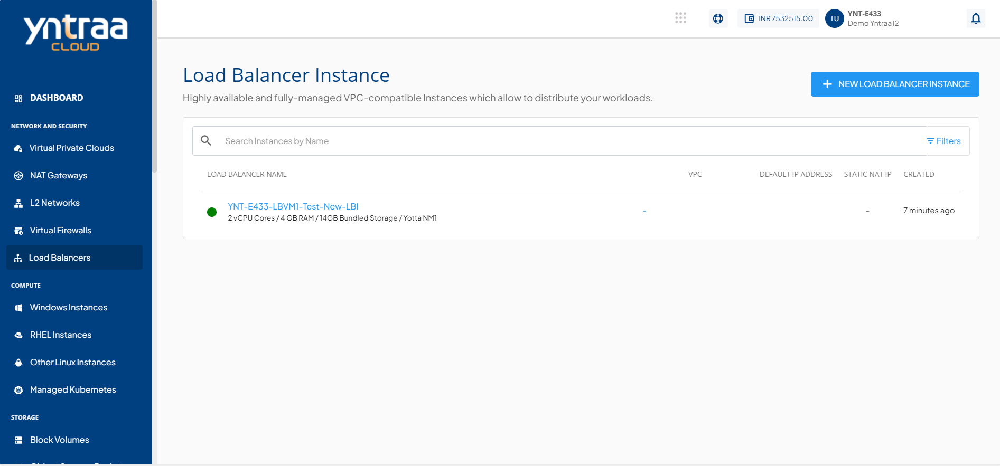

# Managing Networks

Managing Networks allows you to configure the network connectivity of a Load Balancer instance by adding network interfaces and assigning secondary IP addresses. These capabilities help improve connectivity, support multiple network requirements, and enable more flexible traffic management within the VPC.

This section comprises of the following sub-sections:

  
- [Adding a Network](#adding-a-network)
- [Adding a Secondary IP](#adding-a-secondary-ip)

## Adding a Network

Adding a network allows you to attach an additional network interface to a Load Balancer instance. This helps the instance connect to multiple networks, improving network connectivity and supporting different traffic or deployment requirements.

To add a network, follow these steps:

1. Navigate to **Network and Security > Load Balancer**. The following screen appears:
   
2. Click on your created load balancer instance name. The Overview tab opens automatically. The following screen appears:
    
3. Click **Networking**. The following screen appears:
    
4. Click the **Add Network** button. The following screen appears: 
   
5. Click the **Yes** button. 
   
    :::note
    If the instance is inside a VPC, you can associate the instance to multiple tiers within the VPC or share the instance with other VPC networks in the same availability zone by using the Add Network option.
    :::

## Adding a Secondary IP

A secondary IP is an additional private IP address assigned to an instance apart from its primary IP address. Secondary IPs help in better traffic separation, service isolation, and efficient network management within the VPC.

To add a secondary IP, follow these steps:

1. Navigate to **Network and Security > Load Balancer**. The following screen appears:
   
2. Click on your created load balancer instance name. The Overview tab opens automatically. The following screen appears:
    
3. Click **Networking**. The following screen appears:
    
4. Click the **+ New Secondary IP** button. The following screen appears:
   
5. Click the **Add** button. The secondary IP is added (highlighted in red). The following screen appears: 

  
