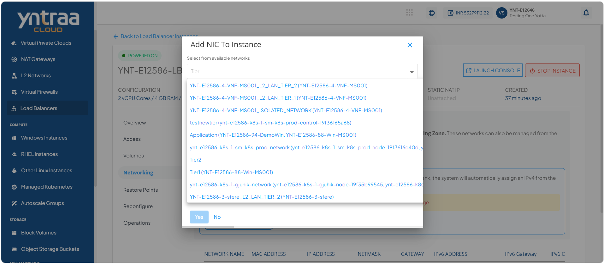
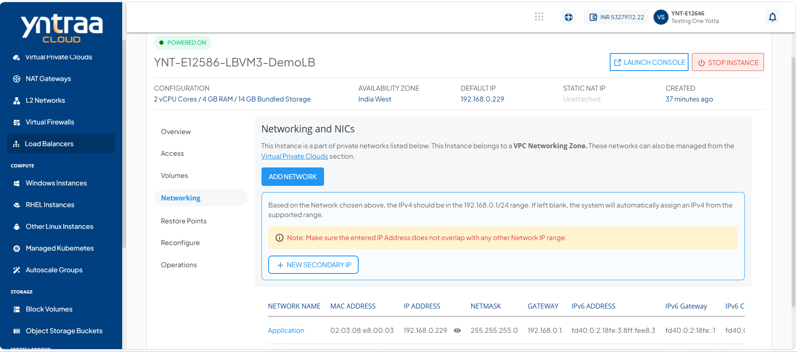

# Networking Management

The Networking Management section covers the process of adding a network and configuring a new secondary IP.

To view the Networks associated with a Load Balancer Instance, navigate to **Network and Security > Load Balancer** and access the **Networking** tab.

The Networking section lists all the networks that a Load Balancer Instance is attached to, with the following details:

- Network Name
- MAC Address
- IP Address
- Netmask
- IPv6 Address
- IPv6 Gateway
- IPv6 CIDR

## Adding a Network

If the Instance is inside a VPC, you can associate the Instance to multiple tiers within the VPC or share the Instance with other VPC networks in the same availability zone by using the Add Network option.

To add a network, follow these steps:

1. Click the **Add Network** button. The following screen appears:

2. Select the tier from the available networks.
   
:::note
The dropdown displays all tiers available in the instance's availability zone.
:::

3. Click Yes.
   
The Unlink action is used to remove the network/tier association.
   
:::note
The [Virtual Private Clouds](/docs/Subscribers/NetworkandSecurity/VirtualPrivateClouds/AboutVirtualPrivateClouds) service is used for advanced networking configurations.
:::

## Adding a Secondary IP

A secondary IP is an additional private IP address assigned to an instance apart from its primary IP address. Secondary IPs help in better traffic separation, service isolation, and efficient network management within the VPC.

It is used in following networking services:

- [Static NAT](/docs/Subscribers/NetworkandSecurity/VirtualPrivateClouds/IPv4AddressesandVPC): You can map a public IP to a secondary IP for external access.
- [Port Forwarding](/docs/Subscribers/NetworkandSecurity/VirtualPrivateClouds/IPv4AddressesandVPC): You can direct traffic on specific ports to a secondary IP address assigned to the instance.
- [Load Balancing](/docs/Subscribers/NetworkandSecurity/VirtualPrivateClouds/IPv4AddressesandVPC): You can use secondary IPs as backend or virtual service IPs to distribute traffic.
  
To add a secondary IP, follow these steps:

1. Navigate to **Network and Security > Load Balancers**, and select the
**Networking** tab. The following screen appears:

2. Click the **New Secondary IP** button. The following screen appears:

3. Enter a **New Secondary IP address** and select the associated network from the
select tier dropdown.
4. Click the **Add** button.