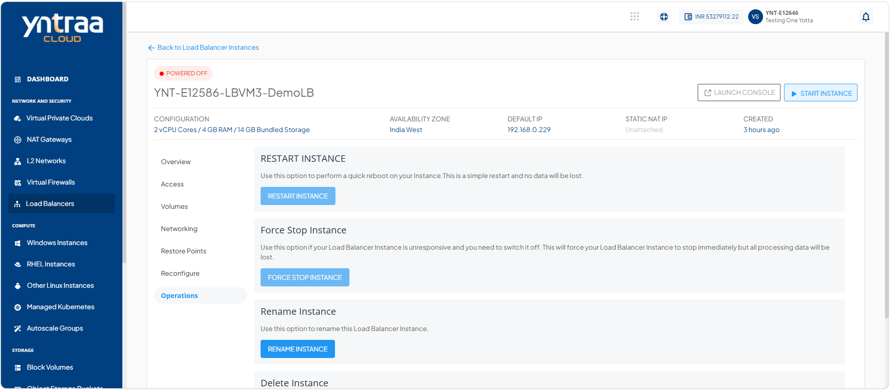
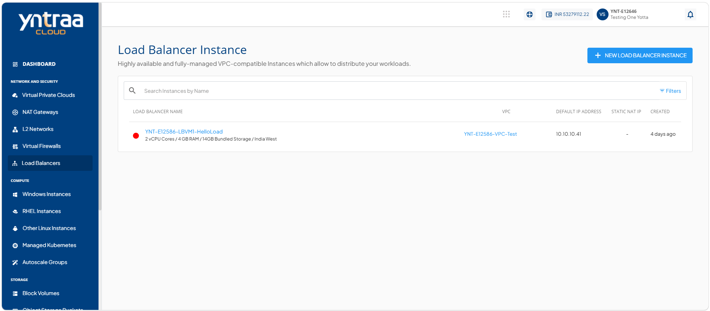
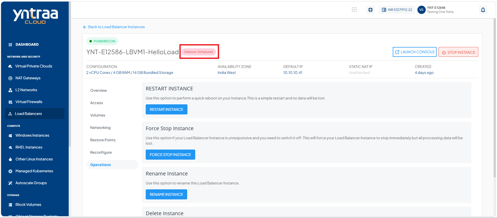

# Operations

Load balancer instance operations to manage the lifecycle of load balancer by restarting, force stopping, renaming, or deleting. These operations help you maintain service availability, resolve operational issues, organize resources, and manage your cloud infrastructure efficiently.

To view all available load balancer instance operations, follow these steps:
 1. Navigate to the **Network and Security > Load Balancers**. The following screen appears:

 2. Select a **Load balancer Instance** and access the **Operations** tab. The following screen appears:

Yntraa Cloud provides the following operations on Linux Instances:

- [Restarting Instance](#restarting-instance)
- [Force Stop Instance](#force-stop-instance)
- [Renaming Instance](#renaming-instance)
- [Deleting Instance](#deleting-instance)

## Restarting Instance

Restart a load balancer instance to refresh its operating state, apply certain configuration changes, or resolve temporary issues without changing its existing settings. This action helps restore normal operation, improve service reliability, and ensure efficient traffic distribution across backend resources.

To restart instance, follow these steps: 

1. Navigate to the **Network and Security > Load Balancers**. The following screen appears:

2. Select a **Load balancer Instance** and access the **Operations** tab. The following screen appears:

3. Click the **Restart Instance** button. The following screen appears: 
 
4. Click the **Yes** button.
   
## Force Stop Instance

Force stop a load balancer instance to immediately terminate its operations when it becomes unresponsive or cannot be shut down through a normal stop operation. This action helps recover from critical issues, restore control of the instance, and prepare it for troubleshooting or restart. 

To force stop instance, follow these steps: 

1. Navigate to the **Network and Security > Load Balancers**. The following screen appears:

2. Select a **Load balancer Instance** and access the **Operations** tab. The following screen appears:

3. Click the **Force Stop Instance** button. The following screen appears: 
 
 4. Click the **Yes** button. The following screen appears: 

## Renaming Instance

Rename a load balancer instance to assign a more meaningful or recognizable name without affecting its configuration or functionality. This action helps improve resource identification, simplifies instance management, and makes it easier to locate the instance in cloud environment. 

To rename instance, follow these steps: 

1. Navigate to the **Network and Security > Load Balancers**. The following screen appears:

2. Select a **Load balancer Instance** and access the **Operations** tab. The following screen appears:

3. Click the **Rename Instance** button. The following screen appears: 
 
4. Click the **Done** button. The new instance name appears (highlighted in red). The following screen appears: 

## Deleting Instance

Delete a load balancer instance when it is no longer required to remove it permanently from cloud environment. This action helps free up resources, reduce unnecessary costs, and keep your infrastructure organized by eliminating unused instances. 

To delete instance, follow these steps:

1. Navigate to the **Network and Security > Load Balancers**. The following screen appears:

2. Select a **Load balancer Instance** and access the **Operations** tab. The following screen appears:

3. Click the **Delete Instance** button. The following screen appears: 

4. Enter **Delete** and click the **Delete Now** button. The following screen appears: 

5. Enter **Delete** and click the **Schedule Deletion** button. The following screen appears: 
