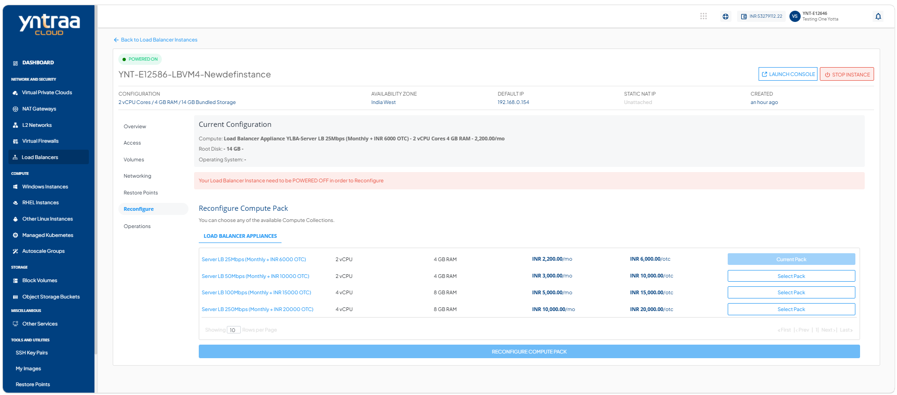
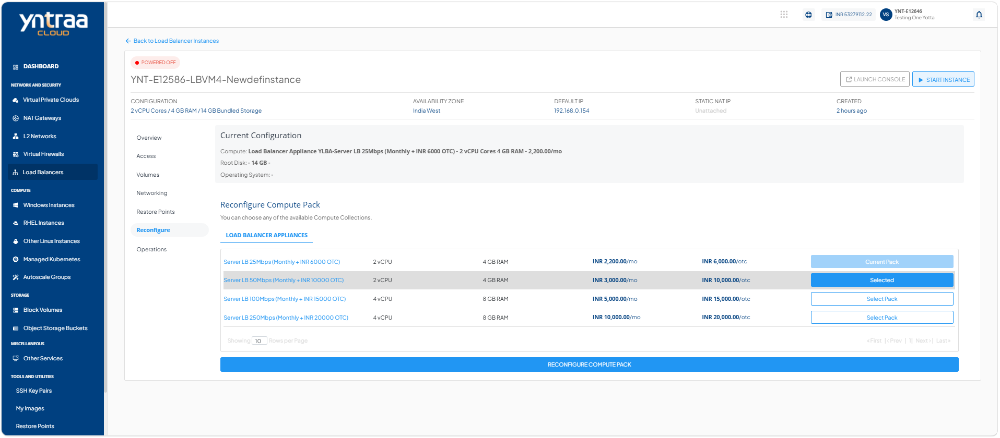
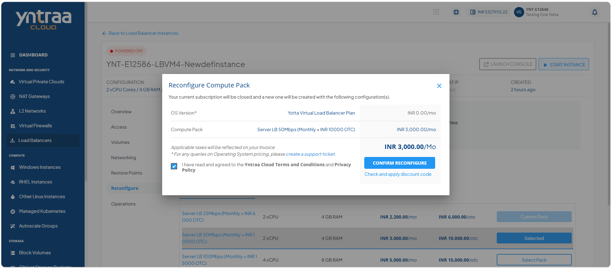
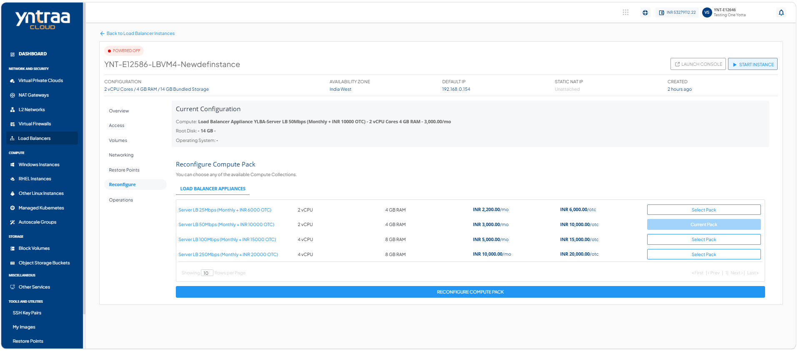

# Reconfiguring Load Balancer Instance

To reconfigure the load balancer instance, follow these steps:

1. Navigate to **Network and Security > Load Balancers**. The following screen appears:

 2. Select a **Load balancer Instance** and click the **Reconfigure** tab. The following screen appears:

3. Click the **Stop Instance** button. The following screen appears:

4. Click the **Yes** button. The following screen appears: 

5. Select a **Compute Pack** from the list, and click the **Reconfigure Compute Pack** button. The following screen appears: 
 
6. Select the option **I have read and agreed to the Yntraa Cloud Terms and Conditions and Privacy Policy**.
7. Click the **Confirm reconfigure** button. The following screen appears:
 

   
