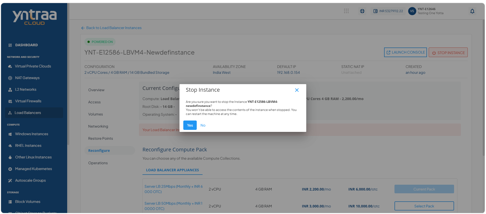
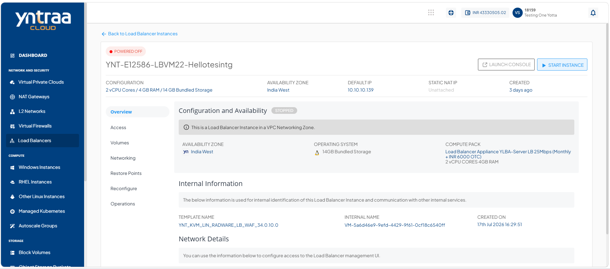
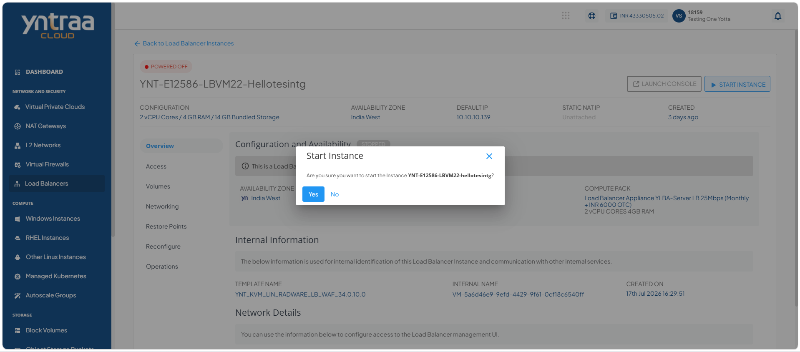
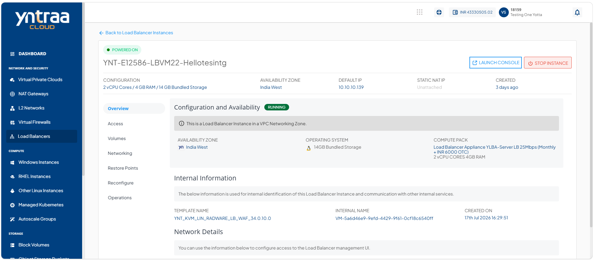

# Viewing Load Balancer Instance Details

Load balancer instance details provide an overview of the instance, including its current status, configuration, internal information, and network details. This information helps you monitor the instance, verify its configuration, and manage network connectivity effectively.

This section comprises of the following sub-sections:
<div className="custom-block-blue">  
- [Launching LBI Web Based Console](#launching-lbi-web-based-console)
- [Stopping and Starting Load Balancer Instance](#stopping-and-starting-load-balancer-instance)
</div>

To view the details of a load balancer instance, follow these steps:

 1. Navigate to **Network and Security > Load Balancers**. The following screen appears:
   
 2. Click on your created load balancer Instance from the list. The Overview tab opens automatically. The following screen appears with the details:
   
 
**Configuration and Availability:** This section displays the following details to help verify its current configuration and operational state:
    - The instance's status <span class="green">**Running**</span> or <span style={{ color: 'red' }}>**Stopped**</span>
    - Availability Zone
    - Operating System
    - Compute Pack

**Internal Information:** This section displays the following information used for internal identification of this instance and communication with other internal services:
    - Template Name
    - Internal Name
    - Created On

**Network Details:** This displays the following network interface details associated with the Load Balancer instance to help identify and manage its network connectivity:
    - VPC Name
    - Gateway
    - Subnet Mask
      
## Launching LBI Web Based Console 

Launch the LBI Web Based Console to access the browser-based management interface for your load balancer instance. The console enables you to configure and manage load balancing settings, monitor traffic and system health, and perform administrative tasks from a web browser.

1. Navigate to **Network and Security > Load Balancers**. The following screen appears:
   
2. Click on your created load balancer instance name from the list. The following screen appears:
    
3. Click the **Launch Console** button to access the Instance's console interface. One-by-one, run the following commands:
 
```
set ns config -IPAddress <VM_private_IP_address> -netmask <VM_tier_netmask>
add route 0 0 <gateway_IP_address_for_tier>
save config
reboot
```
   
## Stopping and Starting Load Balancer Instance

Stop and start the load balancer instance to apply updates, perform maintenance, or optimize resource usage. This action suspends firewall operations without deleting configurations and quickly restores protection when restarted.

To start and stop the load balancer instance, follow these steps:  

1. Navigate to **Network and Security > Load balancers**. The following screen appears: 
   
 2. Click on your created load balancer instance name from the list. The following screen appears:
    
3. Click the <span style={{ color: 'red' }}>Stop Instance</span> button. The following screen appears: 
   
4. Click the **Yes** button. The following screen appears:
   
5. Click the <span style={{ color: 'blue' }}>Start Instance</span> button. The following screen appears: 
   
6. Click the **Yes** button. The following screen appears:
    

