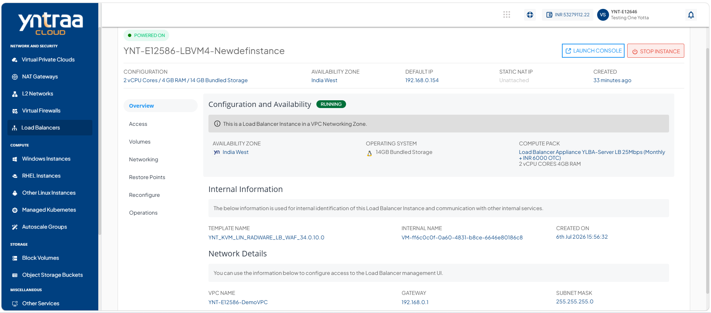

# Viewing Load Balancer Instance Details

Load balancer instance details provide an overview of the instance, including its current status, configuration, internal information, and network details. This information helps you monitor the instance, verify its configuration, and manage network connectivity effectively.

To view the details of a load balancer instance, follow these steps:

 1. Navigate to **Network and Security > Load Balancers**. The following screen appears:
  
 2. Click on your created load balancer Instance from the list. The Overview tab opens automatically. The following screen appears with the details:
 
 
 
  
- [Configuration and Availability](#configuration-and-availability)
- [Internal Information](#internal-information)
- [Network Details](#network-details)

 
## Configuration and Availability
This section displays the following details to help verify its current configuration and operational state:
    - The instance's status **Running** or **Stopped**.
    - Availability Zone
    - Operating System
    - Compute Pack
    

## Internal Information
This section displays the following information used for internal identification of this instance and communication with other internal services:
    - Template Name
    - Internal Name
    - Created On

## Network Details
This displays the following network interface details associated with the Load Balancer instance to help identify and manage its network connectivity:
    - VPC Name
    - Gateway
    - Subnet Mask
