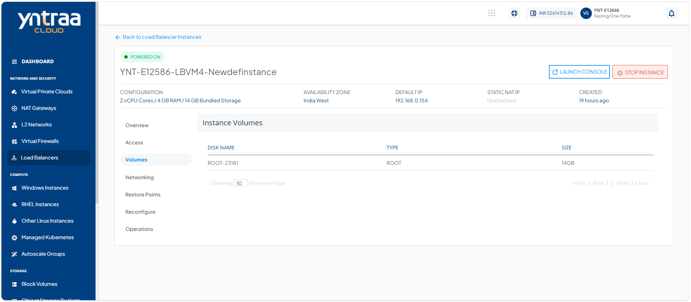

# Volume Management 

Volume management enables you to manage storage volumes associated with a load balancer instance. Proper volume management ensures that the load balancer has sufficient storage capacity to support logs, configuration data, and other operational requirements. It also helps optimize storage usage, improve performance, and maintain the reliability and availability of the load balancer instance.

To view the disks attached to this Instance:

1. Navigate to **Network and Security > Load Balancers**. The following screen appears:

2. Select a **Load balancer Instance** and click the **Volume** tab. The following screen appears:

