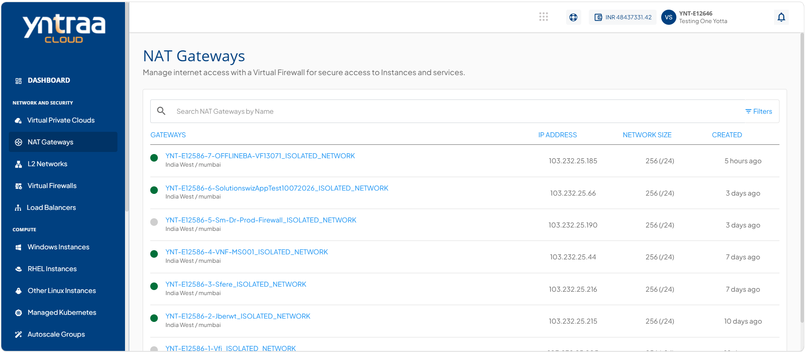
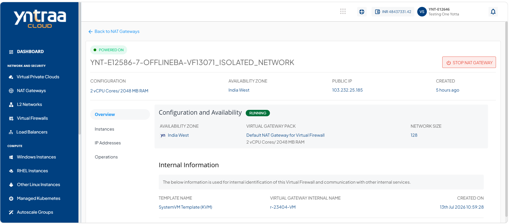
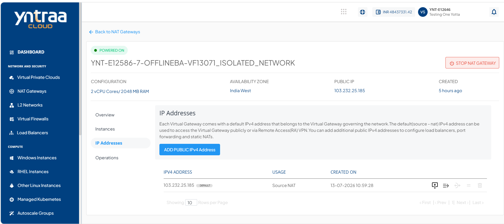
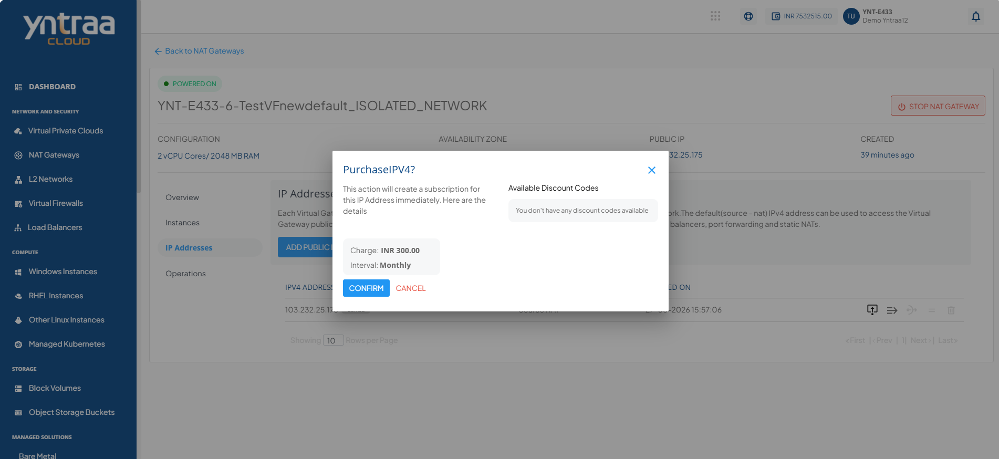
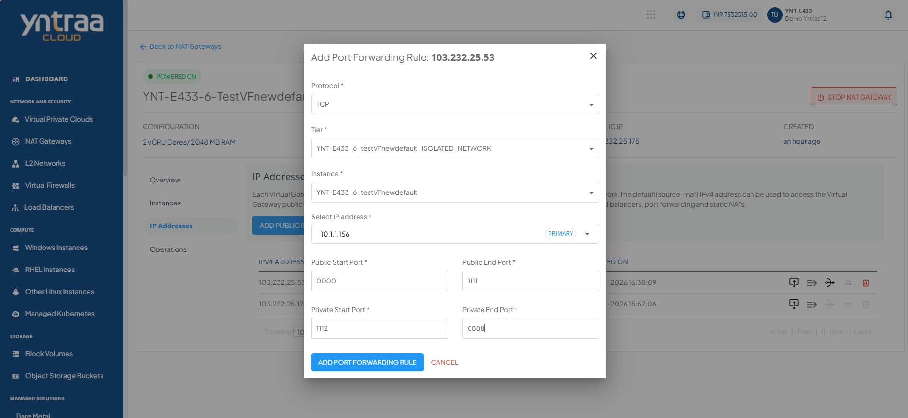
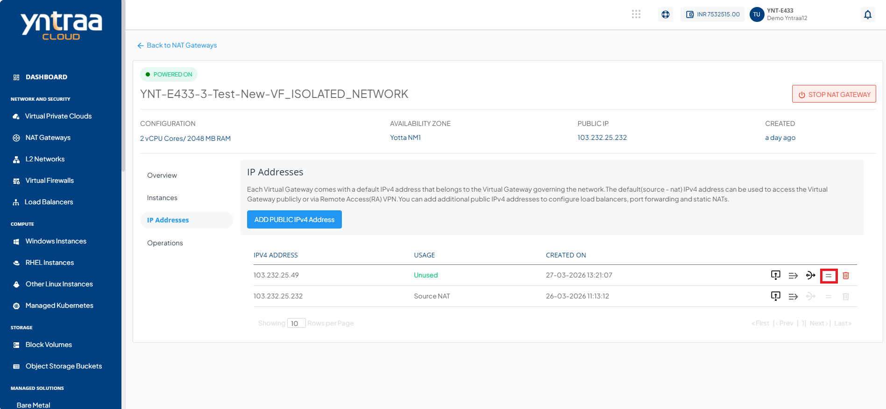
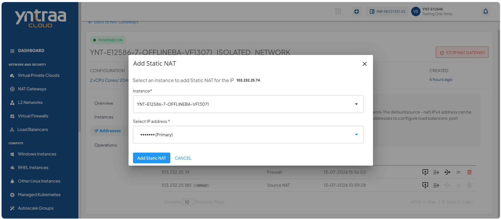

# Managing IP Addresses

Each virtual gateway comes with a default IPv4 address that belongs to the Virtual Gateway governing the network. The default (source - NAT) IPv4 address can be used to access the Virtual Gateway publicly or via Remote Access (RA) VPN.

This section comprises of the following sub-sections:

  
- [Adding Public IPv4 Addresses](#adding-public-ipv4-addresses)
- [Adding Firewall Rules](#adding-firewall-rules)
- [Adding Port Forwarding Rules](#adding-port-forwarding-rules)
- [Changing the Source NAT ](#changing-the-source-nat)
- [Deleting an IP Address](#deleting-an-ip-address) 

## Adding Public IPv4 Addresses

A public IPv4 address uniquely identifies a resource on the internet and enables communication with external networks. Add a public IPv4 address to a NAT Gateway to allow private instances to access the internet and external services while keeping them protected from direct inbound internet traffic.

To add a public IPv4 address, follow these steps:

1. Navigate to **Network and Security > NAT Gateways**. The following screen appears:

2. Click on your created NAT Gateway from the list. The following screen appears: 

3. Click **IP Addresses**. The following screen appears:
 
4. Click the **Add Public IPv4 Address** button. The following screen appears:

5. Select the **Monthly** option and click the **Confirm Purchase** button. The following screen appears:

6. Click the **Confirm** button. The public IPv4 address is added.
   
## Adding Firewall Rules

A firewall rule defines how a NAT Gateway allows or blocks network traffic based on specified criteria, such as IP addresses, ports, and protocols. Adding firewall rules helps control network access, enhance security, and ensure that only authorized traffic passes through the NAT Gateway.

To add a firewall rule, follow these steps:

1. Click the **Firewall Rule** icon (highlighted in red).

   The following screen appears:

2. Click the **Add Rule** button. The firewall rule is added

## Adding Port Forwarding Rules

A port forwarding rule maps incoming traffic on a specific public IP address and port to a private instance and port within your virtual network. Adding port forwarding rules enables external users or services to securely access applications running on private instances through the NAT Gateway.

To add a port forwarding rule, follow these steps:

1. Click the **Port Forwarding Rule** icon (highlighted in red).

   The following screen appears: 
   
2. Click **+ Add Rule**. The following screen appears;

3. Click the **Add Port Forwarding Rule** button. The port forwarding rule is added.

## Changing the Source NAT 

A Source NAT (SNAT) IPv4 address is the public IP address that the NAT Gateway uses for outbound traffic from private instances. Changing the Source NAT IPv4 address allows you to route outbound traffic through a different public IP, helping you meet network, security, or connectivity requirements.

To change the source NAT, follow these steps:

1. Click the **Source NAT** icon (highlighted in red).

   The following screen appears: 
   

2. Click the **Okay** button.

## Adding a Static NAT

Static NAT maps a dedicated public IP address to a private instance within your virtual network using a one-to-one association. Adding a Static NAT rule enables external users or services to securely access the private instance by assigning it a persistent public IP address while maintaining network isolation.

To add a static NAT, follow these steps: 

1. Click the **Static NAT** icon (highlighted in red).

   The following screen appears where you provide the required details: 
   
   
    - **Instance**: Select the instance to associate with the Static NAT from the **Instance** dropdown.
    - **IP Address**: Select the instance IP address to map with the Static NAT from the **Select IP Address** dropdown.
2. Click the **Add Static NAT** button. The static NAT is added.
   
## Deleting an IP Address

A public IP address enables a NAT Gateway to communicate with external networks and the internet. Delete a public IP address when it is no longer required to free up network resources, simplify configuration, and maintain an organized and efficient network environment.
:::warning
This is an irreversible action.
:::

To delete an IP address, follow these steps:

1. Click the **Delete IP** icon (highlighted in red).

  
   The following screen appears: 
    
   
2. Select the **I confirm that I have removed everything from this IPv4 Address** option, and click the **Delete Now** button.

