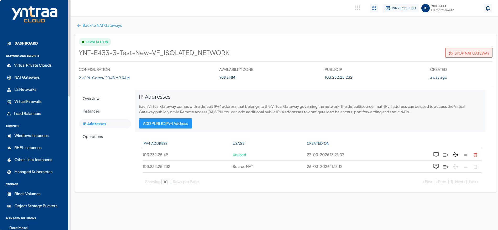
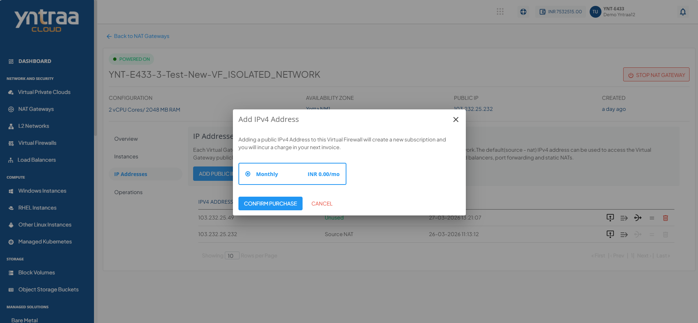
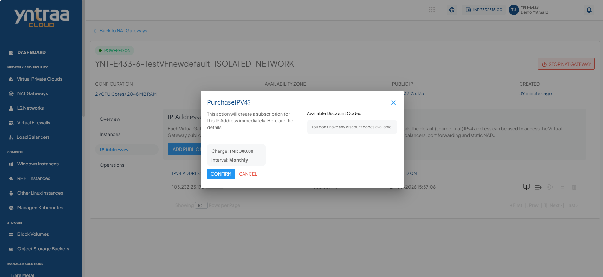
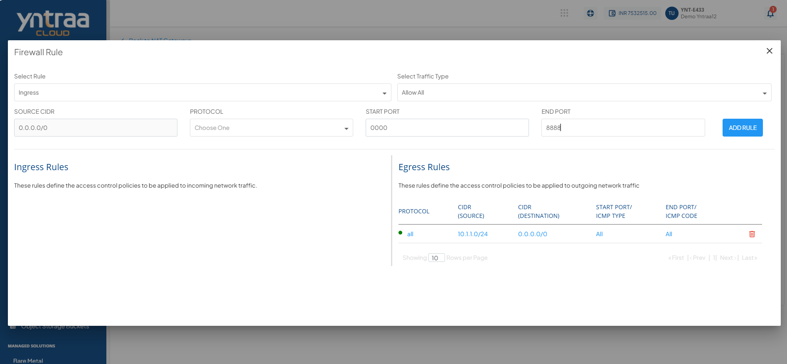
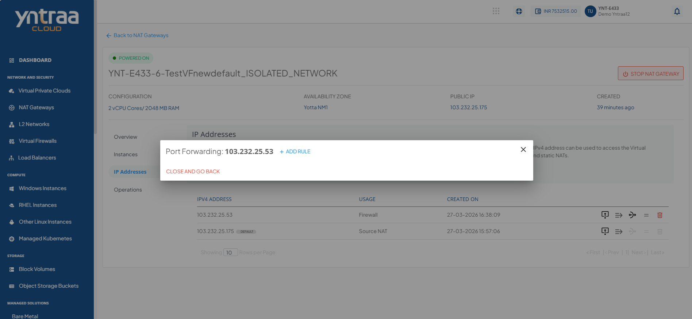
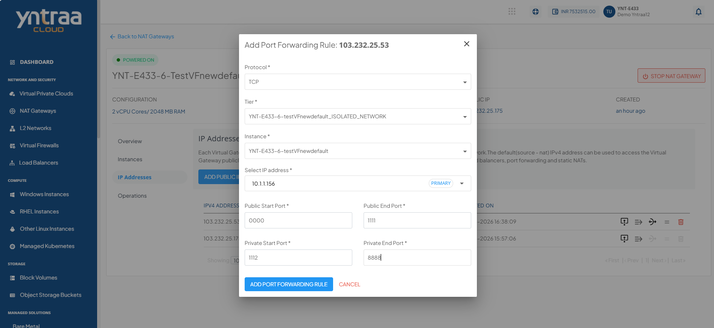
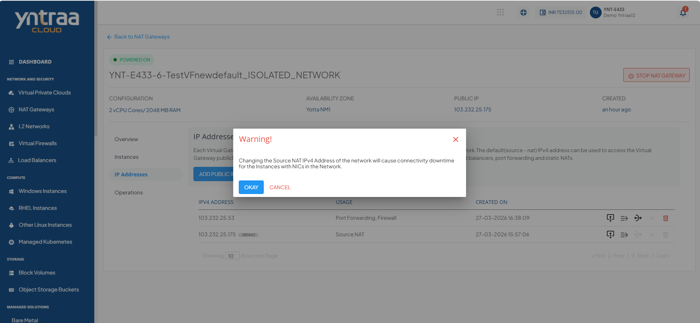
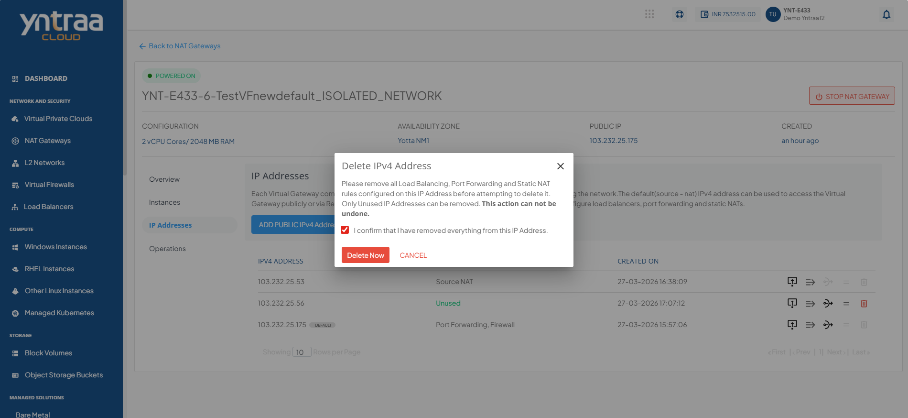

# IPv4 Addresses
Each virtual gateway comes with a default IPv4 address that belongs to the Virtual Gateway governing the network. The default (source - NAT) IPv4 address can be used to access the Virtual Gateway publicly or via Remote Access (RA) VPN.

### Adding Public IPv4 Addresses
You can add additional public IPv4 addresses to configure firewall rules, port forwarding rules and source NATs.

1. Click the **Add Public IPv4 Address** button. The following screen appears:
   
2. Select the **Monthly** option and then click the **Confirm Purchase** button. The following screen appears.
   
3. Verify the details and click the **Confirm** button to create complete adding a public IPv4 address.
### Managing Firewall Rules
1. Click the **Firewall Rule** icon.
   
2. Enter the details as shown to create a new firewall rule.
    1. **Select Rule** from the drop-down. 
	2. **Select Traffic Type** from the drop-down.
	3. Select the **Protocol** from the drop-down list.
	4. Enter the **Start Port** and **End Port**. 
	5. Click on **Add Rule** button.

### Managing Port Forwarding Rules
1. Click the **Port Forwarding Rule** icon. The following screen appears:
   
2. To add a new rule, click on **+ Add Rule**.
   
3. Enter the required details to add a rule.
   
4. Click the **Add Port Forwarding Rule** button.
   

### Changing Source NAT IPv4 Address
1. Click the **Source NAT** icon.
  

2. Click the **Okay** button.
   
   
### Deleting IP Address
1. Click the **Delete IP** icon.
  
2. Select the **I confirm that I have removed everything from this IPv4 Address** option and click the **Delete Now** button.
   
	:::warning
	This is an irreversible action.
	:::

