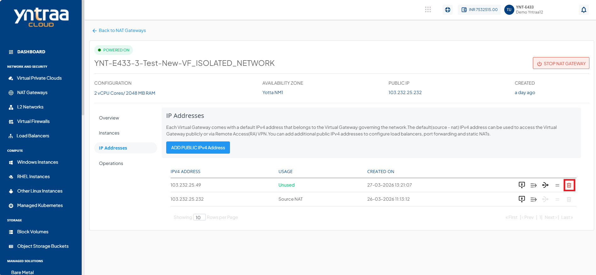
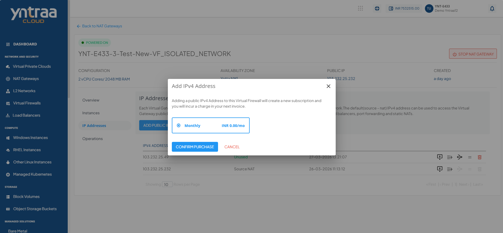
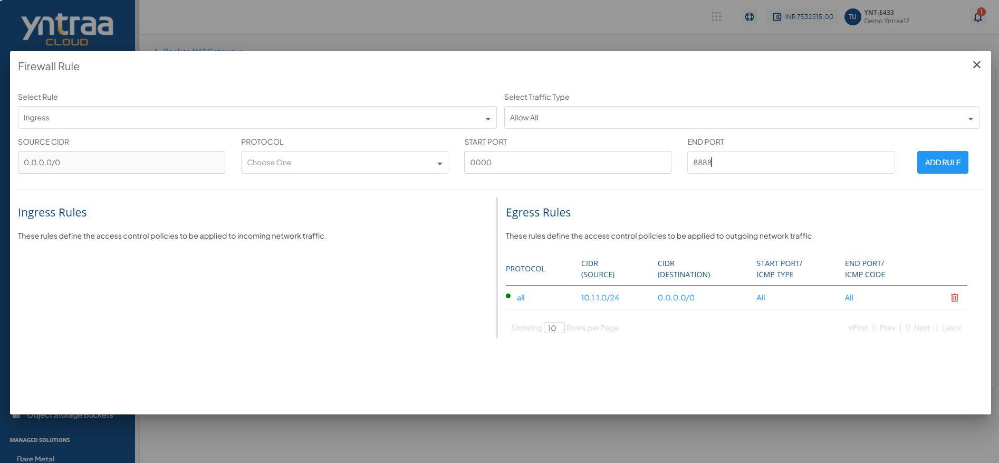
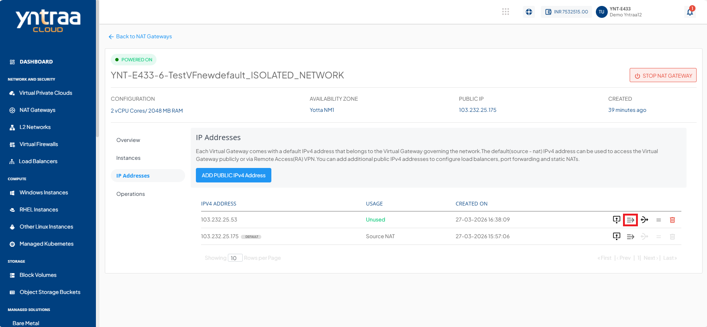
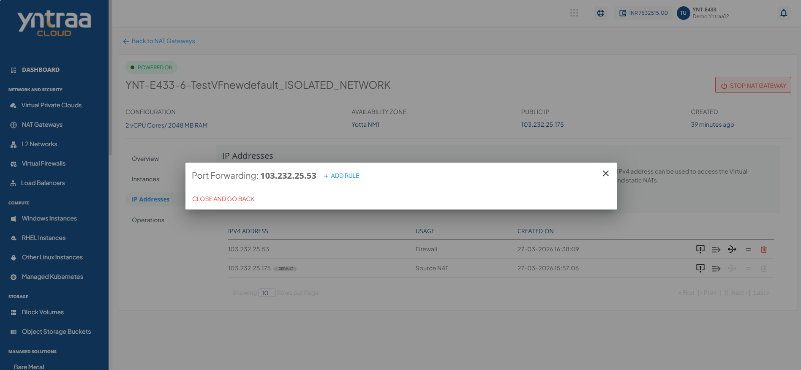
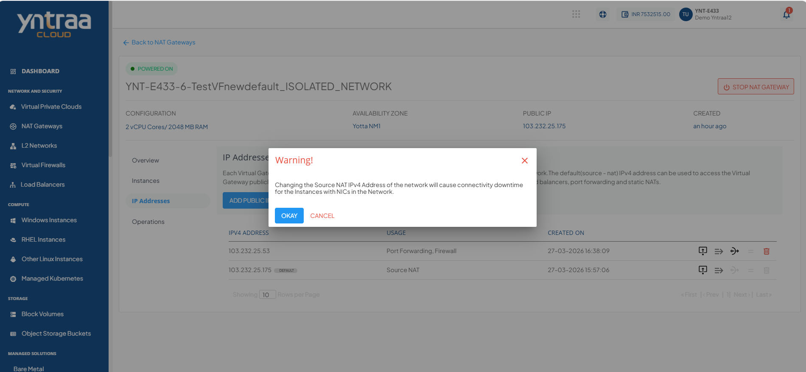
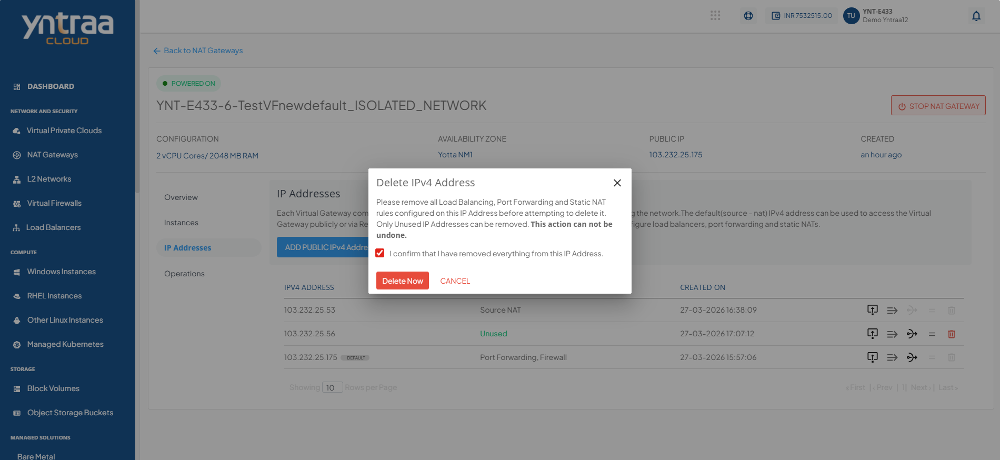

# Managing IP Addresses

Each virtual gateway comes with a default IPv4 address that belongs to the Virtual Gateway governing the network. The default (source - NAT) IPv4 address can be used to access the Virtual Gateway publicly or via Remote Access (RA) VPN.

This section comprises of the following sub-sections:

  
- [Adding Public IPv4 Addresses](#adding-public-ipv4-addresses)
- [Adding Firewall Rules](#adding-firewall-rules)
- [Adding Port Forwarding Rules](#adding-port-forwarding-rules)
- [Changing Source NAT IPv4 Address](#changing-source-nat-ipv4-address)
- [Deleting IP Address](#deleting-ip-address) 

## Adding Public IPv4 Addresses

A public IPv4 address uniquely identifies a resource on the internet and enables communication with external networks. Add a public IPv4 address to a NAT Gateway to allow private instances to access the internet and external services while keeping them protected from direct inbound internet traffic.

To add a public IPv4 address, follow these steps:

1. Click the **Add Public IPv4 Address** button. The following screen appears:

2. Select the **Monthly** option and click the **Confirm Purchase** button. The following screen appears.

3. Verify the details and click the **Confirm** button to create complete adding a public IPv4 address.
   
## Adding Firewall Rules

A firewall rule defines how a NAT Gateway allows or blocks network traffic based on specified criteria, such as IP addresses, ports, and protocols. Adding firewall rules helps control network access, enhance security, and ensure that only authorized traffic passes through the NAT Gateway.

To add firewall rules, follow these steps:

1. Click the **Firewall Rule** icon (highlighted in red).

   The following screen appears:

2. Enter the required details.
    - **Select Rule** from the drop-down. 
	- **Select Traffic Type** from the drop-down.
	- Select the **Protocol** from the drop-down list.
	- Enter the **Start Port** and **End Port**. 
3. Click on the **Add Rule** button.

## Adding Port Forwarding Rules

A port forwarding rule maps incoming traffic on a specific public IP address and port to a private instance and port within your virtual network. Adding port forwarding rules enables external users or services to securely access applications running on private instances through the NAT Gateway.

To add a Port Forwarding rule, follow these steps:

1. Click the **Port Forwarding Rule** icon (highlighted in red).

   The following screen appears: 
   
2. To add a new rule, click on **+ Add Rule**. The following screen appears: 

3. Enter the required details to add a rule. 
4. Click the **Add Port Forwarding Rule** button.
   

## Changing Source NAT IPv4 Address

A Source NAT (SNAT) IPv4 address is the public IP address that the NAT Gateway uses for outbound traffic from private instances. Changing the Source NAT IPv4 address allows you to route outbound traffic through a different public IP, helping you meet network, security, or connectivity requirements.

To change source NAT IPv4 address, follow these steps:

1. Click the **Source NAT** icon (highlighted in red).

   The following screen appears: 
   

2. Click the **Okay** button.
   
## Deleting IP Address

A public IP address enables a NAT Gateway to communicate with external networks and the internet. Delete a public IP address when it is no longer required to free up network resources, simplify configuration, and maintain an organized and efficient network environment.

To delete an IP address, follow these steps:

1. Click the **Delete IP** icon (highlighted in red).

  
   The following screen appears: 
    
   
2. Select the **I confirm that I have removed everything from this IPv4 Address** option and click the **Delete Now** button.

	:::warning
	This is an irreversible action.
	:::

