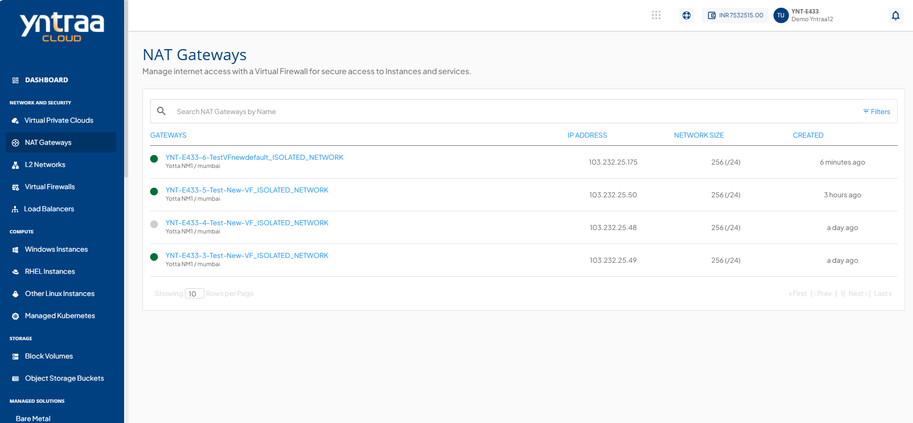

# Managing NAT Gateways

Managing NAT Gateways allows you to monitor and maintain NAT gateway configurations for secure and reliable network connectivity. It helps ensure seamless traffic flow, efficient IP address translation, and consistent access between private and external networks.

To manage a NAT gateway, follow these steps:

1. Navigate to **Network and Security> NAT Gateways**.
   
2. Click your created gateway from the list. The following screen appears:
   

The gateway details are displayed under the following categories:

 
    - [Viewing NAT Gateway Overview](/docs/Subscribers/NetworkandSecurity/NATGateways/ManagingNATGateways/ViewingNATGatewayOverview)
    - [Viewing NAT Gateway Instances](/docs/Subscribers/NetworkandSecurity/NATGateways/ManagingNATGateways/ViewingNATGatewayInstances)
    - [Managing IP Addresses](/docs/Subscribers/NetworkandSecurity/NATGateways/ManagingNATGateways/ManagingIPAddresses)
    - [Restarting and Deleting a NAT Gateway](/docs/Subscribers/NetworkandSecurity/NATGateways/ManagingNATGateways/RestartingandDeletingaNATGateway)

