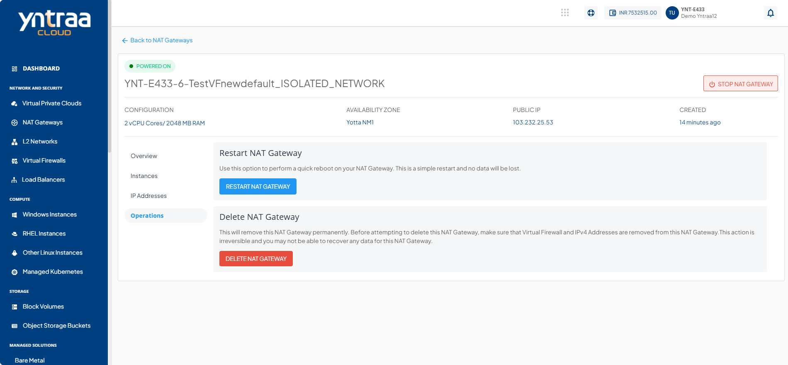

# Operations

You can perform the following operations in the Operations section:

- **RESTART NAT GATEWAY -** Use this option to perform a quick reboot on your Instance. This is a simple restart, and no data will be lost.
- **DELETE NAT GATEWAY -** This permanently removes the NAT gateway.. Before attempting to delete this NAT Gateway, make sure that Virtual Firewall and IPv4 Addresses are removed from this NAT Gateway. 
	

:::note
This action is irreversible and you may not be able to recover any data for this NAT Gateway.
 :::

