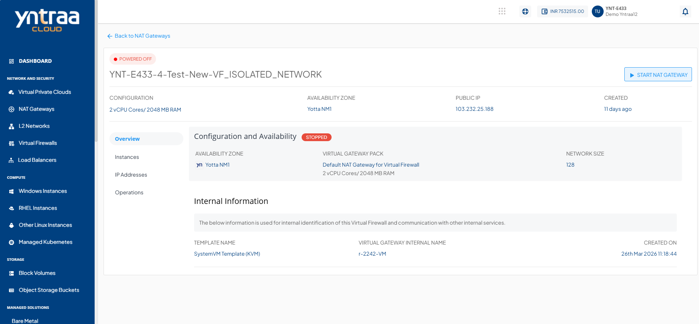

# Overview

Navigate to **Nat Gateways** tab and access the **Overview** tab to view the following details:

- **Configuration and Availability** 
	This section displays the instance's status, **RUNNING**, is displayed in  ****green****, whereas **STOPPED** is displayed in **red** out and the information about the networking zone.
- **Internal Information** 
	This section displays the information used for internal identification of this instance and communication with other internal services.
	- Template Name
	- Virtual Gateway Internal Name
	- Created On
	

To **POWER ON/OFF** the virtual router, click the **STOP NAT GATEWAY/START NAT GATEWAY**.
   
   

