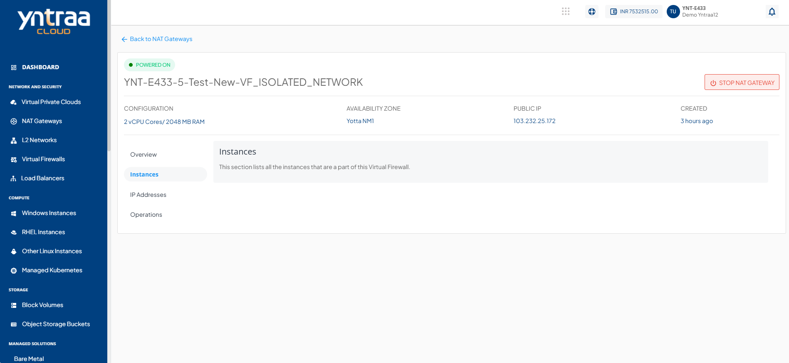
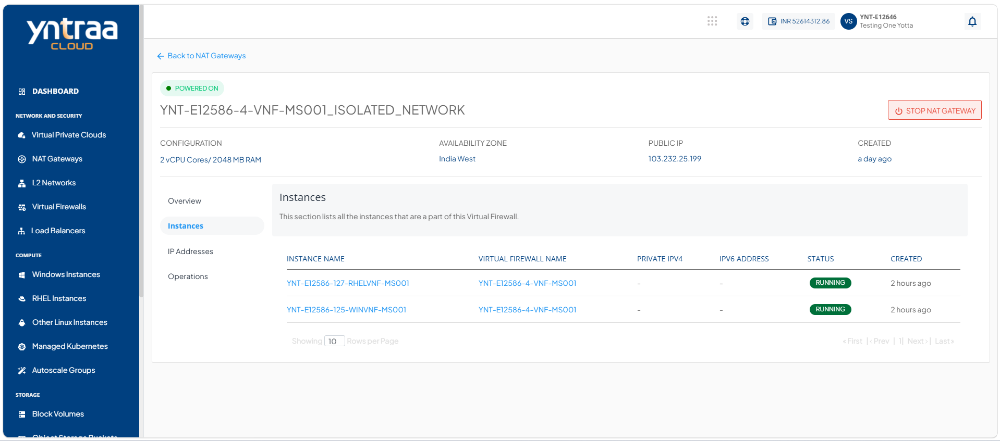

# Viewing NAT Gateway Instances

A NAT Gateway enables private instances in a virtual network to access the internet without assigning them public IP addresses. Viewing a NAT Gateway instance helps you verify its configuration and status, ensuring secure and reliable outbound internet connectivity.

This section lists all the instances that are associated with your selected NAT Gateway:

To view all the instances associated with NAT Gateway, follow these steps:

1. Navigate to **Network and Security > Nat Gateways**. The following screen appears:
   
2. Click on your created NAT Gateway. 

3. Click **Instances**. The following screen appears, which shows all the instances associated with your NAT Gateway:

