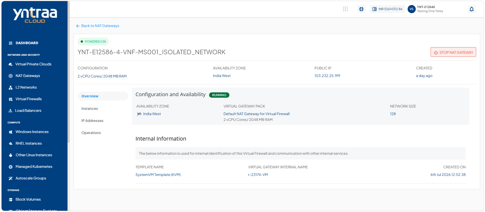
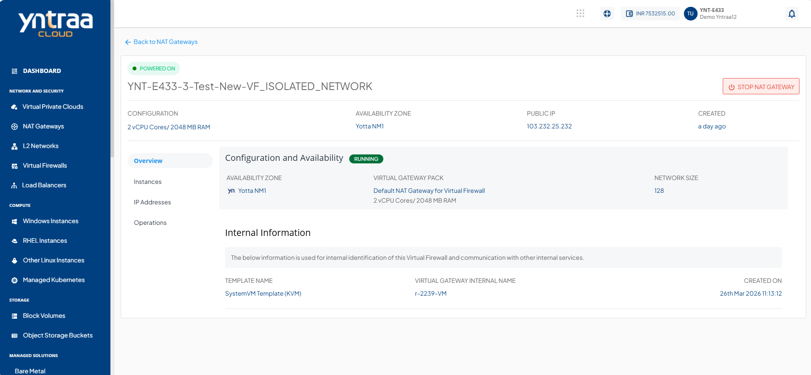

# Viewing NAT Gateway Overview

The NAT gateway overview helps you view the current configuration and operational status of the gateway. Reviewing the overview enables you to validate the gateway's settings, monitor its performance, and manage it more effectively.

1. Navigate to **Network and Security > Nat Gateways**. The following screen appears
  
2. Click on your created NAT Gateway. The following screen appears:
 
3. Click **Overview**. The following screen appears:

   The Overview section displays the following details:

- **Configuration and Availability** 
	This section displays the instance's status as **Running** or **Stopped**. It also displays the following information: 
    
      - Availability Zone
      - Virtual Gateway Pack
      - Network Size
      
- **Internal Information** 
	This section displays the information used for internal identification of this instance and communication with other internal services.
	- Template Name
	- Virtual Gateway Internal Name
	- Created On
	  
## Powering On and Off the Virtual Router

Powering a virtual router on or off allows you to control its operational state. Power on the virtual router to start routing network traffic and enable connectivity between networks. Power off the virtual router when performing maintenance, applying configuration changes, or temporarily stopping network services to conserve resources or troubleshoot issues.

To **Power On/Off** the virtual router, follow these steps: 

1. Click the **Stop NAT Gateway/Start NAT Gateway** button. The following screen appears: 
   
2. Select the option and click the **Stop Virtual Router** button. The following screen appears: 
   

