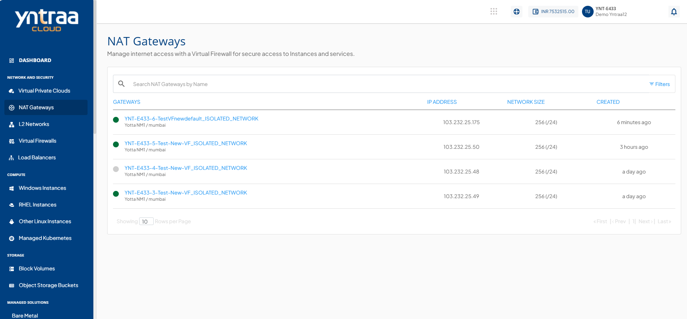

# Viewing and Managing NAT Gateways

To manage a NAT gateway, follow these steps:

1. Navigate to **NETWORK AND SECURITY> NAT Gateways**.
   
2. Click gateway from the list. The following screen appears:
   

The gateway details are displayed under the following categories:

- [Overview](docs/Subscribers/NetworkandSecurity/NATGateways/ManagingNATGateways/Overview.md)
- [Instances](Instances.md)
- [IPv4 Addresses](IPv4Addresses.md)
- [Operations](docs/Subscribers/NetworkandSecurity/NATGateways/ManagingNATGateways/Operations.md)

