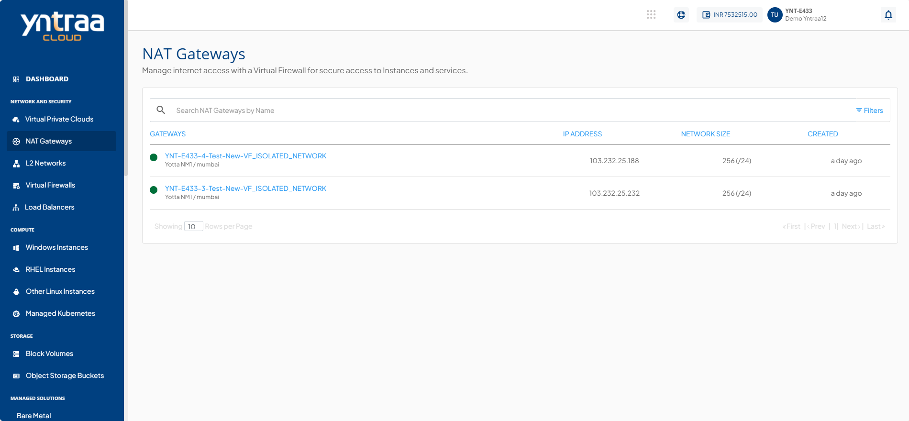
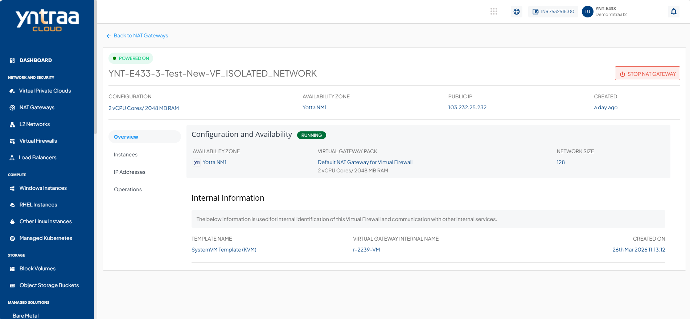
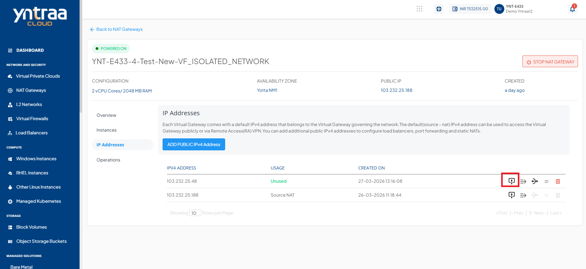
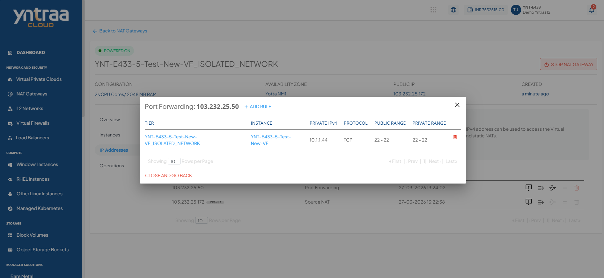
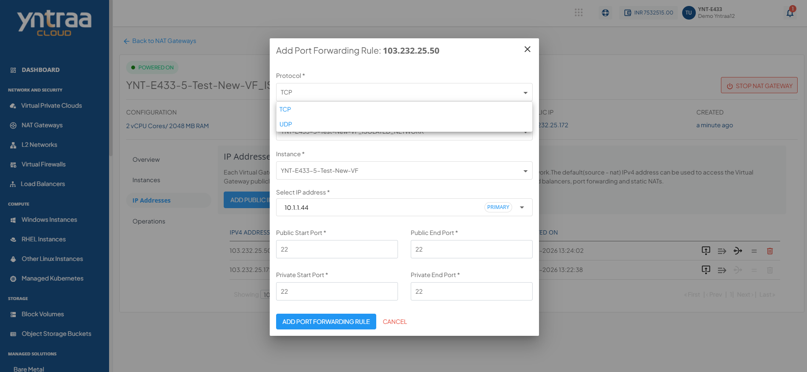
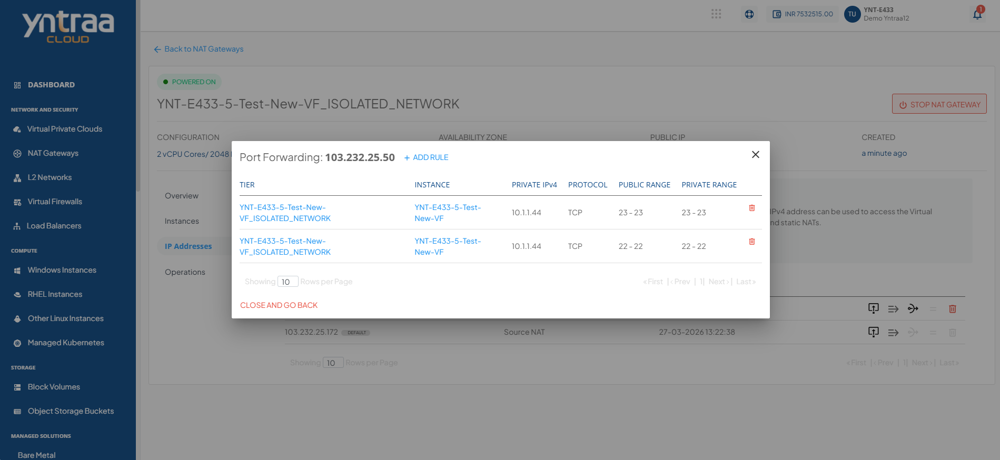

# Port Forwarding for VM via VNF

This section outlines the steps to configure port forwarding for a Virtual Machine (VM) using a Virtual Network Function (VNF) in a cloud environment. Port forwarding allows external clients to securely access services (for example SSH, HTTP) hosted on the VM by mapping ports from the VNF’s public IP to the VM’s private IP. This approach improves network segmentation and control by routing all incoming traffic through the VNF layer.

The following are the high-level tasks required to configure port forwarding for a VM via a VNF:

1. [Accessing and Selecting a NAT Gateway](#accessing-and-selecting-a-nat-gateway)
2. [Reviewing Configuration](#reviewing-configuration)
3. [Accessing Port Forwarding Settings for NAT Gateway](#accessing-port-forwarding-settings-for-nat-gateway)
4. [Adding a New Port Forwarding Rule](#adding-a-new-port-forwarding-rule)
5. [Adding Details and Creating Port Forwarding Rule](#adding-details-and-creating-port-forwarding-rule)
6. [Verifying the Added Port Forwarding Rule](#verifying-the-added-port-forwarding-rule)

## Accessing and Selecting a NAT Gateway

This section outlines the steps to access and select a NAT Gateway within the Yntraa Cloud. Before managing configuration or operational settings, users must navigate to the appropriate section of the dashboard and identify the NAT Gateway instance relevant to their network environment. This ensures that all subsequent actions are performed on the correct gateway associated with the intended Virtual Network Function (VNF). 

The following steps guide you through locating and selecting your NAT Gateway from the dashboard:

1. Navigate to the **Network and Security > NAT Gateways** section from the  Cloud dashboard.
2. Select the appropriate NAT Gateway associated with your VNF.

## Reviewing Configuration

This section offers a detailed review of the current NAT Gateway configuration within the  Cloud environment. It includes essential system specifications, deployment parameters, and operational status to ensure the gateway is correctly set up and functioning as expected. Verify these details before initiating any advanced networking configurations, such as port forwarding or scaling operations.

The following steps guide you through reviewing key configuration details, checking operational status, and accessing internal system information necessary for validation and troubleshooting within your cloud environment: 

1. NAT Gateway Configuration Overview: The following details summarize the key configuration parameters of the selected NAT Gateway.
    - **vCPU/RAM**: For example 2 vCPU Cores / 2048 MB RAM (Indicates the computational resources allocated for the NAT Gateway).
    - **AVAILBILITY Zone**: For example AZ1-India North 1 (The region or zone where the gateway is deployed).
    - **PUBLIC IP**: The public-facing IP through which outbound traffic is routed.
2. Check Operational Status: The NAT Gateway is in a **RUNNING** state, indicating it is active and fully operational.
3. Confirm Network and Gateway Configuration: Review the virtual gateway pack and network size settings to ensure the correct configuration is applied before proceeding with port forwarding or deployment steps.
     - **Virtual Gateway Pack**
     - **Network Size**
4. Access Internal Information for System Reference: The following internal configuration details are provided for system-level reference and tracking of the NAT Gateway within the  Cloud environment.
    - Template Name.
    - Virtual Gateway Internal Name
    - Created On

## Accessing Port Forwarding Settings for NAT Gateway

To enable external access to internal services hosted behind a NAT Gateway, you must configure port forwarding rules. This section explains how to access the port forwarding settings for a NAT Gateway within the  Cloud environment. Port forwarding allows specific inbound traffic to reach designated internal resources by mapping external ports to internal IPs and ports.

The following steps outline the process to navigate to the NAT Gateway, locate the public IP address, and access the port forwarding configuration interface to add or manage rules effectively:

1. In the left-hand menu, click on **NAT Gateways** under the **Network and Security** section.
2. Select your NAT Gateway from the list.
3. In the gateway page, click on the **IPv4 Addresses** tab.
4. Find your public IP address listed on this page.
5. Click the **Port Forwarding Rule** icon (next to the IP address) to start adding a port forwarding rule.

## Adding a New Port Forwarding Rule

To allow external access through a NAT Gateway in the  Cloud Portal, you can add a new port forwarding rule. This involves selecting the appropriate NAT Gateway and configuring the necessary forwarding details. 

The following steps guide you through logging into the Cloud Portal, navigating to the NAT Gateways section, selecting the relevant gateway, and initiating the process of creating a new port forwarding rule by accessing the Port Forwarding interface and reviewing any existing rules: 

1. Login to the Yntraa Cloud.
2. From the left-hand side menu, under the **Network and Security** section, click on **NAT Gateways**.
3. Choose the NAT Gateway for which you want to configure the port forwarding rule.
4. Once inside the selected NAT Gateway, see a section titled **Port Forwarding** along with the public IP address.
5. Click on the **+ ADD RULE** button located next to the Port Forwarding heading. This opens the interface to add a new port forwarding rule.
6. Review Existing Rules (Optional): Below the **+ ADD RULE** button, you may see a list of existing rules including details like:
    - **TIER** 
    - **INSTANCE**
    - **PRIVATE IPv4** 
    - **PROTOCOL** 
    - **PUBLIC RANGE** 
    - **PRIVATE RANGE** 

## Adding Details and Creating Port Forwarding Rule

Once you click on **+ ADD RULE**, a new form opens where you must enter the required information. These details define how incoming traffic on the public IP is routed to your internal instance. 

The following steps guide you through completing the port forwarding rule form by selecting the appropriate protocol, tier, and instance, and by specifying the public and private port ranges required to establish the forwarding rule:

1. After clicking on **+ ADD RULE** a new form titled **Add Port Forwarding Rule** appears.
2. Fill in all the required fields marked with a red asterisk (*):
	- **Protocol**:  Select the desired protocol from the dropdown.
	- **Tier**:  Choose the appropriate tier from the list that maps to your network environment.
	- **Instance**:  Select the instance (virtual machine) that receives the forwarded traffic.
	- **Public Start Port**:  Enter the starting port number from the public IP address range.
	- **Public End Port**:  Enter the ending port number from the public IP address range.
	- **Private Start Port**: Enter the starting port on the internal (private) IP to which traffic must be forwarded.
	- **Private End Port**: Enter the ending port on the private IP.
      
:::note
If you want to forward only one port, enter the same value for start and end ports.
:::
  
:::note
Same rule as above applies if forwarding a single port.
:::
   
3. Click on **ADD PORT FORWARDING RULE** to save and apply the new rule.
   
## Verifying the Added Port Forwarding Rule

After creating the port forwarding rule, it is important to verify that it has been added correctly. This ensures that traffic is properly forwarded to the intended internal instance. Review the rule details listed under the **Port Forwarding** section to confirm everything matches your configuration.

The following steps guide you through locating the newly added rule in the **Port Forwarding** section, reviewing its associated tier, instance, IP addresses, and port ranges, and confirming that all values align with the configuration you specified during rule creation:

1. Once the rule is added, it appears in the list under the **Port Forwarding** section for the selected public IP.
2. Review the displayed rule details, which include:
    - Tier
    - Instance 
    - Private IPv4 address
    - Protocol 
    - Public range
    - Private range
3. Ensure the information is accurate and matches the values you entered during rule creation. 
 

