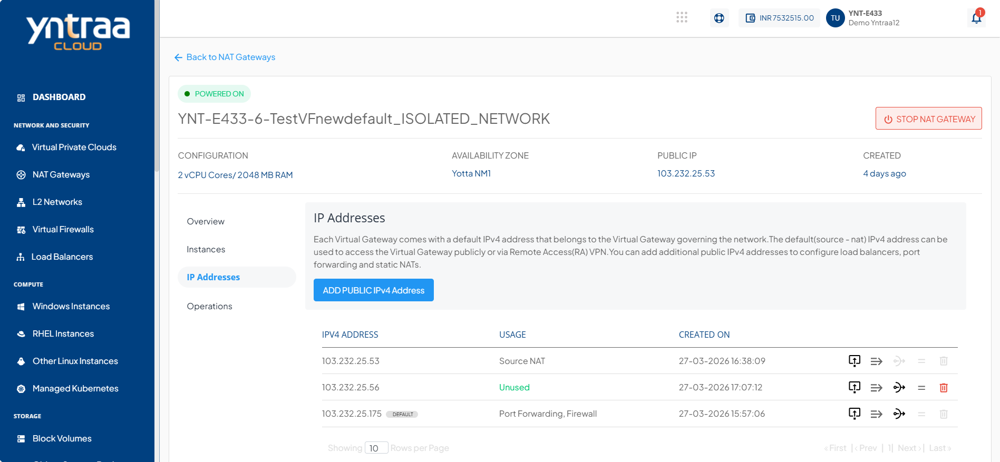
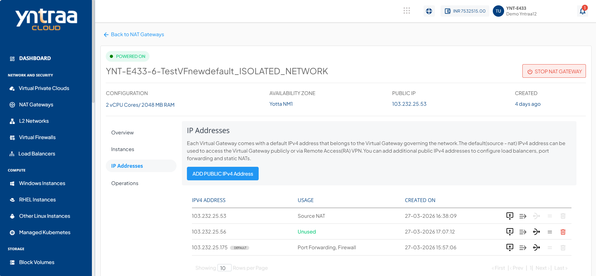
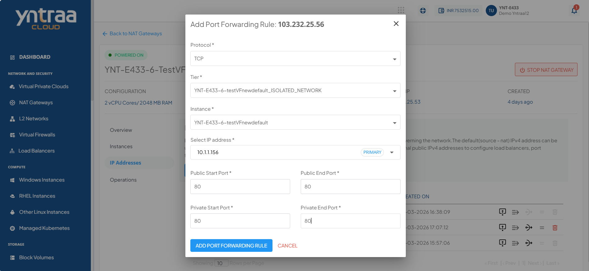

# Port Forwarding with Public IP

In Yntraa Cloud, an additional Public IP enables you to expose internal services hosted on virtual machines (VMs) to the internet by creating dedicated port forwarding rules. This approach is especially useful when multiple external IPs are needed for services such as SSH, HTTP, or custom applications. By assigning specific public IPs to particular services or VMs, you can achieve greater control, flexibility, and network segmentation.

The following are the high level steps required to configure port forwarding with Public IP:

1. [Adding Public IPv4 Address](#adding-public-ipv4-address)
2. [Adding a Port Forwarding Rule](#adding-a-port-forwarding-rule)
3. [Requiring Values in the Rule](#requiring-values-in-the-rule)
   
## Adding Public IPv4 Address

To enable external connectivity for your services through a NAT Gateway, you need to allocate a public IPv4 address. This address serves as the entry point for inbound traffic and is essential for setting up port forwarding or other external access configurations.

The following steps guide you through the process of navigating to your NAT Gateway, generating a new public IPv4 address, and verifying its successful addition and availability within the Yntraa Cloud:

1. Navigate to the **NAT Gateways** section from the left-hand menu.
2. Select the desired gateway.
3. Click on the **IP Addresses** tab from the option on the left.
4. Click the **Add Public IPv4 Address** button. A new public IP is generated and listed under the IPv4 ADDRESS section.
5. A confirmation message **IPv4 Address purchase successful** appears at the top.
6. The newly added IP shows the status as Unused.

## Adding a Port Forwarding Rule

Once a public IPv4 address has been successfully added to your NAT Gateway, the next step is to configure port forwarding. This enables external access to internal services by mapping incoming traffic on specific ports to designated internal IP addresses within your network.

The following steps guide you through locating the unused public IP, accessing the port forwarding interface, and initiating the configuration of a new port forwarding rule using the Yntraa Cloud:

1. Navigate to the **Network and Security > IPv4 Addresses**, click the **Add Public IPv4 Address** button.
2. **Identify the Newly Acquired Public IP**: Look for the public IP address that is marked as **Unused** under the **usage** column.
3. **Click on the Port Forwarding Icon**: 
    - In the row corresponding to the **Unused** public IP, locate and click on the **port forwarding icon**.
    - The icon is next to other icons like the delete (trash bin) and details icon, as shown in  the red box in the screenshot.
4. **Proceed to Configure the Rule**: After clicking the icon, follow the prompted interface to define your port forwarding rule (not shown in the screenshot but typically involves specifying internal and external ports, protocol, and target IP).

## Requiring Values in the Rule

After accessing the port forwarding configuration interface, the next step is to specify the necessary rule parameters. The following details determine how external traffic is routed through the public IP to the intended internal instance:

- **Protocol**
- **Tier**
- **Instance**
- **Select IP Address**
- **Public Start Port**
- **Public End Port**
- **Private Start Port** 
- **Private End Port**

Click the **Add Port Forwarding Rule** button to save and apply the rule.  

    
   