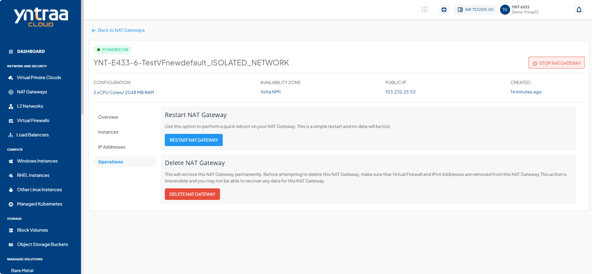

# Restarting and Deleting a NAT Gateway

Restarting a NAT gateway refreshes its services to help resolve temporary issues and apply operational changes without modifying its configuration. Deleting a NAT gateway permanently removes it when it is no longer required, helping keep the network environment organized and eliminating unused resources.

You can perform the following operations:

- **Restart NAT Gateway -** Use this option to perform a quick reboot on your Instance. This is a simple restart, and no data will be lost.
  
:::warning
This action is irreversible and you will not be able to recover any data for this NAT Gateway.
 :::
 
- **Delete NAT Gateway -** This permanently removes the NAT gateway. Before attempting to delete this NAT Gateway, make sure that Virtual Firewall and IPv4 Addresses are removed from this NAT Gateway. 
	

