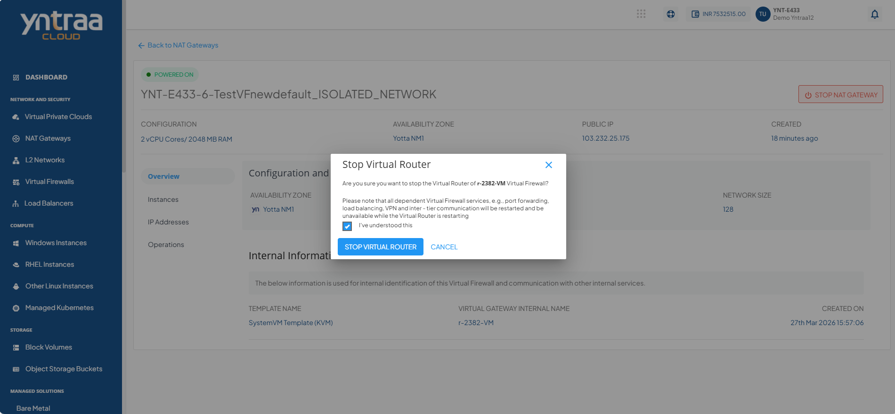
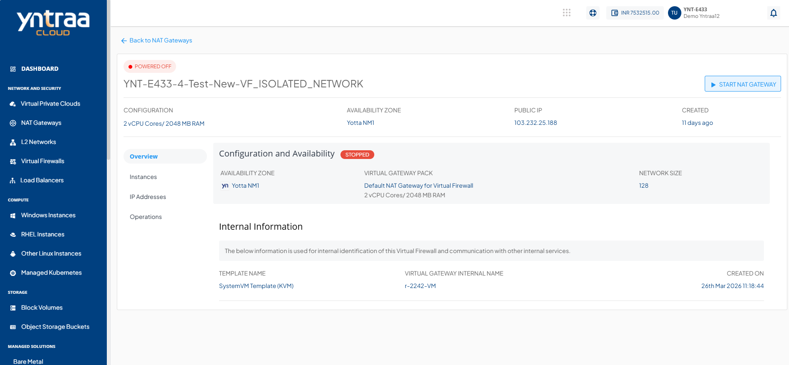
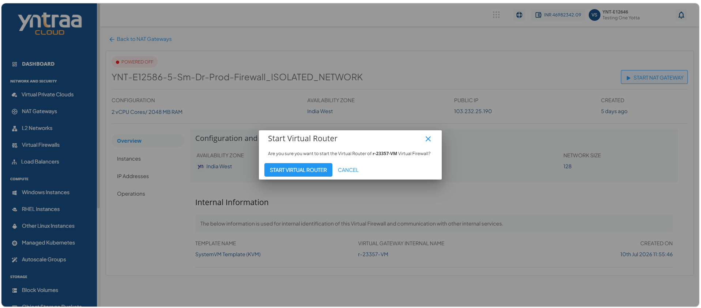
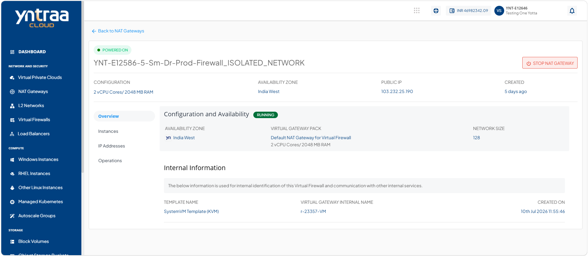

# Viewing NAT Gateways Details

The NAT gateway details helps you view the current configuration and operational status of the gateway. Reviewing the overview enables you to validate the gateway's settings, monitor its performance, and manage it more effectively.

1. Navigate to **Network and Security > NAT Gateways**. The following screen appears:
     
2. Click a NAT Gateway name from the list. The Overview tab opens automatically. The following screen appears with the details:
    

- **Configuration and Availability:** This displays the NAT Gateways configuration details to help verify its current configuration and operational state.

      - The instance's status **Running** or **Stopped**.
      - Availability Zone
      - Virtual Gateway Pack
      - Network Size
      
- **Internal Information:** This section displays the information used for internal identification of the NAT Gateway and communication with other internal services.
	- Template Name
	- Virtual Gateway Internal Name
	- Created On
	  
# Starting and Stopping a NAT Gateway

You can control a NAT gateway’s operational state by starting or stopping the virtual router that provides NAT services. Start the virtual router to enable network address translation, route traffic between connected networks, and restore network connectivity. Stop the virtual router when you perform maintenance, apply configuration changes, or temporarily disable NAT services to conserve resources and troubleshoot network issues.

To Start and Stop a NAT Gateway, follow these steps: 

1. Navigate to **Network and Security > NAT Gateways**. The following screen appears:
     
2. Click a NAT Gateway name from the list. The Overview tab opens automatically. The following screen appears:
    
3. Click the **Stop NAT Gateway** button. The following screen appears: 
   
4. Select the **I have understood this** option, and click the **Stop Virtual Router** button. The following screen appears: 
   
5. Click the **Start NAT Gateway** button. The following screen appears: 
   
6. Click the **Start Virtual Router** button. The following screen appears: 
   

