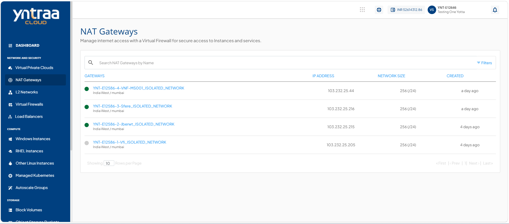

# Viewing NAT Gateway Instances

A NAT Gateway enables private instances in a virtual network to access the internet without assigning them public IP addresses. Viewing a NAT Gateway instance helps you verify its configuration and status, ensuring secure and reliable outbound internet connectivity.

To view all the instances associated with NAT Gateway, follow these steps:

1. Navigate to **Network and Security > NAT Gateways**. The following screen appears:
  
2. Click the instance name from the list. The following screen appears: 

3. Click **Instances**. The following screen appears:

