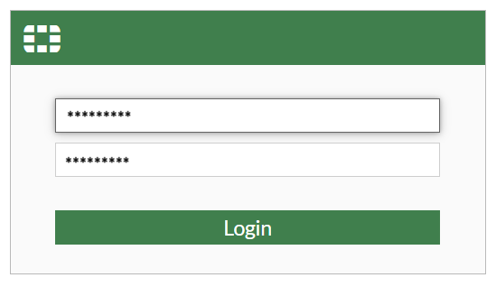

# About Virtual Firewall Instances

Virtual Firewall Instances provide the ability to implement firewall services using a Virtualized Network Function (VNF) framework within your network environment. These instances are designed to support multiple VLAN configurations, enable the use of public IPv4 addresses, and offer automated service deployment.

The service falls under the Virtual Firewall and is built using our integration framework using [FortiGate VM](https://www.fortinet.com/products/private-cloud-security/fortigate-virtual-appliances) for powering the appliance.

The following are the important features:

- Multi-VLAN support and multiple Public IPv4 addresses for Virtual Firewalls.
- Automated service activation, reducing the need for manual intervention.
- Subscribers can create, configure, and manage Virtual Firewalls with enhanced network interface controls, restore points, etc.
- Limitations include predefined WAN-LAN configurations and one firewall per gateway.
  
To access all virtual firewalls created in your account, follow these steps: 
  
Navigate to **Network and Security > Virtual Firewalls**. The following screen appears: 

This section comprises of the following sub-sections:

  
- [Viewing Virtual Firewall Details](#viewing-virtual-firewall-details)
- [Launching VF Web Based Console ](#launching-vf-web-based-console)
- [Stopping and Starting Virtual Firewall Instance](#stopping-and-starting-virtual-firewall-instance)

## Viewing Virtual Firewall Details

Viewing virtual firewall details lets you access the configuration, status, and key information of a virtual firewall. View the firewall details to verify its settings, monitor its configuration, and ensure it is protecting network traffic as intended.

To view a virtual firewall details, follow these steps: 

1. Navigate to **Network and Security > Virtual Firewalls**. The following screen appears with the details: 

    - Virtual Firewall Name
    - Public IPv4
    - Instances
    - Created

2. Click the instance name. The following screen appears with the available sections and their corresponding operations.

   
- [Viewing Firewall Instance Details](/docs/Subscribers/NetworkandSecurity/VirtualFirewall/Viewing%20Firewall%20Instance%20Details)
- [Viewing Graphs and Utilisation](/docs/Subscribers/NetworkandSecurity/VirtualFirewall/ViewingGraphsandUtilisation)
- [Configuring Alerts](/docs/Subscribers/NetworkandSecurity/VirtualFirewall/ConfiguringAlerts)
- [Managing Volume](/docs/Subscribers/NetworkandSecurity/VirtualFirewall/ManagingVolume)
- [Networking Management](/docs/Subscribers/NetworkandSecurity/VirtualFirewall/NetworkingManagement)
- [Restore Points](/docs/Subscribers/NetworkandSecurity/VirtualFirewall/Snapshots)
- [Reconfiguring Virtual Firewall](/docs/Subscribers/NetworkandSecurity/VirtualFirewall/ReconfiguringVirtualFirewall)
- [Operations](/docs/Subscribers/NetworkandSecurity/VirtualFirewall/Operations)
  

On the top-right corner, the following options are available: 

- **Launch Console**
- Stop Instance and Start Instance
  
## Launching VF Web Based Console 

The virtual firewall console provides a secure, web‑based interface to manage and monitor your firewall. It allows administrators or you to configure policies, review system activity, and ensure network protection through a centralized dashboard. 

1. Navigate to **Network and Security > Virtual Firewalls**. The following screen appears with the details: 

2. Click the instance name. The following screen appears:
 
3. Click the **Launch Console** button. The following screen appears where you provide the required details:  

    - Username 
    - Password
4. Click the **Login** button. The FortiGate web-based management interface opens, allowing you to begin firewall configuration.
   
## Stopping and Starting Virtual Firewall Instance

Administrators stop and start the virtual firewall instance to apply updates, perform maintenance, or optimize resources. This action suspends firewall operations without deleting configurations and quickly restores protection when restarted.

To start and stop the virtual firewall instance, follow these steps:  

1. Navigate to **Network and Security > Virtual Firewalls**. The following screen appears with the details: 

 2. Click the instance name. The following screen appears:
 
3. Click the Stop Instance button. The following screen appears: 

4. Click the **Yes** button. The following screen appears:

5. Click the Start Instance. The following screen appears: 

6. Click the **Yes** button. The following screen appears:
 

