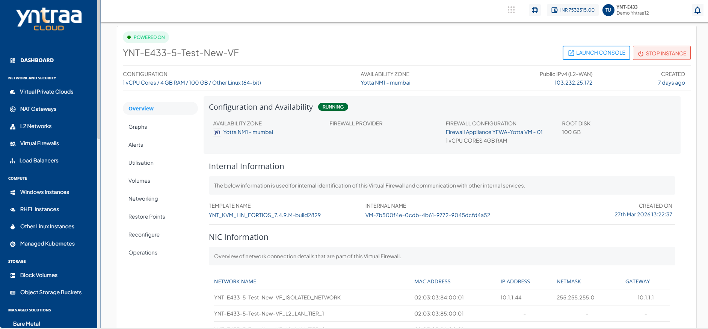

# Accessing the VFI Control Panel

The Virtual Firewall Service is delivered as an integration using OS images pre-loaded with Yntraa Software Firewall.

Navigate to **Virtual Firewalls** and access the **Overview** tab. The following screen appears:

Click the **Launch Console** button to access the Virtual Firewall Control Panel.
