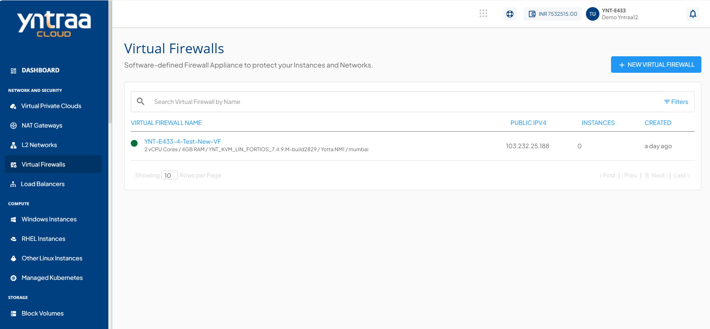
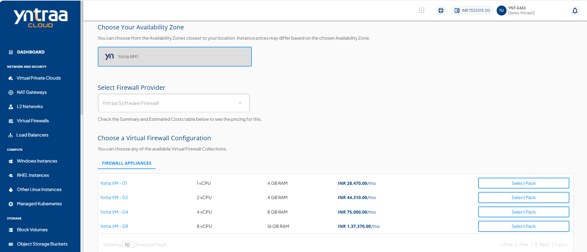
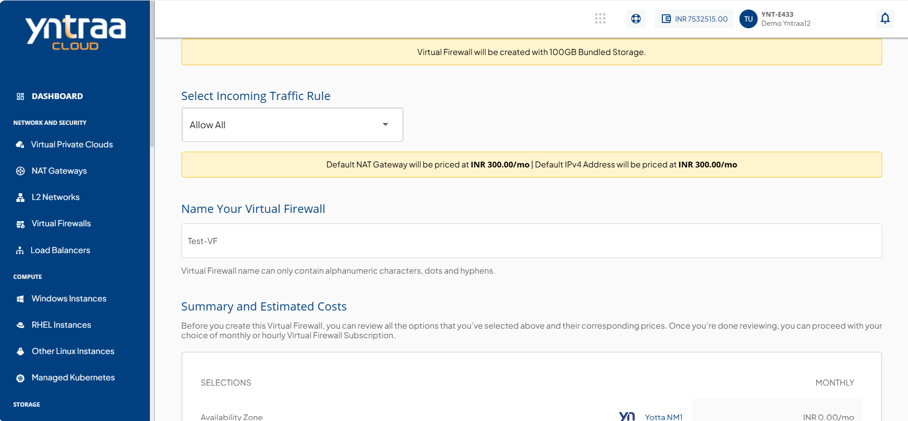
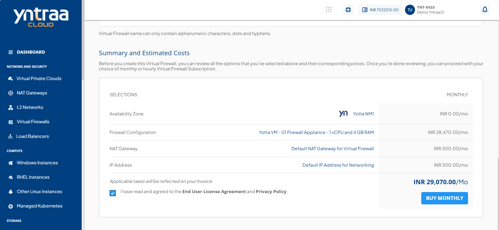
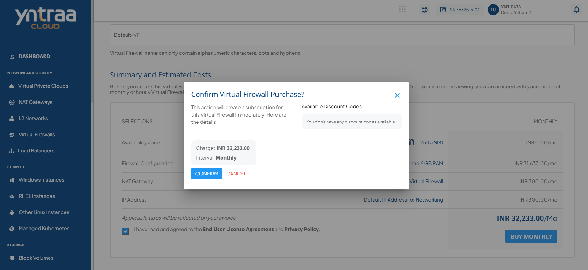

# Creating a Virtual Firewall

 To create a Virtual Firewall, follow these steps:
 
 1. In the main menu, navigate to the **Network and Security > Virtual Firewalls** tab. 
 2. To activate the service, click the **+ NEW VIRTUAL FIREWALL** button.
	:::note
	 Yntraa currently only supports one Virtual Firewall per Availability Zone.
	 :::
	
3. Select your Availability Zone.
4. Select the Virtual Firewall provider from the dropdown menu. 
	
5. Choose the virtual firewall configuration from the list.
6. Select the Incoming Traffic Rule (Allow All, Deny All, Allow Custom) and give a name to your Virtual Firewall.
	:::note
		**Allow All-** Grants access to all protocols and services without restriction when selected.
		**Deny All-**  Restrict access to all protocols and services when selected.
		**Allow Custom-** Enable the user to specify the Source from which traffic should be allowed.
	:::
	
7. Review the summary and estimated costs for monthly.
   
8.  Select **BUY MONTHLY** based on your requirement, and then click the **Confirm** button.
   

