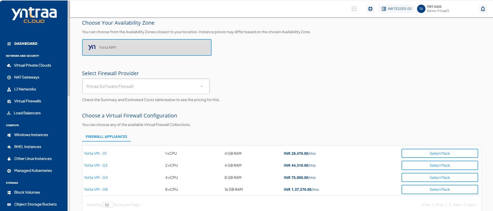
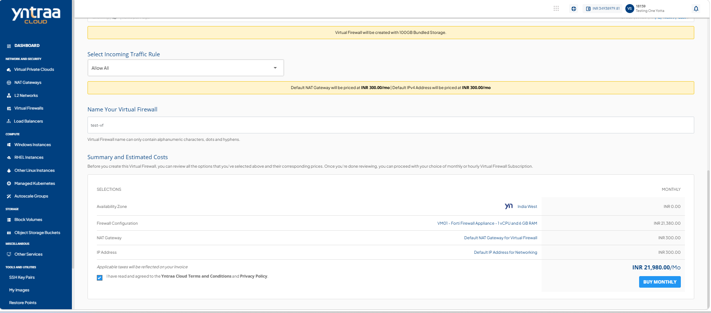
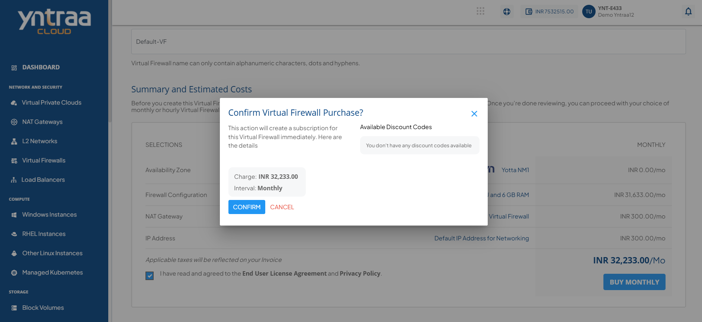

# Creating a Virtual Firewall

Creating a virtual firewall allows you to deploy a firewall instance to secure and manage network traffic for your cloud resources. It helps protect your environment by applying the required security configuration and traffic control policies during deployment.

 To create a virtual firewall, follow these steps:
 
1. Navigate to the **Network and Security > Virtual Firewalls**. The following screen appears: 
   
2. Click **New Virtual Firewall**. The following screen appears: 
   
   
3. Select your availability zone.
4. Select the virtual firewall provider from the dropdown.
5. Choose the virtual firewall configuration from the list.
6. Select the Incoming Traffic Rule (Allow All, Deny All, or Allow Custom) and give a name to your virtual firewall.	
	:::note
		**Allow All:** Grants access to all protocols and services without restriction when selected.  
		**Deny All:**  Restrict access to all protocols and services when selected.  
		**Allow Custom:** Enable you to specify the source from which traffic should be allowed.
	:::
7.  Select the **I have read and agreed to the End User License Agreement and Privacy Policy** option, and click the **Buy Monthly** button. The following screen appears: 
   
8. Click the **Confirm** button.

