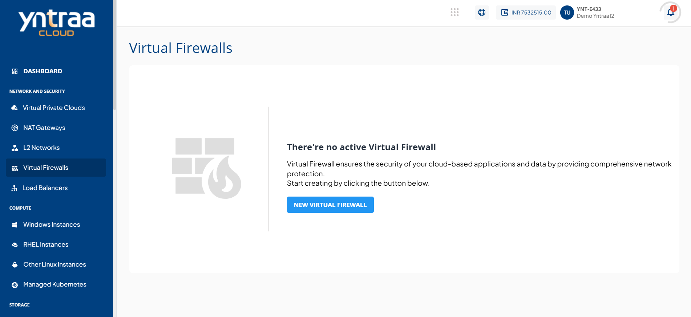
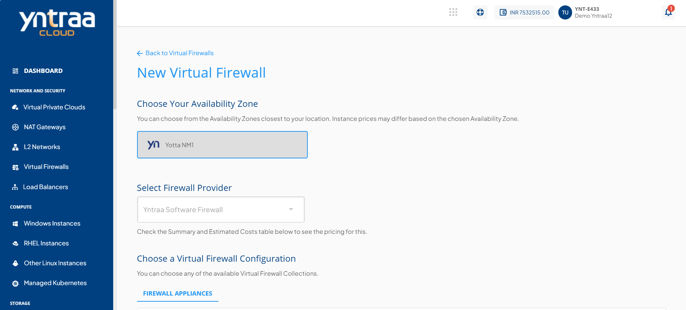
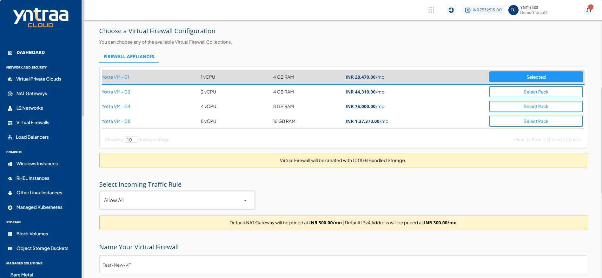
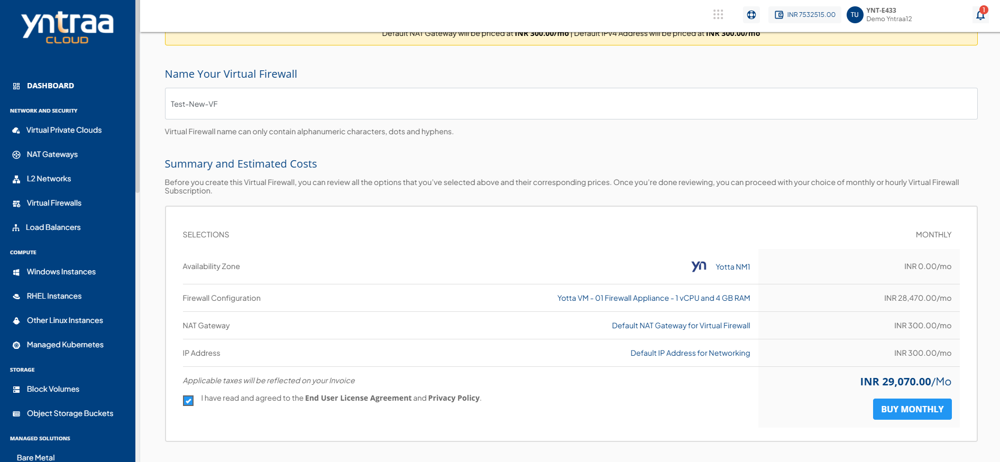
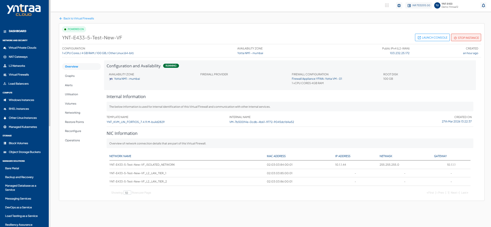
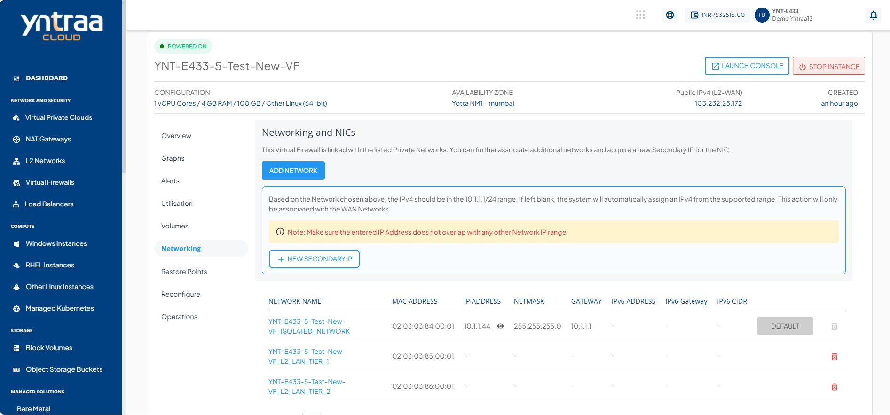

# Deploying VNF and VM Within VNF

This section provides a step-by-step guide for deploying a Virtual Network Function (VNF)—specifically a virtual firewall—and provisioning a Virtual Machine (VM) behind it using the Yntraa Cloud. This setup allows users to route VM traffic through the VNF, enabling secure and segmented network environments. 

It is ideal for use cases requiring:
- Advanced traffic control
- Isolation
- Policy enforcement
  
The following are the high level steps required for deploying VNF and VM within VNF:
  
1. [Creating The New Virtual Firewall](#creating-the-new-virtual-firewall)
2. [Configuration Options For Virtual Firewall](#configuration-options-for-virtual-firewall)
3. [Deploying Virtual Firewall](#deploying-virtual-firewall)
4. [Viewing Firewall Details](#viewing-firewall-details)
5. [Viewing LAN and WAN Tiers](#viewing-lan-and-wan-tiers)
  
## Creating the New Virtual Firewall

To enhance your network security within the Yntraa Cloud, you can deploy a virtual firewall that manages and filters traffic between your virtual resources. This firewall acts as a protective layer, enforcing rules and access controls based on your configuration.

The following steps guide you through the process of navigating to the correct section, initiating the firewall creation, and completing its configuration:

1. In the left-hand menu, go to **Virtual Firewalls** under the **NETWORK AND SECURITY** section.
2. On the Virtual Firewalls page, click the **NEW VIRTUAL FIREWALL** button.
3. Follow the prompts to configure and create the virtual firewall.

### Configuration Options for Virtual Firewall

To configure the new virtual firewall in the Yntraa Cloud, you must define a few key options such as the zone, compute size, firewall provider, and access rules. These settings ensure the firewall is tailored to your deployment needs.

The following steps guide you through selecting configuration options like availability zone, compute configuration, firewall provider, and traffic rules before finalizing the setup:

1. **Choose Availability Zone**: Select your preferred availability zone based on your location and network needs.
2. **Choose Compute Configuration**: Pick a compute option that matches your performance requirements.
3. **Select Firewall Provider**: Choose a firewall provider from the dropdown (for example, **pfsense Plan**)    
4. **Set Incoming Traffic Rule**: Select the desired ACL rule, such as **Allow All**, from the dropdown menu.
5. **Name Your Virtual Firewall**: Enter a name for your virtual firewall. Use only letters, numbers, hyphens, or dots.
6. **Review Estimated Costs**: Check the summary and pricing before proceeding.

### Deploying Virtual Firewall

After completing the configuration and deployment steps, the newly created virtual firewall appears in the Virtual Firewalls section. This interface provides a summary of key details such as the firewall's name, compute configuration, provider, zone, public IP address, instance count, and deployment status.

The following steps guide you through accessing the Virtual Firewalls section and verifying that your newly deployed firewall is active and correctly configured:

1. Navigate to the **Virtual Firewalls** section from the left-hand menu. 
2. See a list of deployed virtual firewalls. 
3. The newly created firewall appears with:
    - Name
    - vCPU and RAM details
    - Firewall provider
    - Availability zone
    - Public IPv4 address
    - Creation time 
A green **POWERED ON** icon confirms that the firewall is active and running.

### Viewing Firewall Details

To check the configuration and operational status of your deployed virtual firewall, you can access its detailed view in the Yntraa Cloud. This section provides essential system specifications, network settings, and real-time status indicators.

The following steps guide you through viewing the full details of your virtual firewall instance, including public IP, provider, and availability zone:

1. From the Yntraa Cloud:
    - Navigate to the **Virtual Firewalls** section in the left-hand menu.
    - Locate and click on the firewall instance to open its configuration page.
2. On the firewall **Overview** page, you can view the following key details:
    - **Configuration**: vCPU, RAM, and OS details.
    - **Availability Zone**
    - **Firewall Provider**
    - **Public IPv4 (L2-WAN)**: Note down the public IP which is used for SSH access.
    - **Status**: Ensure the firewall is in **POWERED ON** state.

### Viewing LAN and WAN Tiers

To understand the network configuration, navigate to the **NETWORK AND SECURITY** section where you can view both **LAN** and **WAN** tiers. This helps identify how instances are connected and how traffic flows between internal and external networks.

The following steps guide you through accessing the Networking section and identifying the WAN and LAN tiers connected to your firewall:

1. Open the Firewall Instance: Navigate to the **Virtual Firewalls** section and open the required firewall instance.
2. Click on the **Networking** option: In the left-side menu, under the opened firewall instance, click on the **Networking** tab. This section displays all networks linked to the selected firewall.
3. Identify the **WAN Tier**: Look for the network labeled as ISOLATED_NETWORK. This is the WAN Tier, typically connected to external/public networks.
4. Identify the **LAN Tiers**: LAN tiers used for internal communications. 
 
