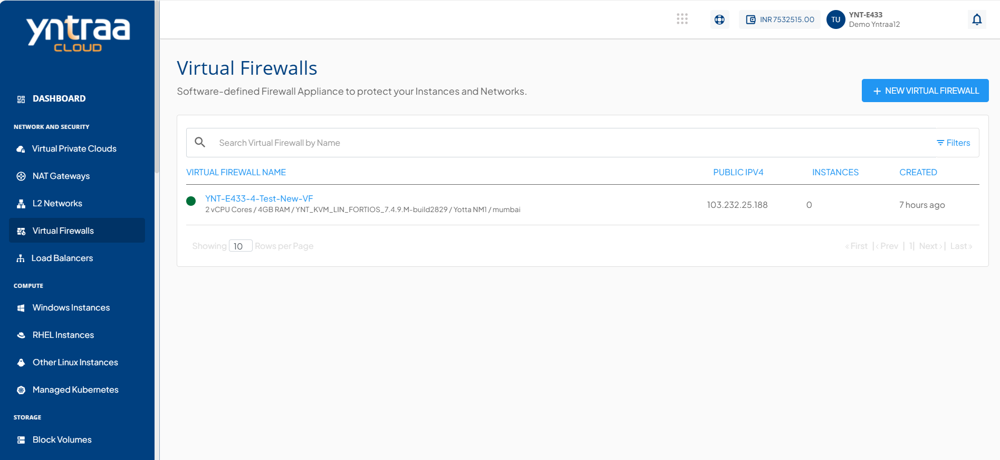

# About Virtual Firewall Instances

Firewall Instances provide the ability to implement firewall services using a Virtualized Network Function (VNF) framework within your network environment. These instances are designed to support multiple VLAN configurations, enable the use of public IPv4 addresses, and offer automated service deployment.

The Service falls under the **Virtual Firewall** and is built using our integration framework using [FortiGate VM](https://www.fortinet.com/products/private-cloud-security/fortigate-virtual-appliances) for powering the appliance.

The following are the important features:

- Multi-VLAN support and multiple Public IPv4 addresses for Virtual Firewalls.
- Automated service activation, reducing the need for manual intervention.
- Subscribers can create, configure, and manage Virtual Firewalls with enhanced network interface controls, restore points, etc.
- Limitations include predefined WAN-LAN configurations and one firewall per gateway.

All virtual firewalls created in an account can be accessed from navigating to the **Network and Security > Virtual Firewalls** tab.

