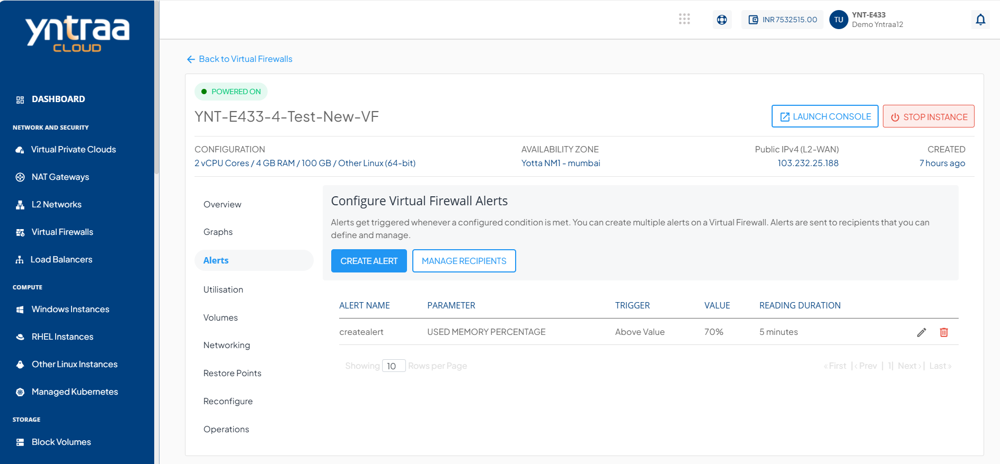
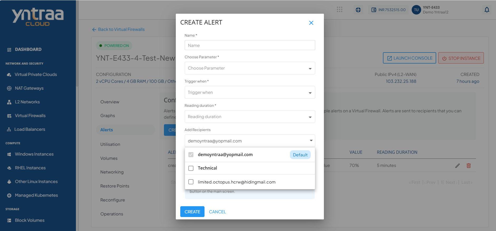
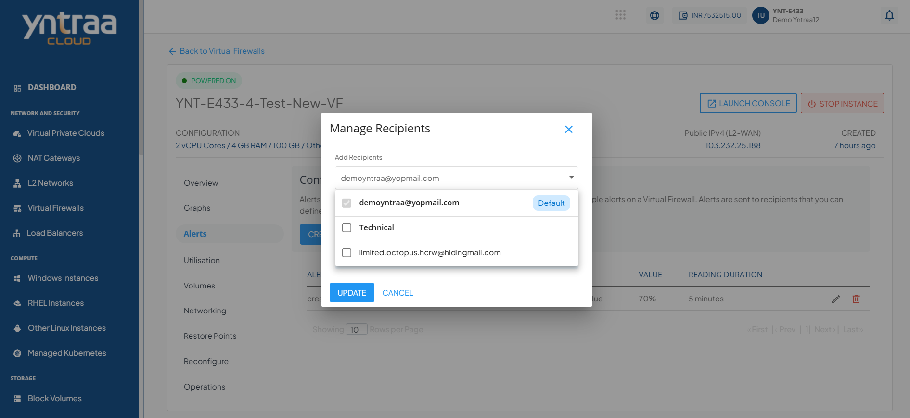

# Configuring Alerts

To view the configured alerts or configure new ones, navigate to the Virtual Firewall and access the **Alerts** tab.

Alerts get triggered whenever a configured condition is met. You can create multiple alerts on an instance. Alerts are sent to recipients that you can define and manage.

You can configure alerts for instances running on the Yntraa Cloud. You can define alerts for Instances and configure the email recipients for these alerts using a straightforward and easy-to-use interface.

## Instance Alerts

The Alerts tab lists all the alerts already configured for that particular Virtual Firewall. In addition, it shows the following details:

- Alert Name
- Parameter
- Trigger
- Value
- Reading Duration

## Adding an Alert

To create or add alerts, click the **CREATE ALERT** button. The following window appears:

The various fields of the Create Alert screen are as follows:
- **Name** - You can define the name for your alert.
- **Choose Parameter** - This option will allow you to define what parameter needs to be monitored to trigger the alert email. Yntraa cloud supports CPU, RAM, NETWORK INPUT, NETWORK OUTPUT parameters.
- **Trigger when** - This set of options lets you define whether to trigger above or below a custom value.
- **Reading duration** - This option lets you define the breach window, that is, the duration for which the breach must be consistent to trigger the alert email.
- **Add Recipients** - Email IDs can be added here, or also you can add them by using the manage recipients.

## Managing Recipients

This section list and display all the email IDs already configured for the alerts. You can delete the existing email IDs and add other email IDs by following these steps:

1. Click on the **MANAGE RECIPIENTS** button.
2. Use the dropdown menu to select available recipients.
3. Click the **UPDATE** button to save the recipient list.

:::note
All configured recipients receive all setup alerts. If no email ID is configured or added, no email is sent for the already configured alerts.
:::

