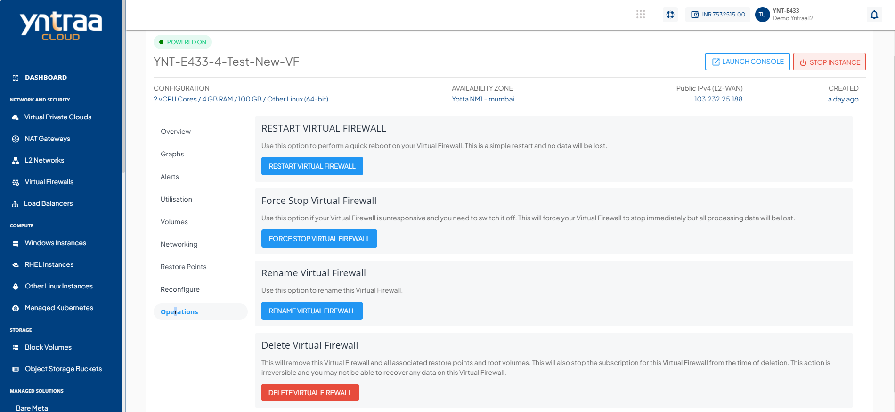

# Operations

To view all available Instance operations, navigate to the **Network and security**, select a **Virtual Firewall** and access the **Operations** tab.

Yntraa Cloud provides the options to perform the following operations on Virtual Firewall:
	
- **RESTART VIRTUAL FIREWALL** - Perform a quick reboot on your Instance. This is a simple restart, and no data will be lost.
- **FORCE STOP VIRTUAL FIREWALL** - Force stop a running or a hung Virtual Firewall.
- **RENAME VIRTUAL FIREWALL** - Rename the Virtual Firewall.
- **DELETE VIRTUAL FIREWALL** - Delete the Virtual Firewall.
  :::warning
  Deleting a Virtual Firewall removes it entirely along with its subscription and is a non-reversible action.
  :::

