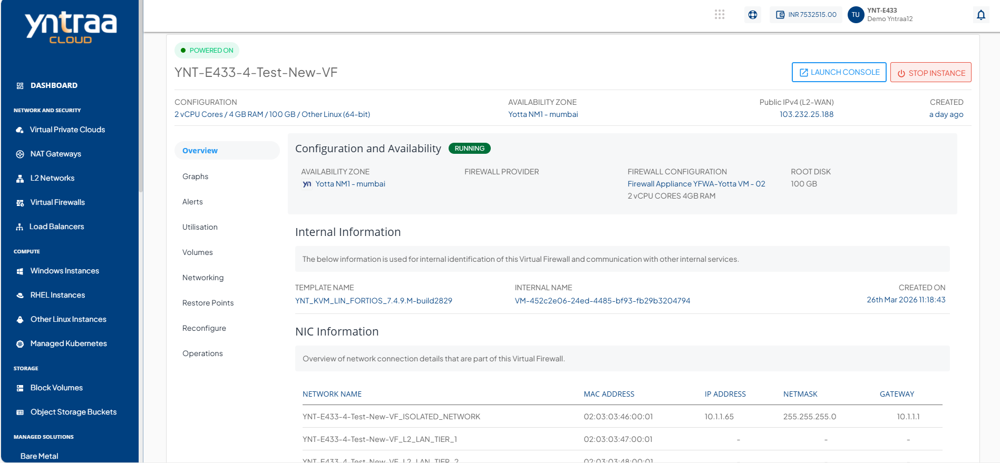

# Overview

To view the below details, navigate to the [Firewall Instance](AboutFirewallInstances.md), select the Virtual Firewall and access the **Overview** tab.

- [Configuration and Availability](#configuration-and-availability)
- [Internal Information](#internal-information)
- [NIC Information](#nic-information)

---

## Configuration and Availability

This section displays the instance's status, **RUNNING**, is displayed in  **green**, whereas **STOPPED** is displayed in red out and the information about the networking zone.
## Internal Information

This section displays the information used for internal identification of this instance and communication with other internal services.

- Template Name
- Internal Name
- Created On
## NIC Information

This section displays the following information:

- Network Name
- MAC Address
- IP Address
- Netmask
- Gateway

