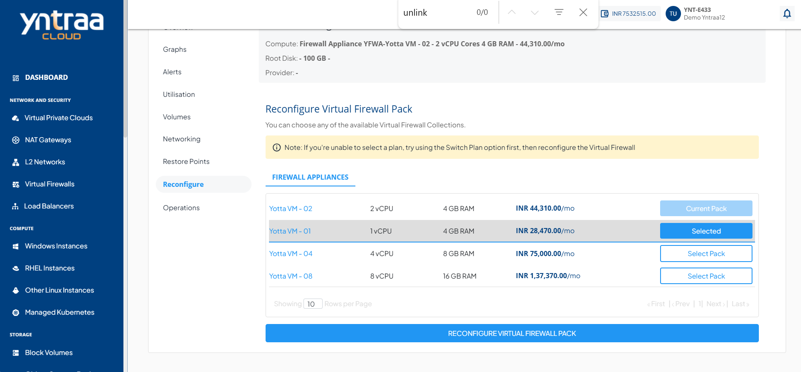

# Reconfiguring Virtual Firewall

To reconfigure the existing virtual firewall pack, navigate to the **Network and Security** section and select a **Virtual Firewall** and access the **Reconfigure** tab.

Select the **Firewall Appliances**, then click the **Reconfigure Virtual Firewall Pack** button.

:::note
Your Virtual Firewall needs to be powered off in order to be reconfigured.
:::
The Virtual Firewall on Yntraa Cloud can be reconfigured in the following ways:

- The Billing interval changed monthly.
- Choosing and applying a new Compute pack.

:::note
You can only reconfigure with the same billing interval.
:::

