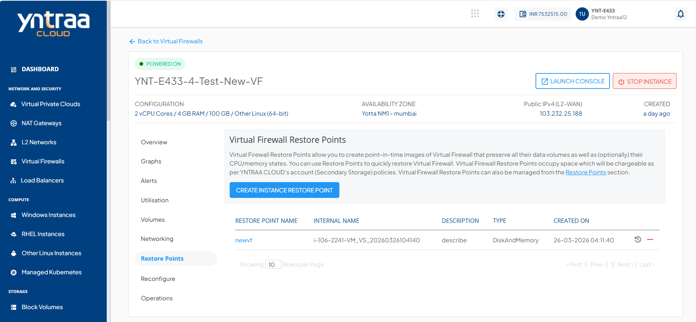
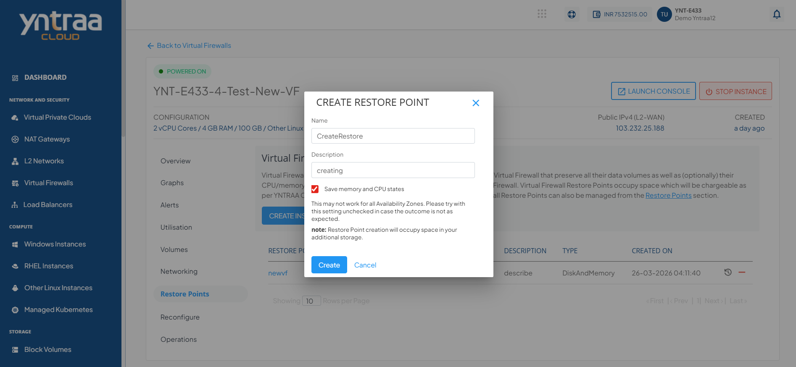

# Restore Points

To view all the restore points taken for Instance, navigate to the **Network and Security**, select a **Virtual Firewall** and access the **Restore Points** tab.

Instance Restore Point allow you to create point-in-time images of instances that preserve all their data volume as well as (optionally) their CPU/memory states. You can use Restore Point to quickly restore Instances.

The Restore Point section shows all the Virtual Firewall Restore Point, which can be used to revert the Virtual Firewall to an earlier state.

A Restore Point lists the following details:
- Restore Point Name
- Internal Name
- Description
- Type
- Created On

The following quick options are available:
- **Restore from Instance Restore Point**
- **Delete Restore Point**
  
## Creating a Restore Point

To create a Restore Point, follow these steps:

1. Click the **CREATE RESTORE POINT** button. The following window appears. 
2. Enter the **Name** and **Description** of the Restore Point.
3. Click the **Create** button.

