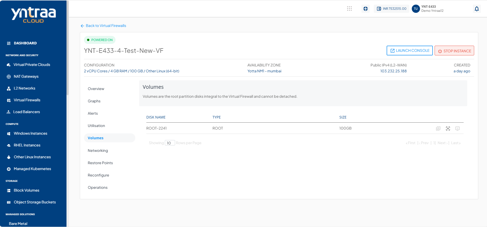

# Volume Management

To view the disks attached to this Instance, navigate to the **Network and Security**, select a **Virtual Firewall** and access the **Volumes** tab.

Virtual Firewall on Yntraa work with the [Block Volumes Service](/docs/Subscribers/NetworkandSecurity/VirtualFirewall/FirewallInstances/VolumeManagement) and let you carry out basic disk operations.

The following are the quick actions:

- **Create Image** - Click on it, and enter the image name and description.
- **CREATE RESTORE POINT** - Click on it, to create a Volume restore point.
- **Detach/attach** - This will attach/detach the volume to/from the instance.

:::note
Volume-level operations are available as part of the Block Volumes service.
:::

