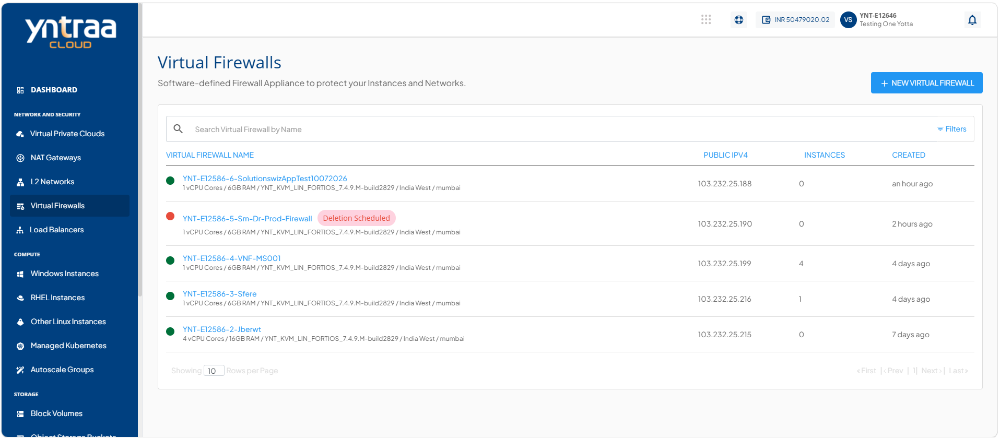
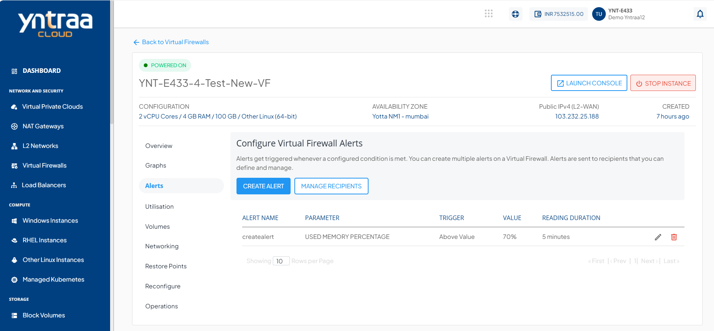
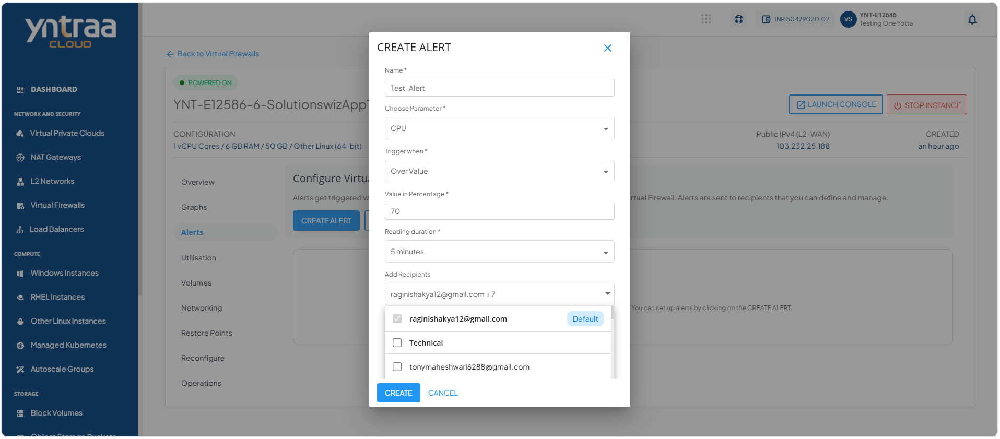
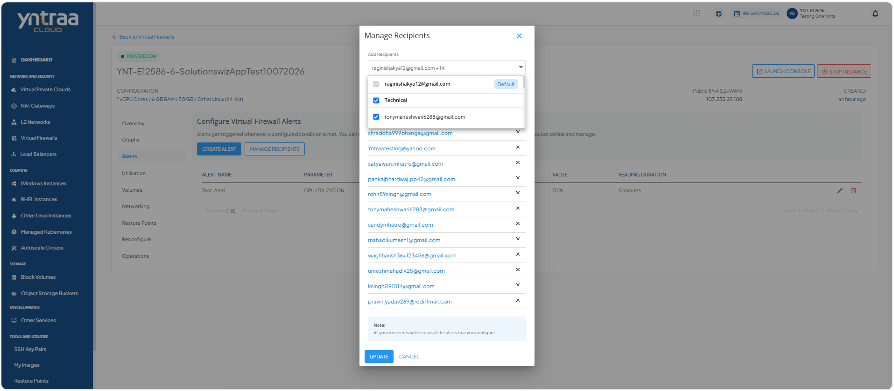

# Managing Alerts

Alerts help you monitor the health and performance of your virtual firewall by notifying you when predefined conditions are met. You can create, view, modify, or delete alerts and manage email recipients to ensure the appropriate users receive notifications. Managing alerts enables you to proactively monitor your virtual firewall and respond promptly to important events.

This section comprises of the following sub-sections:

  
- [Configuring Alerts](#configuring-alerts)
- [Managing Recipients](#managing-recipients)

## Configuring Alerts

Create an alert to monitor a specific virtual firewall metric and receive an email notification when the configured threshold is reached. While creating an alert, specify a name, select the parameter to monitor, define the trigger condition and reading duration, and add the email recipients for notifications.

To configure alerts, follow these steps: 

1. Navigate to **Network and Security > Virtual Firewalls**. The following screen appears: 

2. Click on your created virtual firewall from the list. The following screen appears:
 
3. Click **Alerts**. The following screen appears:

4. Click the **Create Alert** button. The following screen appears where you provide the required details: 

    - **Name** - You can define the name for your alert.
    - **Choose Parameter** - This option allows you to define what parameter needs to be monitored to trigger the alert email. Yntraa Cloud supports CPU, RAM, NETWORK INPUT, and NETWORK OUTPUT parameters.
    - **Trigger when** - This set of options lets you define whether to trigger above or below a custom value.
    - **Reading duration** - This option lets you define the breach window, that is, the duration for which the breach must be consistent to trigger the alert email.
    - **Add Recipients** - You can add the emails of the recipients.

## Managing Recipients

The Manage Recipients feature lets you control who receives firewall alerts. It displays all configured or added email IDs and provides options to remove outdated addresses or add new ones. 

To remove existing email IDs and add other email IDs, follow these steps:

1. Navigate to **Network and Security > Virtual Firewalls**. The following screen appears: 

2. Click on your created virtual firewall from the list. The following screen appears:
 
3. Click **Alerts**. The following screen appears:

4. Click the **Manage Recipients** button. The following screen appears:
 
5. Click the dropdown. From the list, you can perform the following:
    - **Add recipients**: Select the email IDs that you want to add.
    - **Remove recipients**: Clear the selection for the email IDs that you want to remove.
6. Click the **Update** button to save the changes. 

