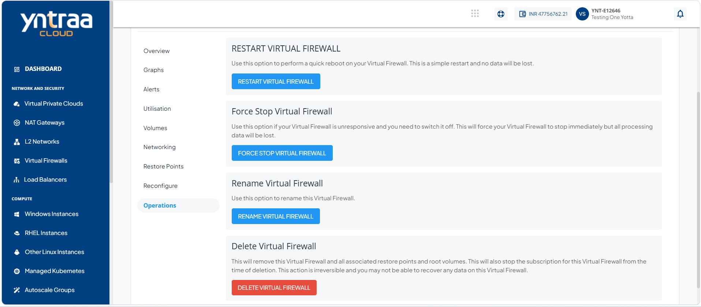
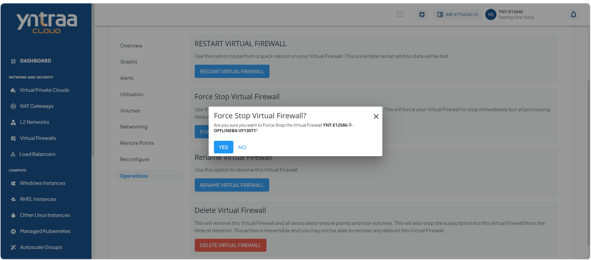
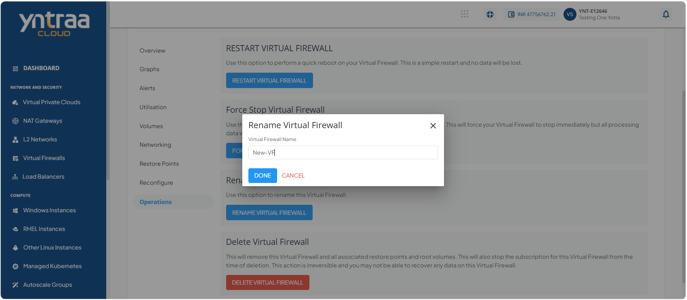
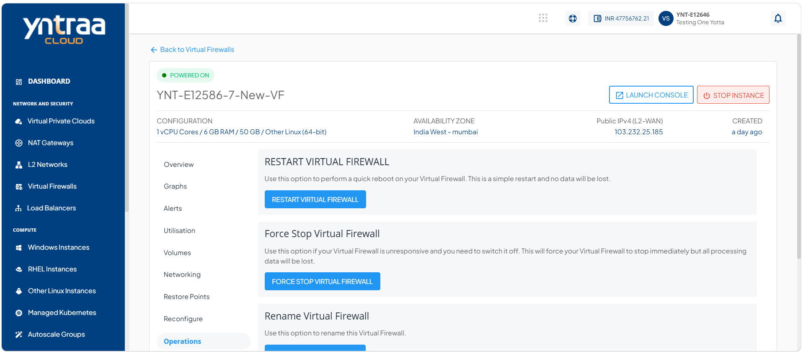
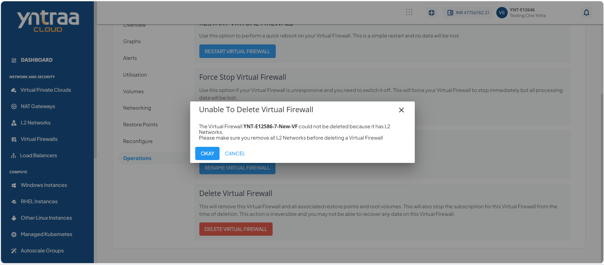
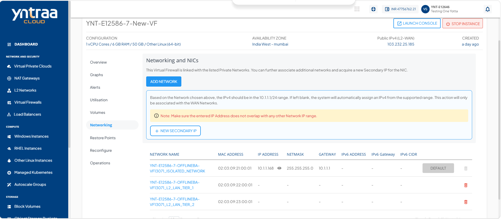
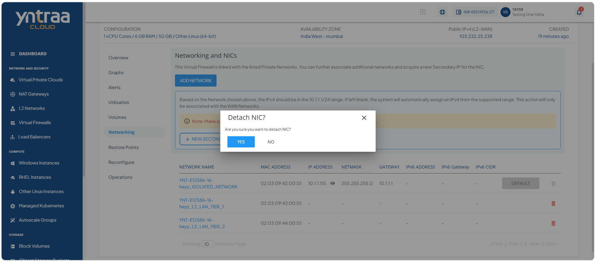
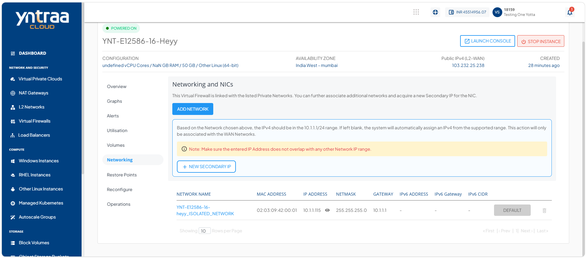
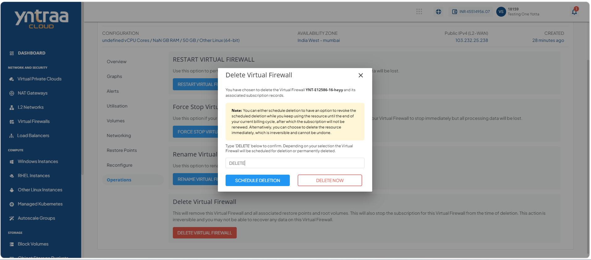

# Managing Firewall Instance Operations

Managing virtual firewall operations allows you to perform essential administrative tasks on your Virtual Firewall, such as restarting, force stopping, renaming, and deleting it. These operations help you maintain the firewall, manage its lifecycle, and ensure efficient administration of your cloud resources.

This section comprises of the following sub-sections:

  
- [Restarting a Virtual Firewall](#restarting-a-virtual-firewall)
- [Force Stop a Virtual Firewall](#force-stop-a-virtual-firewall)
- [Renaming a Virtual Firewall](#renaming-a-virtual-firewall)
- [Deleting a Virtual Firewall](#deleting-a-virtual-firewall)

## Restarting a Virtual Firewall

Restart a Virtual Firewall to refresh its services and apply recent configuration changes. Use this option to restore normal firewall operations or resolve temporary service or connectivity issues.

To restart a virtual firewall, follow these steps: 

1. Navigate to **Network and security > Virtual Firewalls**. The following screen appears: 
   
2. Click on your created virtual firewall name from the list. The following screen appears: 
   
3. Click **Operations**. The following screen appears:
    
4. Click the **Restart Virtual Firewall** button. The following screen appears: 
   
5. Click the **Yes** button.

## Force Stop a Virtual Firewall

Force stop a Virtual Firewall to immediately terminate its operations when it becomes unresponsive or cannot be stopped through the normal shutdown process. Use this option to recover from critical issues, regain control of the firewall, or prepare it for troubleshooting or restart.

To force stop a virtual firewall, follow these steps: 

1. Navigate to **Network and security > Virtual Firewalls**. The following screen appears: 
   
2. Click on your created virtual firewall name from the list. The following screen appears: 
   
3. Click **Operations**. The following screen appears:
    
4. Click the **Force Stop Virtual Firewall** button. The following screen appears: 
   
5. Click the **Yes** button.

## Renaming a Virtual Firewall

Rename a Virtual Firewall to assign a more meaningful or updated name for easier identification and management. Use this option to keep resource names organized and aligned with your naming conventions.

To rename a virtual firewall, follow these steps: 

1. Navigate to **Network and security > Virtual Firewalls**. The following screen appears: 
   
2. Click on your created virtual firewall name from the list. The following screen appears: 
   
3. Click **Operations**. The following screen appears:
    
4. Click the **Rename Virtual Firewall** button. The following screen appears where you can change or update the name of virtual firewall in Virtual Firewall Name.
   
5. Click the **Done** button. The following screen appears: 
   

## Deleting a Virtual Firewall

Delete a Virtual Firewall to permanently remove it when it is no longer required. Use this option to free up associated resources and maintain an organized cloud environment.
:::note
You can schedule deletion to continue using the resource until the end of the current billing cycle and cancel the deletion before it takes effect. Alternatively, you can delete the resource immediately, which is permanent and cannot be undone.
:::

To delete a virtual firewall, follow these steps: 

1. Navigate to **Network and security > Virtual Firewalls**. The following screen appears: 
   
2. Click on your created virtual firewall name from the list. The following screen appears: 
   
3. Click **Operations**. The following screen appears:
    
4. Click the **Delete Virtual Firewall** button. The following screen appears:
   
5. Click **Cancel**.
    :::note
    Before deleting a virtual firewall, ensure that all associated L2 networks are detached.
    :::
6. Navigate to **Network and Security > Virtual Firewalls**. The following screen appears:
   
7. Click on your created virtual firewall name from the list. The following screen appears: 
   
8. Click **Networking**. The following screen appears: 
   
9. Click the **Detach NIC** icon (highlighted in red) next to the required private network to detach the network interface card(s) (NIC) from the virtual firewall. The following screen appears: 
   
10. Click the **Yes** button. The following screen appears:
   
11. Click **Operations**. The following screen appears: 
    
12. Click the **Delete Virtual Firewall** button. The following screen appears: 
   
13. Enter **DELETE** and click the **Delete Now** button. The virtual firewall instance is deleted. 
14. Enter **DELETE** and click the **Schedule Deletion** button. 

