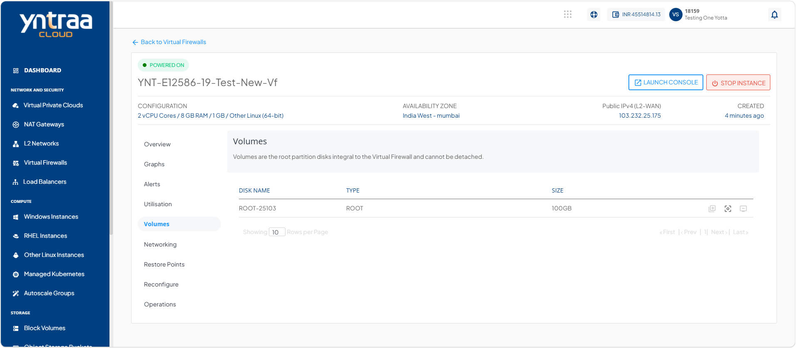
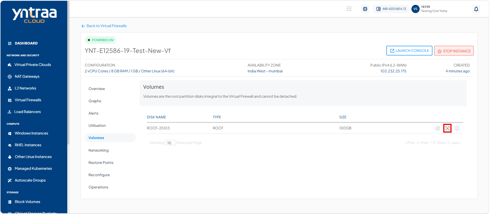
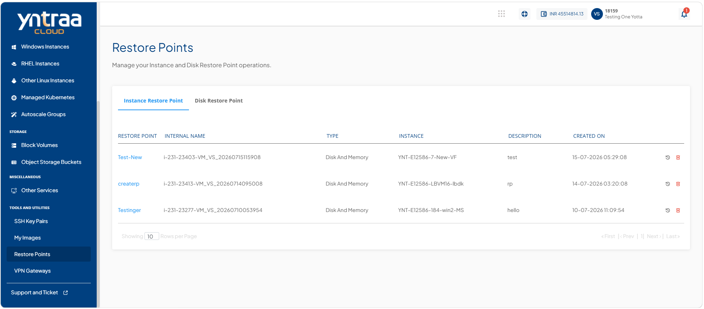
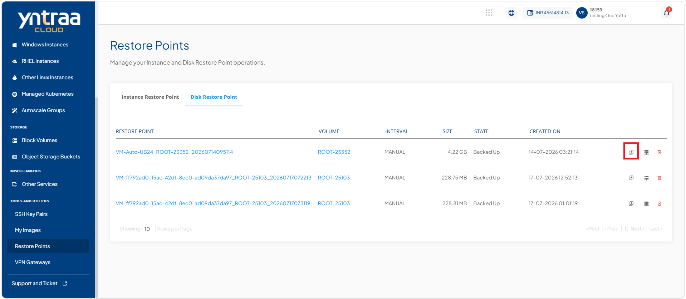
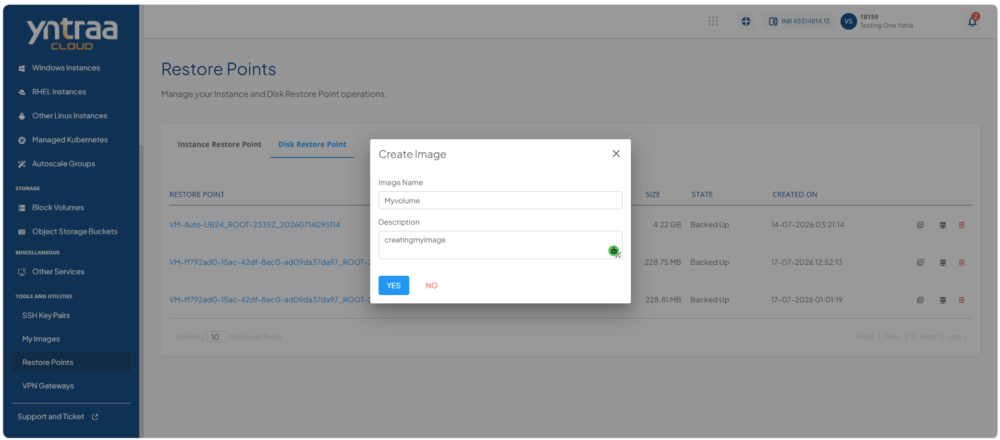
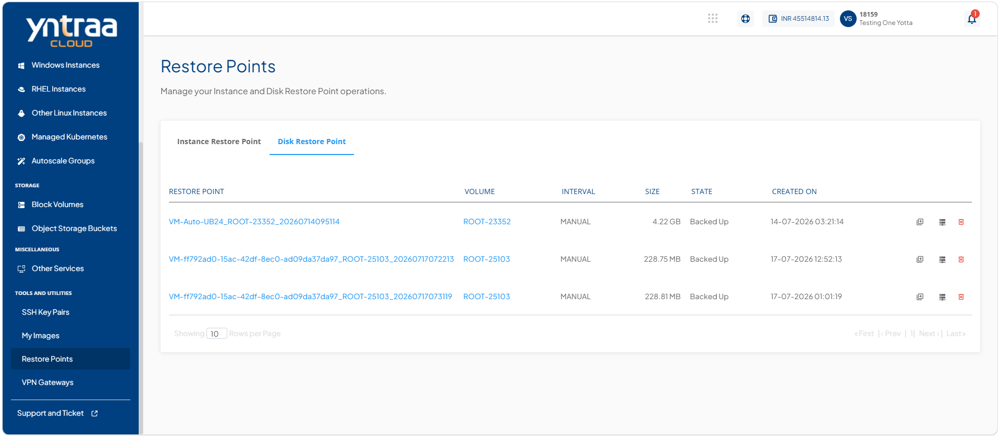
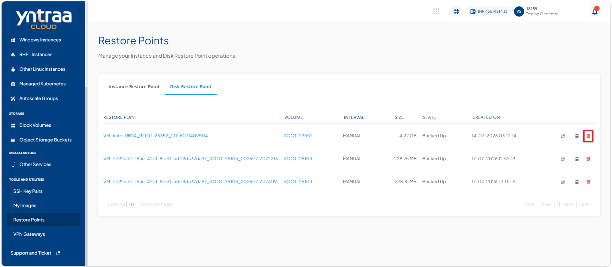
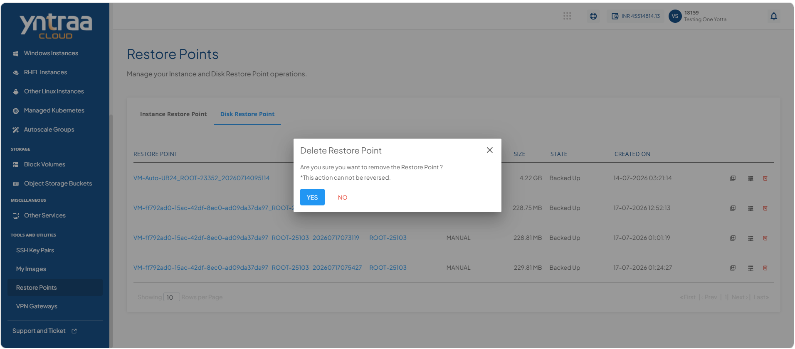

# Managing Volume

Manage volumes to monitor and protect the storage resources attached to your instances. Volume management allows you to view attached disks, create disk restore points to safeguard data before changes, and create custom images for rapid instance deployment and recovery. These operations help ensure data protection, simplify backup and restoration, and maintain consistent storage configurations across your cloud environment.

  
- [Viewing Attached Disk](#viewing-attached-disk)
- [Creating Disk Restore Point ](#creating-disk-restore-point )
- [Creating My Images](#creating-my-images)
- [Deleting Disk Restore Point](#deleting-disk-restore-point)

## Viewing Attached Disk

View the disks attached to an instance to verify the storage resources associated with it. This helps you identify the attached disks, review their details, and confirm that the required storage volumes are correctly connected, enabling efficient storage management and troubleshooting.

To view the disks attached to an Instance, follow these steps: 

1. Navigate to **Network and Security > Virtual Firewall**. The following screen appears: 

2. Click on your created virtual firewall from the list. The following screen appears:
 
3. Click **Volumes**. The following screen appears: 

## Creating Disk Restore Point 

Create a disk restore point to capture the current state of a disk before performing updates, configuration changes, or other modifications. A disk restore point preserves the disk data at a specific point in time, allowing you to restore the disk to that state if needed. This helps protect against accidental data loss, simplifies recovery from unexpected issues, and ensures business continuity with minimal downtime.

To create the disk restore point, follow these steps: 

1. Navigate to **Network and Security > Virtual Firewall**. The following screen appears: 

2. Click on your created virtual firewall from the list. The following screen appears:
 
3. Click **Volumes**. The following screen appears: 

4. Click the **Create Restore Point** icon (highlighted in red). The following screen appears: 

5. Click the **Click Disk Restore Point** button. 
:::note
Restore Point creation will occupy space in your additional storage.
:::
6. Navigate to **Tools and Utilities > Restore Points**. The following screen appears: 

7. Click **Disk Restore Point**. The following screen appears: 

## Creating My Images

Create a custom image to capture the complete state of an instance, including its operating system, installed applications, and configuration settings. A custom image enables you to quickly deploy new instances with the same configuration, ensuring consistency, reducing deployment time, and simplifying backup and disaster recovery.

To create My Images, follow these steps: 

1. Navigate to **Network and Security > Virtual Firewall**. The following screen appears: 

2. Click on your created virtual firewall from the list. The following screen appears:
 
3. Click **Volumes**. The following screen appears: 

4. Click the **Create Restore Point** icon (highlighted in red). The following screen appears: 

5. Click the **Click Disk Restore Point** button. 
:::note
Restore Point creation will occupy space in your additional storage.
:::
6. Navigate to **Tools and Utilities > Restore Points**. The following screen appears: 

7. Click **Disk Restore Point**. The following screen appears: 

8. Click the **Create Image** icon (highlighted in red) corresponding to the required disk restore point. The following screen appears.

9. Click the **Yes** button. The image is created.

:::note
After the image is created, it becomes available under **Choose an OS Image > MY Images** when creating windows Instances, RHEL instances, and Other Linux Instances in the Compute section.
:::

## Creating Volume

To create volume, follow these steps: 

1. Navigate to **Network and Security > Virtual Firewall**. The following screen appears: 

2. Click on your created virtual firewall from the list. The following screen appears:
 
3. Click **Volumes**. The following screen appears: 

4. Click the **Create Restore Point** icon (highlighted in red). The following screen appears: 

5. Click the **Click Disk Restore Point** button. 
:::note
Restore Point creation will occupy space in your additional storage.
:::
6. Navigate to **Tools and Utilities > Restore Points**. The following screen appears: 

7. Click **Disk Restore Point**. The following screen appears: 

8. Click the [**Create Volume**](/docs/Subscribers/Storage/BlockVolumes/CreatingDataDisk) icon (highlighted in red) corresponding to the required disk restore point. The following screen appears.

## Deleting Disk Restore Point

Delete a disk restore point when it is no longer required to free up storage resources and simplify restore point management. Removing outdated or unnecessary restore points helps maintain an organized backup environment while ensuring that only relevant recovery points are retained.

To delete disk restore point, follow these steps: 

:::warning
This action can not be reversed.
:::

1. Navigate to **Network and Security > Virtual Firewall**. The following screen appears: 

2. Click on your created virtual firewall from the list. The following screen appears:
 
3. Click **Volumes**. The following screen appears: 

4. Click the **Create Restore Point** icon (highlighted in red). The following screen appears: 

5. Click the **Click Disk Restore Point** button. 
:::note
Restore Point creation will occupy space in your additional storage.
:::
6. Navigate to **Tools and Utilities > Restore Points**. The following screen appears: 

7. Click **Disk Restore Point**. The following screen appears:

8. Click the  **Delete Disk Restore Point** button. The following screen appears: 

9. Click the **Yes** button. The disk restore point is deleted.

   

