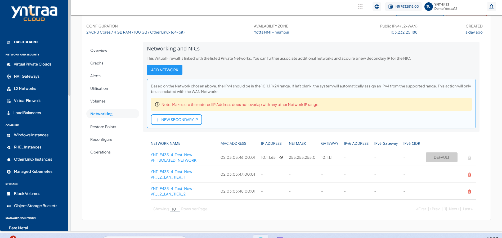
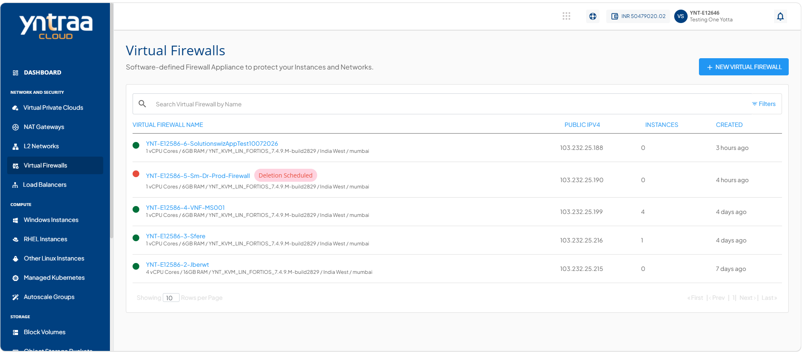
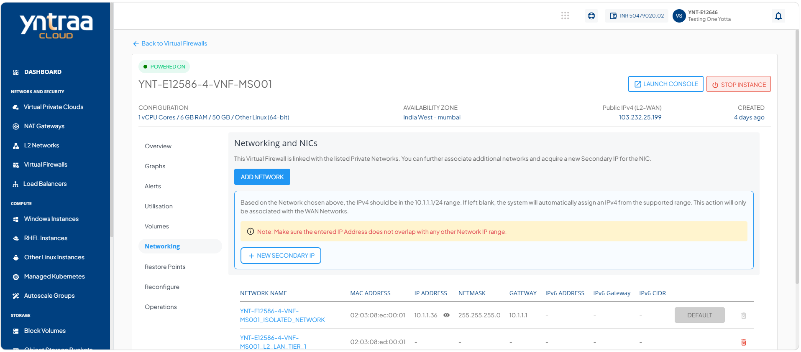
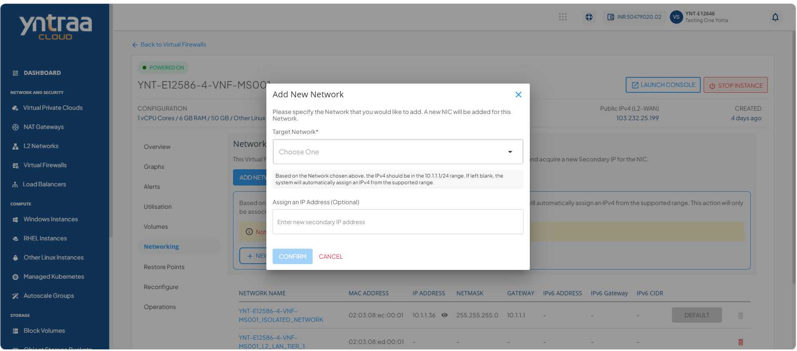
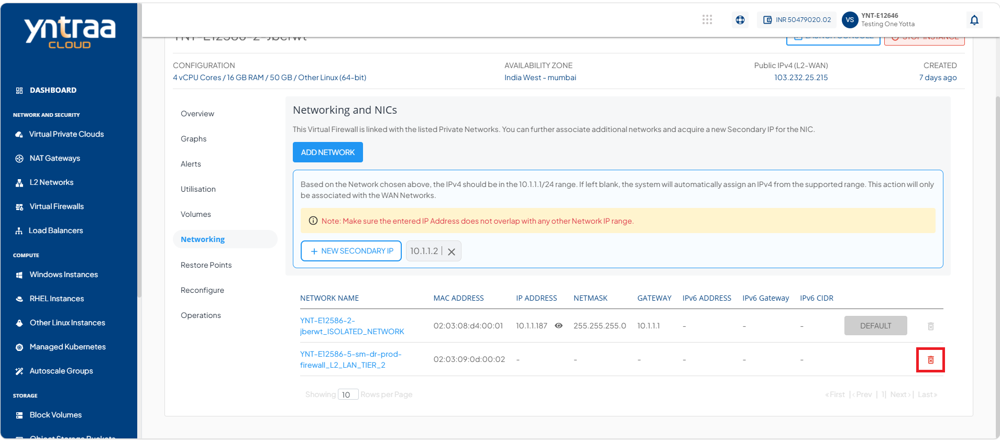
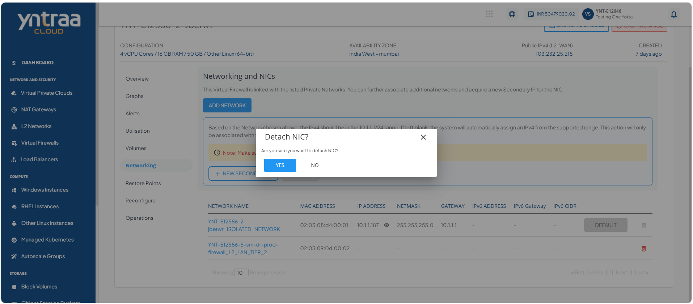
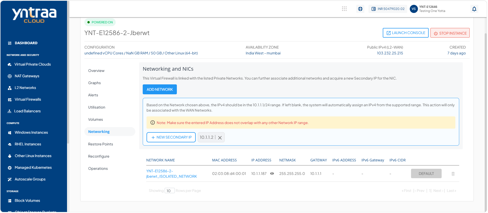
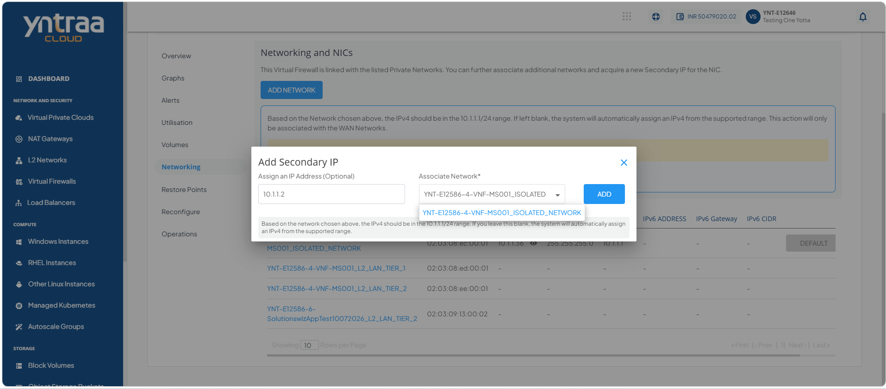
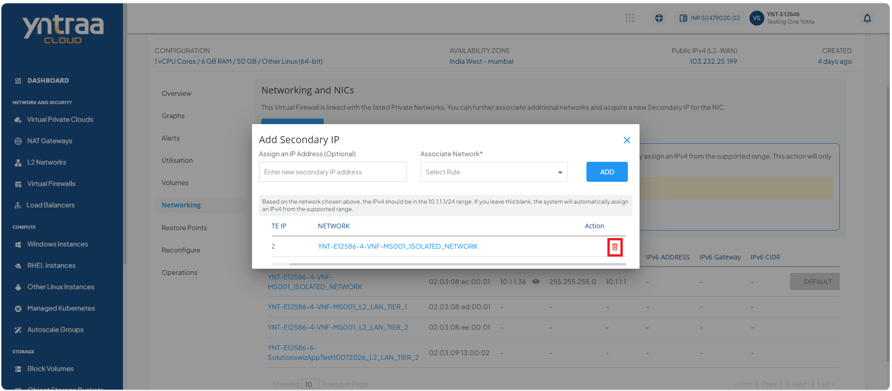
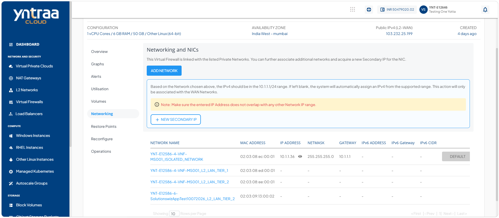

# Networking Management

Networking management keeps your virtual firewall instance connected securely and ensures smooth traffic flow. It involves expanding connectivity when needed, assigning extra addresses for flexibility, and removing unused interfaces to keep configurations clean.

This section comprises of the following sub-sections:

  
- [Adding and Detaching a Network](#adding-and-detaching-a-network)
- [Adding a Secondary IP and Deleting an NIC](#adding-a-secondary-ip-and-deleting-an-nic)

## Adding and Detaching a Network

A network links your virtual firewall instance to other systems and defines how traffic flows securely. It specifies IP addresses, gateways, and subnets, which are essential for managing communication and isolating workloads. 

Adding a network expands connectivity and allows you to assign secondary IPs, while detaching a network removes unused connections to keep the configuration clean and secure.

To add and detach a network, follow these steps: 

1. Navigate to **Network and Security > Virtual Firewall**. The following screen appears

2. Click the instance name from the list. The following screen appears: 

3. Click **Networking**. The following screen appears: 

4. Click the **Add Network** button. The following screen appears:
 
:::note
If the instance is deployed in a VPC, use **Add Network** to connect it to multiple VPC tiers or share it with other VPC networks within the same availability zone.
::: 
5. Click the **Confirm** button. The following screen appears: 

6. Click the **Detach NIC** icon (highlighted in red). The following screen appears: 

7. Click the **Yes** button. The following screen appears: 

## Adding a Secondary IP and Deleting an NIC

A secondary IP is an additional address assigned to your virtual firewall instance, allowing it to handle multiple connections or services on the same network interface. Adding a secondary IP is important because it helps you isolate workloads, support different applications, and improve flexibility in managing traffic. 

Deleting a network interface card (NIC) removes unused or unnecessary connections, keeping your configuration clean and secure while ensuring that only active interfaces handle traffic.

To add a secondary IP and delete an NIC, follow these steps: 

1. Navigate to **Network and Security > Virtual Firewall**. The following screen appears

2. Click the instance name. The following screen appears: 

3. Click **Networking**. The following screen appears: 

4. Click the **+ New Secondary IP** button. The following screen appears where you provide the required details: 

5. Click the **Add** button. The following screen appears:

6. Click the **Delete NIC** icon (highlighted in red). The following screen appears: 

:::note
You can configure advanced networking settings using the [Virtual Private Clouds](/docs/category/virtual-private-clouds) service.
:::
