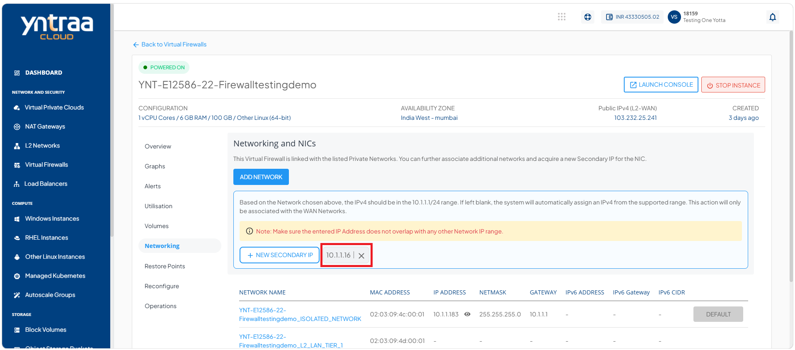

# Networking Management

Networking management keeps your virtual firewall instance connected securely and ensures smooth traffic flow. It involves expanding connectivity when needed, assigning extra addresses for flexibility, and removing unused interfaces to keep configurations clean.

This section comprises of the following sub-sections:

  
- [Adding and Detaching a Network](#adding-and-detaching-a-network)
- [Adding a Secondary IP](#adding-a-secondary-ip)

## Adding and Detaching a Network

A network connects your virtual firewall to other resources and defines secure traffic flow through IP addressing and subnet configuration. Add a network to extend connectivity or assign secondary IPs, and detach unused networks to simplify management and maintain a secure configuration.

To add and detach a network, follow these steps: 

1. Navigate to **Network and Security > Virtual Firewalls**. The following screen appears:

2. Click on your created virtual firewall name from the list. The following screen appears: 

3. Click **Networking**. The following screen appears: 

4. Click the **Add Network** button. The following screen appears:
 
5. Click the **Confirm** button. The following screen appears: 

6. Click the **Detach NIC** icon (highlighted in red). The following screen appears: 

7. Click the **Yes** button. The following screen appears: 

## Adding a Secondary IP 

A secondary IP is an additional address assigned to your virtual firewall instance, allowing it to handle multiple connections or services on the same network interface. Adding a secondary IP is important because it helps you isolate workloads, support different applications, and improve flexibility in managing traffic. 

To add a secondary IP, follow these steps: 

1. Navigate to **Network and Security > Virtual Firewalls**. The following screen appears:

2. Click on your created virtual firewall name from the list. The following screen appears: 

3. Click **Networking**. The following screen appears: 

4. Click the **+ New Secondary IP** button. The following screen appears:

5. Click the **Add** button. The secondary IP is added (highlighted in red). The following screen appears:

    :::note
    You can configure advanced networking settings using the [Virtual Private Clouds](/docs/category/virtual-private-clouds) service.
    :::
