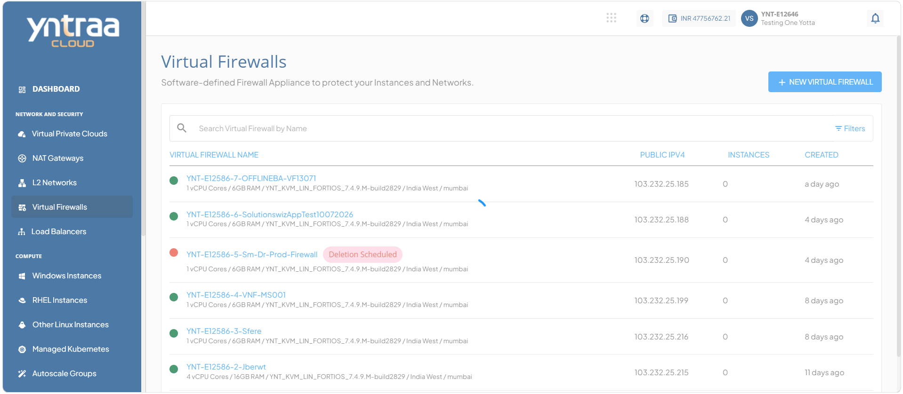
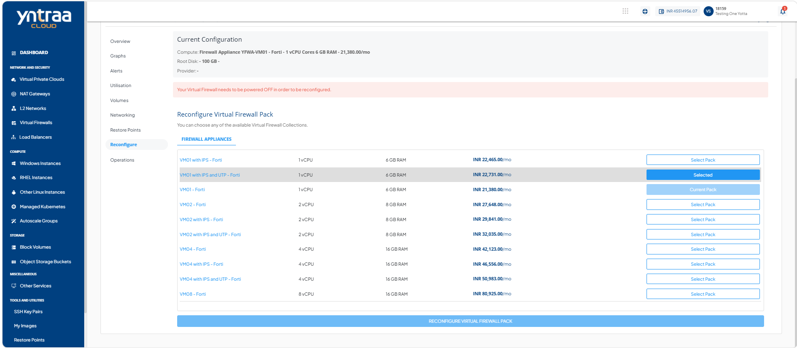

# Reconfiguring Virtual Firewall

To reconfigure the existing virtual firewall pack, 

1. Navigate to **Network and Security > Virtual Firewall**. The following screen appears: 
 
2. Click on your created virtual firewall name from the list. The following screen appears: 

3. Click **Reconfigure**. The following screen appears: 

4. Click the **Stop Instance** button. The following screen appears: 

5. Select a **Firewall Appliance** from the list. The following screen appears: 

6. Click the **Reconfigure Virtual Firewall Pack**. The following screen appears: 

:::note
Your Virtual Firewall needs to be powered off in order to be reconfigured.
:::
The Virtual Firewall on Yntraa Cloud can be reconfigured in the following ways:

- The Billing interval changed monthly.
- Choosing and applying a new Compute pack.

:::note
You can only reconfigure with the same billing interval.
:::

