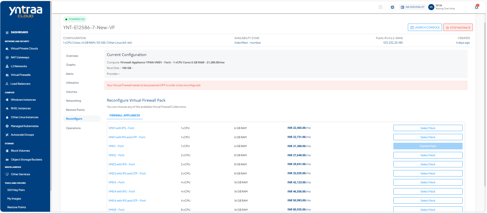
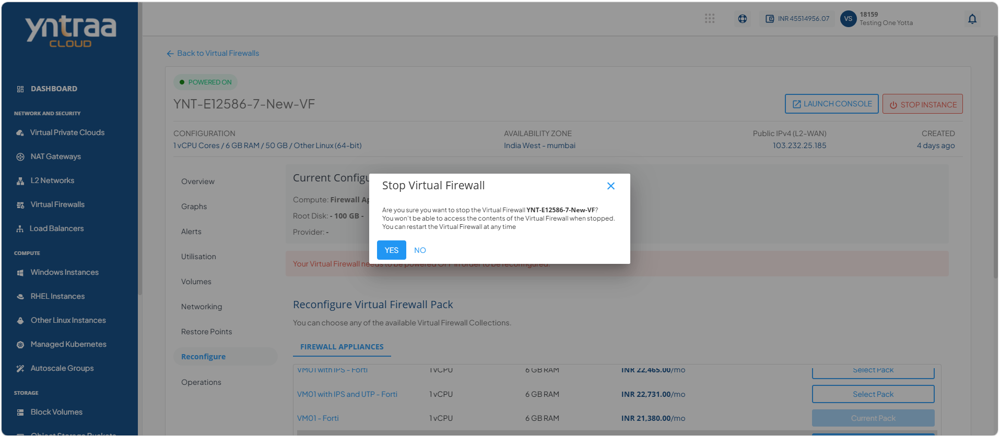
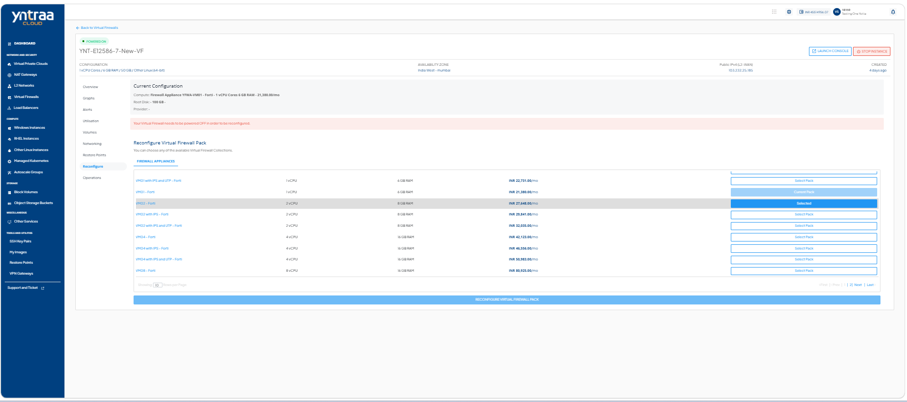
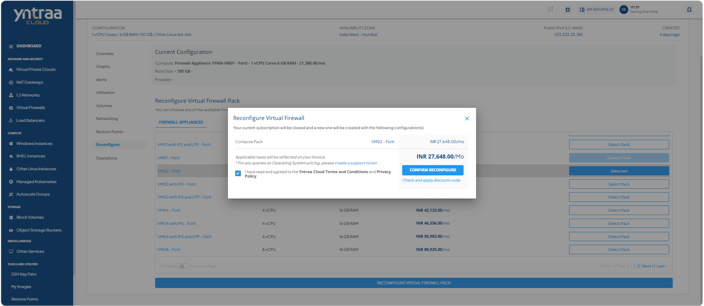

# Reconfiguring Virtual Firewall

Reconfigure a virtual firewall to replace its current firewall appliance with a different one that better meets your operational and security requirements. This operation updates the firewall configuration by applying the selected appliance. 

To reconfigure the existing virtual firewall, follow these steps: 

1. Navigate to **Network and Security > Virtual Firewalls**. The following screen appears: 
 
2. Click on your created virtual firewall name from the list. The following screen appears: 

3. Click **Reconfigure**. The following screen appears: 

4. Click the **Stop Instance** button. The following screen appears: 

5. Click the **Yes** button. The following screen appears:

6. Select a **Firewall Appliance** from the list, and click the **Reconfigure Virtual Firewall Pack** button. The following screen appears: 

7. Select **I have read and agreed to the Yntraa Cloud Terms and Conditions and Privacy policy** option, and click the **Confirm Reconfigure** button. 

