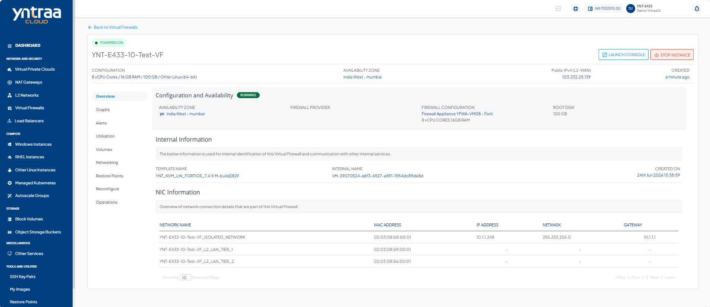
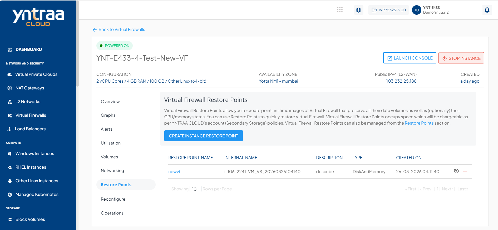
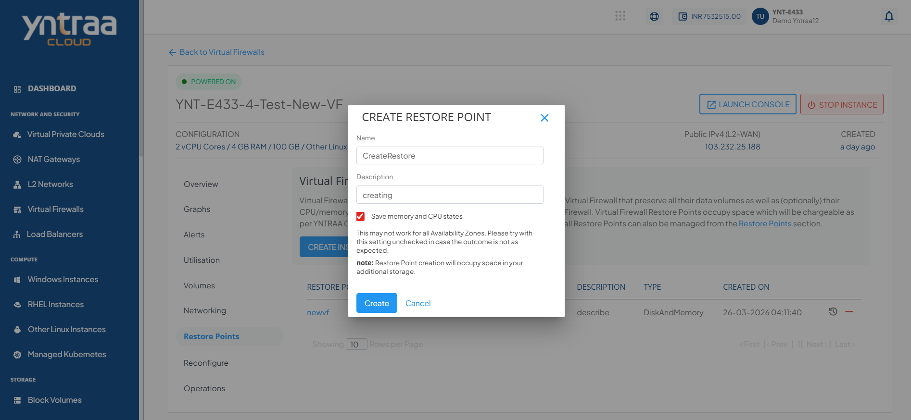
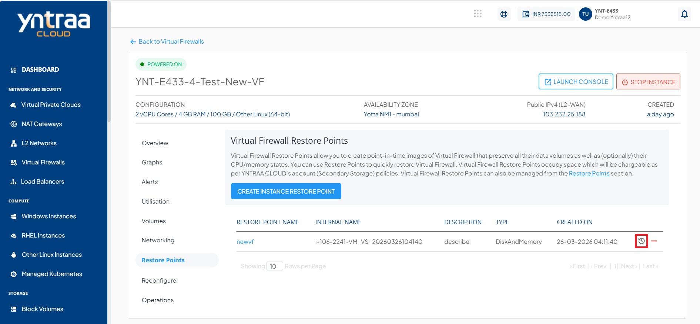
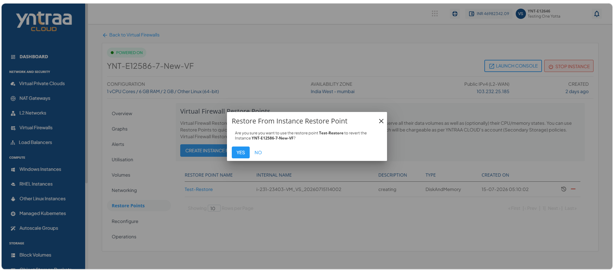
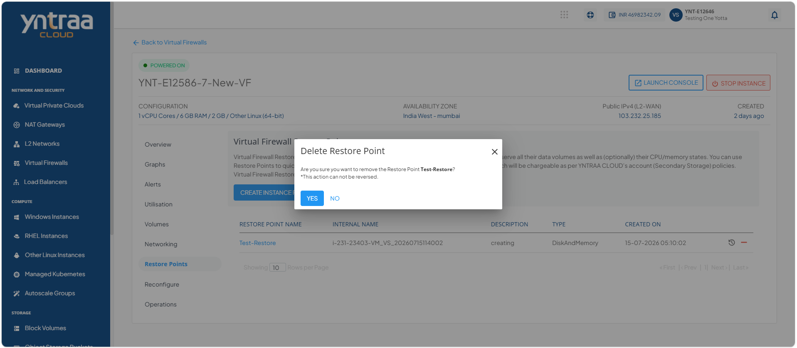

# Restore Points

Instance Restore Point allow you to create point-in-time images of instances that preserve all their data volume as well as (optionally) their CPU/memory states. You can use Restore Point to quickly restore Instances.

The Restore Point section shows all the Virtual Firewall Restore Point, which can be used to revert the Virtual Firewall to an earlier state.

This section comprises of the following sub-sections:

  
- [Creating a Restore Point](#creating-a-restore-point)
- [Restoring an Instance Restore Point](#restoring-an-instance-restore-point)
- [Deleting an Instance Restore Point](#deleting-an-instance-restore-point)

## Creating a Restore Point

Create a restore point to capture the current state of an instance before making configuration changes, updates, or other modifications. A restore point helps you recover the instance to a previous state if needed, improving data protection and minimizing the impact of unexpected changes.

To create a restore point, follow these steps:

1. Navigate to **Network and Security > Virtual Firewall**. The following screen appears: 

2. Click on created your virtual firewall name. The following screen appears: 

3. Click **Restore Points**. The following screen appears: 

4. Click the **Create Restore Point** button. The following screen appears

5. Click the **Create** button. 

## Restoring an Instance Restore Point

Restore an instance from a restore point to recover it to a previously captured state. This helps you reverse unwanted changes, recover from configuration issues, and quickly return the instance to a known working state.

To restore an instance restore point, follow these steps:

1. Navigate to **Network and Security > Virtual Firewall**. The following screen appears: 

2. Click on created your virtual firewall name. The following screen appears: 

3. Click **Restore Points**. The following screen appears: 

4. Click the **Create Restore Point** button. The following screen appears

5. Click the **Create** button. The following screen appears: 

6. Click the **Restore from Instance Restore Point** icon (highlighted in red). The following screen appears: 

7. click the **Yes** button. 
   
## Deleting an Instance Restore Point

Delete an instance restore point to remove recovery points that are no longer required. This helps you keep restore point records organized and manage storage resources efficiently while retaining only the recovery points you need.

To delete instance restore point, follow these steps:

1. Navigate to **Network and Security > Virtual Firewall**. The following screen appears: 

2. Click on created your virtual firewall name. The following screen appears: 

3. Click **Restore Points**. The following screen appears: 

4. Click the **Create Restore Point** button. The following screen appears

5. Click the **Create** button. The following screen appears: 

6. Click the **Delete Restore Point** icon (highlighted in red). The following screen appears: 
 

