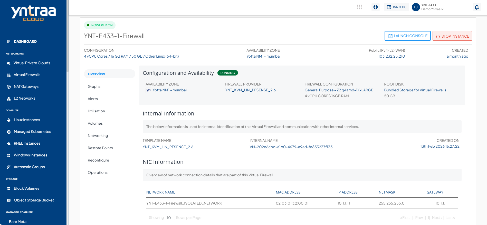

# Viewing Firewall Instance Details

Firewall instance details give a simple overview of the system. They show its current status, basic identifiers, and network connections. This information is important because it helps you track resources, manage connectivity, and keep communication secure.

To view the details associated with a virtual firewall instance, follow these steps:

1. Navigate to **Network and Security > Virtual Firewalls**. The following screen appears: 

2. Click the [instance name](AboutVirtualFirewallInstances.md) from the list. The **Overview** tab opens automatically. The following screen appears:

  
    - [Configuration and Availability](#configuration-and-availability)
    - [Internal Information](#internal-information)
    - [NIC Information](#nic-information)

## Configuration and Availability

This displays the Virtual Firewall configuration details to help verify its current configuration and operational state.

- The instance's status **Running** or **Stopped**.
- Availability Zone
- Firewall Provider
- Firewall Configuration
- Root Disk

## Internal Information

This displays the information that is used for internal identification of the Virtual Firewall and communication with other internal services.
- Template Name
- Virtual Firewall Internal Name
- Created On
  
## NIC Information

This displays the network interface details associated with the Virtual Firewall to help identify and manage its network connectivity.

- Network Name
- MAC Address
- IP Address
- Netmask
- Gateway

