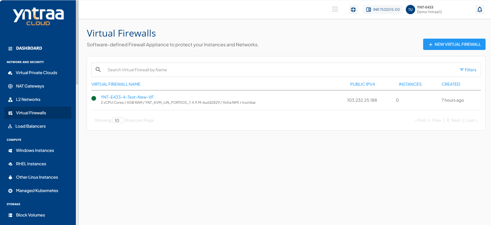
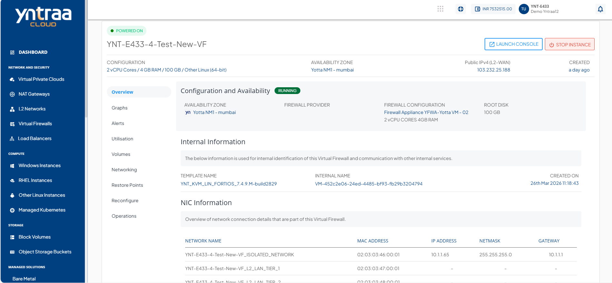
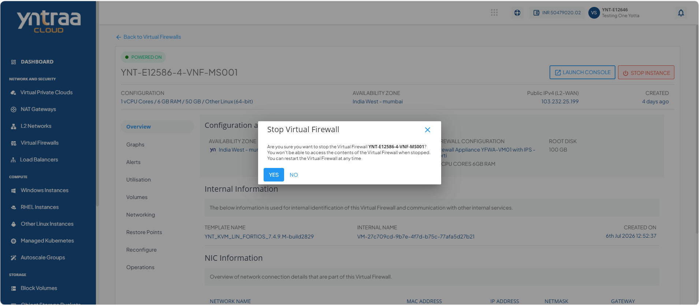
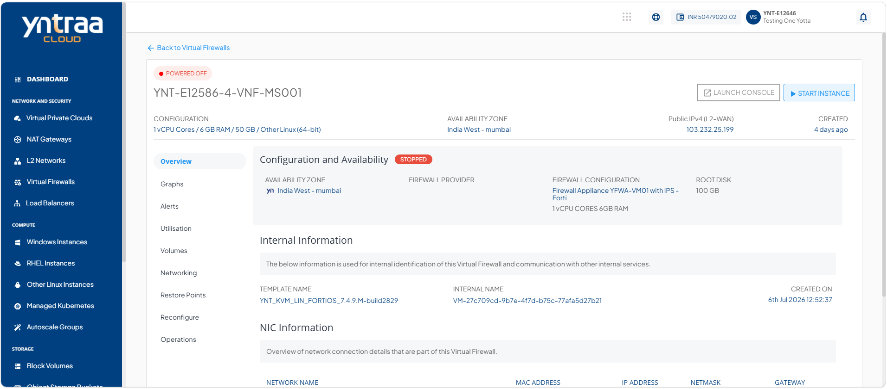
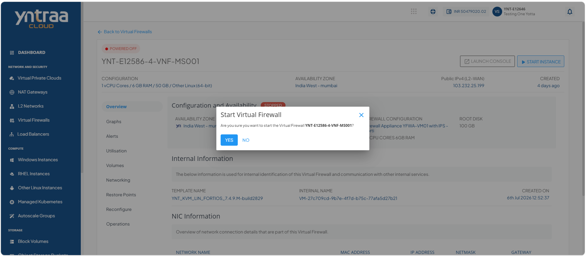

# Viewing Virtual Firewall Instance Details

Firewall instance details give a simple overview of the system. They show its current status, basic identifiers, and network connections. This information is important because it helps you track resources, manage connectivity, and keep communication secure.

This section comprises of the following sub-sections:

 
- [Launching Virtual Firewall Web Based Console](#launching-virtual-firewall-web-based-console)
- [Stopping and Starting Virtual Firewall Instance](#stopping-and-starting-virtual-firewall-instance)

To view the details associated with a virtual firewall instance, follow these steps:

1. Navigate to **Network and Security > Virtual Firewalls**. The following screen appears: 

2. Click on your created virtual firewall from the list. The Overview tab opens automatically. The following screen appears with the details:

**Configuration and Availability:** This displays the following virtual firewall configuration details to help verify its current configuration and operational state:

- The instance's status **Running** or **Stopped**
- Availability Zone
- Firewall Provider
- Firewall Configuration
- Root Disk

**Internal Information:** This displays the following information that is used for internal identification of the virtual firewall and communication with other internal services:
- Template Name
- Virtual Firewall Internal Name
- Created On
  
**NIC Information:** This displays the following network interface details associated with the virtual firewall to help identify and manage its network connectivity:
- Network Name
- MAC Address
- IP Address
- Netmask
- Gateway

## Launching Virtual Firewall Web Based Console 

The virtual firewall console provides a secure, web‑based interface to manage and monitor your firewall. It allows administrators or you to configure policies, review system activity, and ensure network protection through a centralized dashboard. 

1. Navigate to **Network and Security > Virtual Firewalls**. The following screen appears:

2. Click on your created virtual firewall name from the list. The following screen appears:
 
3. Click the **Launch Console** button, enter your username and password, and then click **Login** button to access the FortiGate web-based management interface.
   
## Stopping and Starting Virtual Firewall Instance

Stop and start the virtual firewall instance to apply updates, perform maintenance, or optimize resource usage. This action suspends firewall operations without deleting configurations and quickly restores protection when restarted.

To start and stop the virtual firewall instance, follow these steps:  

1. Navigate to **Network and Security > Virtual Firewalls**. The following screen appears: 

 2. Click on your created virtual firewall name from the list. The following screen appears:
 
3. Click the Stop Instance button. The following screen appears: 

4. Click the **Yes** button. The following screen appears:

5. Click the Start Instance button. The following screen appears: 

6. Click the **Yes** button. The following screen appears:
 

