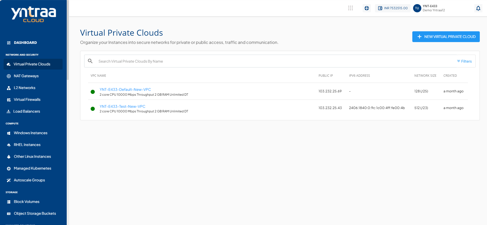
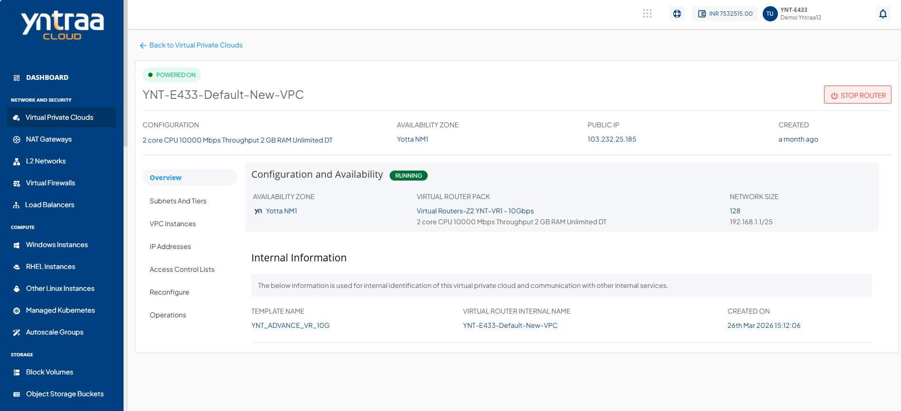
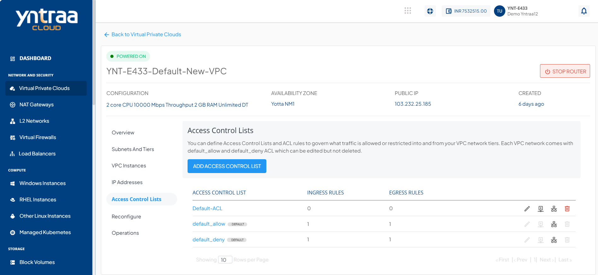
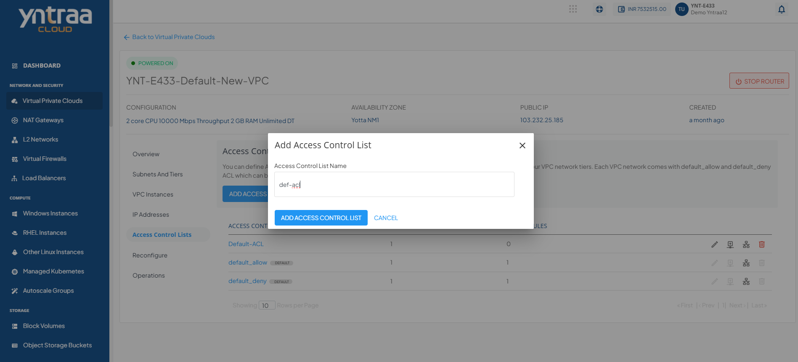
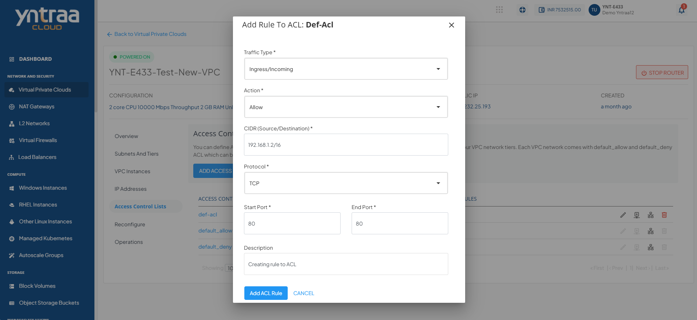
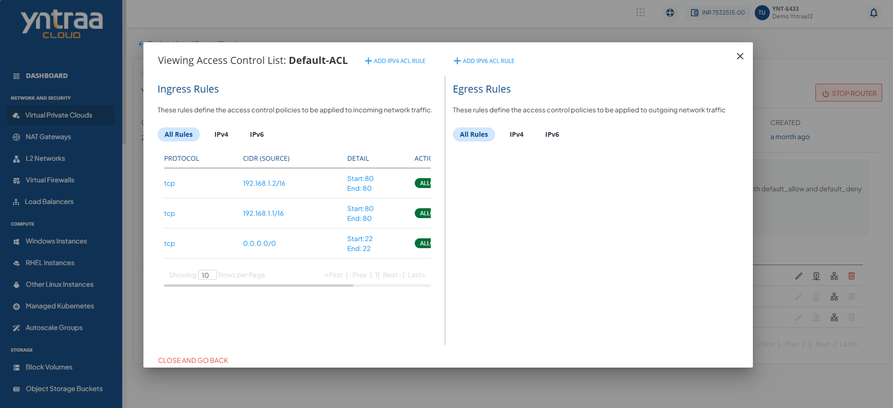
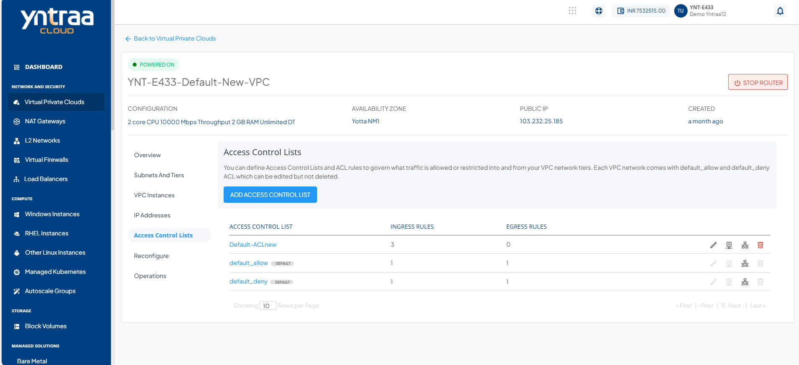
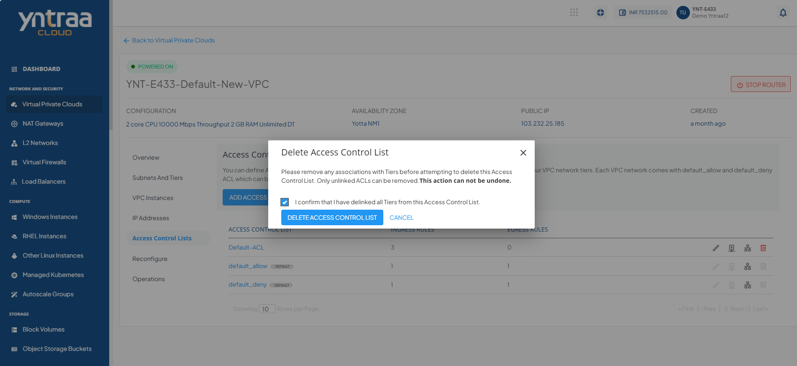
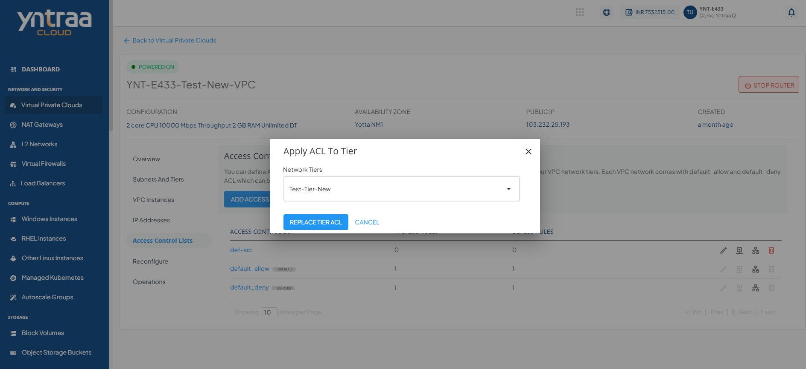

# Managing Access Control on VPC Subnets

Access control policies can be created using Access Control Lists (ACL) and configuring rules within these ACL (called ACL Rules). An ACL can then be applied to any tier within the VPC. These policies govern what traffic is allowed or restricted into and from your VPC network tiers.

## Creating ACL

To create access control policies, follow these steps: 

1. Navigate to **Network and Security > Virtual Private Cloud** tab. The following screen appears: 
2. Click the **VPC Name**. The following screen appears: 
3. Click the **Access Control Lists** tab. The following screen appears: 
4. Click the **Add Access Control list** button. The following screen appears:   
    - Enter name in the **Access Control List Name** field
5. Click **Add Access Control List** button.
   
:::note
Each VPC comes with **default_allow** and **default_deny** ACL, which can be edited but not deleted.
:::

## Adding Rule

To add rule to ACL, follow these steps: 

1. Navigate to **Network and Security > Virtual Private Cloud** tab. The following screen appears: 
2. Click the **VPC Name**. The following screen appears: 
3. Click the **Access Control Lists** tab. The following screen appears: 
4. Click the **Add Rule** icon. The following screen appears: 
5. Click the **Add ACL Rule** button. 
6. Click the **Access Control** name from the list, to view the rule you applied. The following screen appears: 

   :::note
   Any available ACL (existing or new) can be viewed in detail by clicking its name in the list. This displays a list of rules that govern ingress (incoming) and egress (outgoing) traffic for the subnet.
   ::: 
7. Click the **Edit** icon to edit/change the ACL name. The following screen appears: 
    - Click the **Edit Access Control List** button. The following screen appears: 
   
8. Click the **Delete List** icon. The following screen appears: 
    - Select the option **I confirm that I have delinked all tiers from this access control list**.
    - Click the **Delete Access Control List** button.

## Applying ACL to Tier

To apply ACL to tier, follow these steps: 

1. Navigate to **Network and Security > Virtual Private Cloud** tab. The following screen appears: 
2. Click the **VPC Name**. The following screen appears: 
3. Click the **Access Control Lists** tab. The following screen appears: 
4. Click the **Apply ACL to Tier** icon. The following screen appears: 
5. Click the **Replace Tier ACL** button. 

