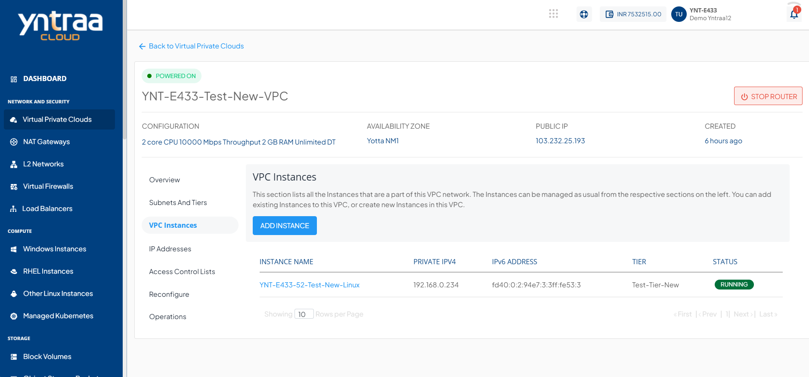
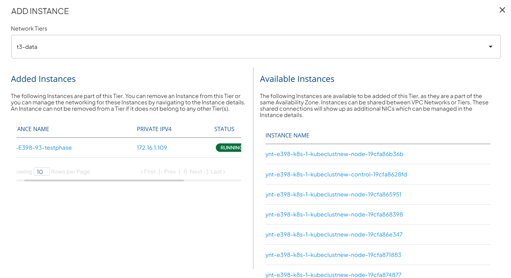

# Managing VPC Instances

## Viewing VPC Instances

Yntraa Cloud offers a quick means to view Instances that are part of a VPC network, and to associate or dissociate Instances with VPCs by navigating to VPC details and selecting  **VPC Instances**.

## Adding or Removing Instances to VPC

To add or remove instances to VPC, follow these steps:

1. To view all Instances that are available to add to this VPC, click the **ADD INSTANCE** button.
2. Select the Network Tier where you want to add the available instances

:::note
An Instance created in any VPC/advanced Availability Zone must be attached to at least one subnet.
:::

