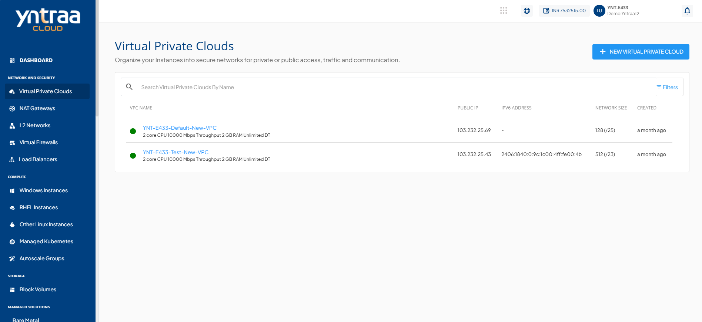
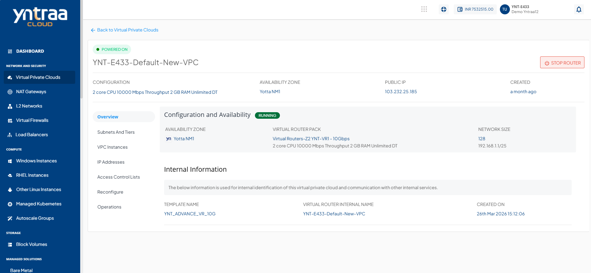
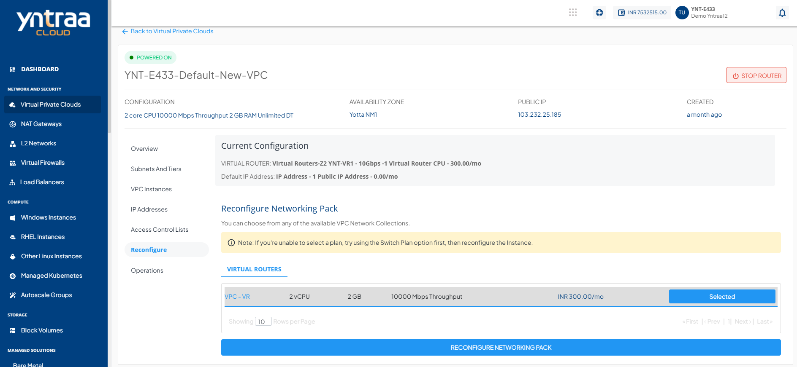
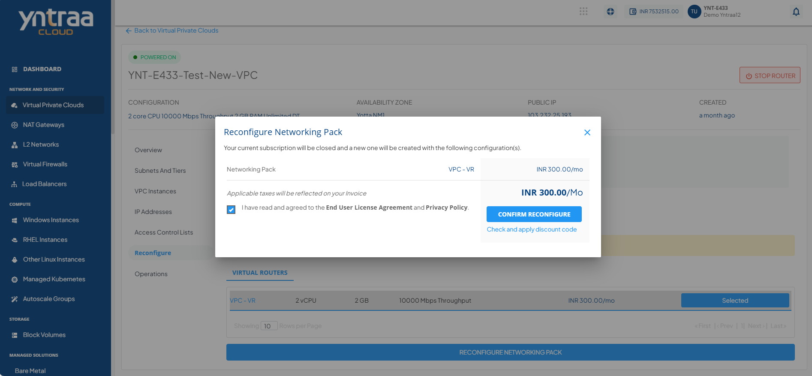

# Reconfiguring a VPC

The Reconfigure section/tab lists your current subscription details and allows you to reconfigure 
the networking pack.

To reconfigure the current subscription of networking pack, follow these steps: 

1. Navigate to **Network and Security > Virtual Private Clouds**. The following screen appears: 
2. Click the **VPC Name**. The following screen appears: 
3. Click the **Reconfigure** tab. The following screen appears:  
4. To reconfigure the network pack, select the **Virtual Router** from the list.  
5. Click the **Reconfigure Networking Pack** button. The following screen appears: 
    - Select the **I have read and agreed to the end user license agreement and privacy policy** option. 
6. Click the **Confirm Reconfigure** button.

:::note
You can only reconfigure with the same billing interval.
:::

