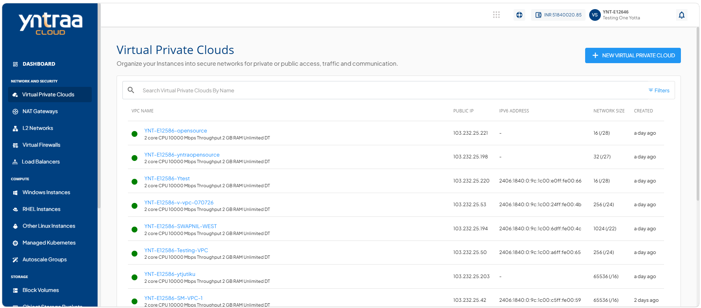
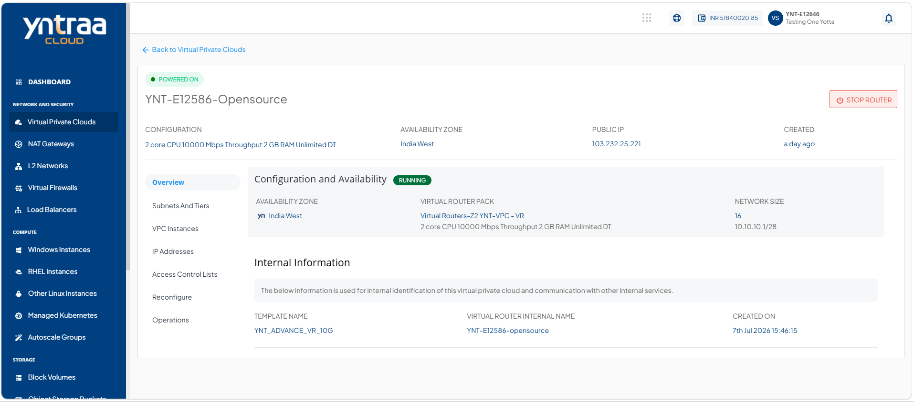
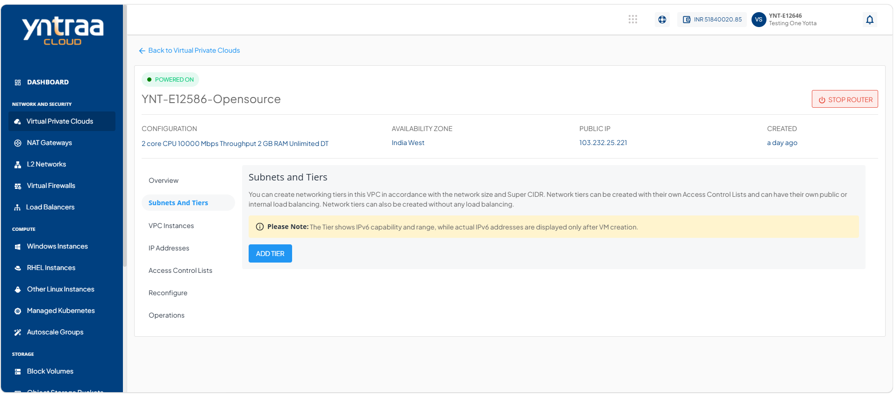
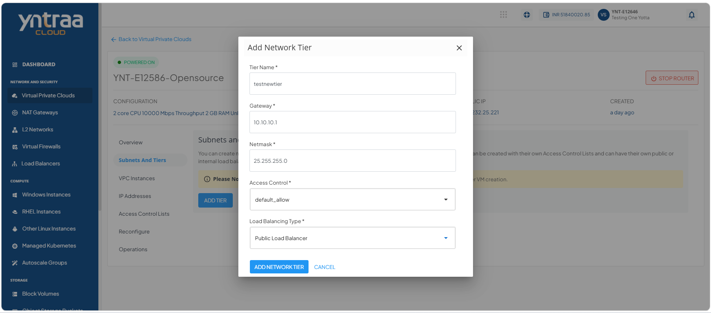
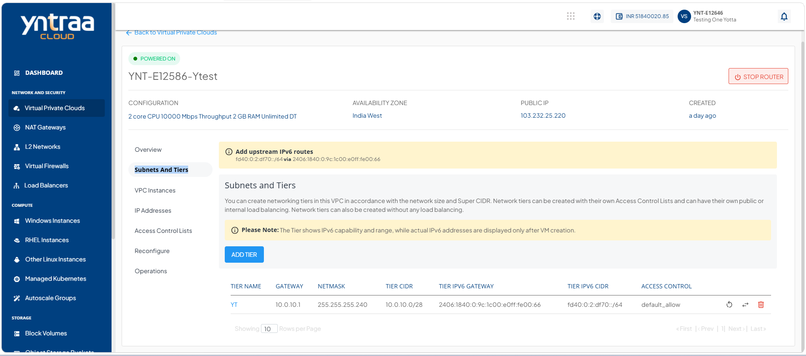
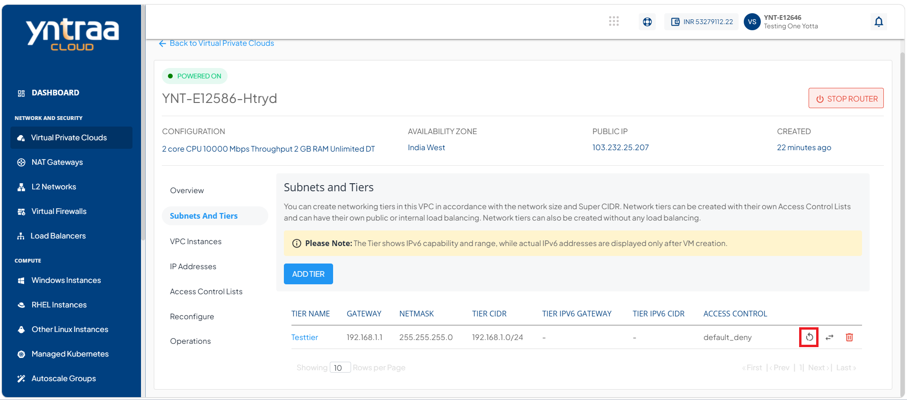
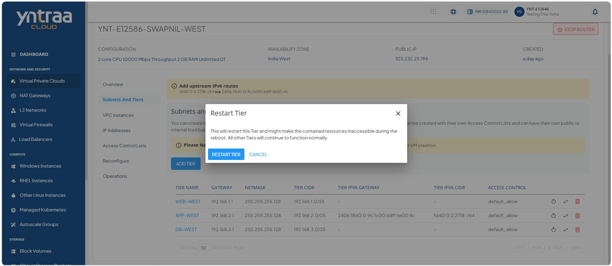
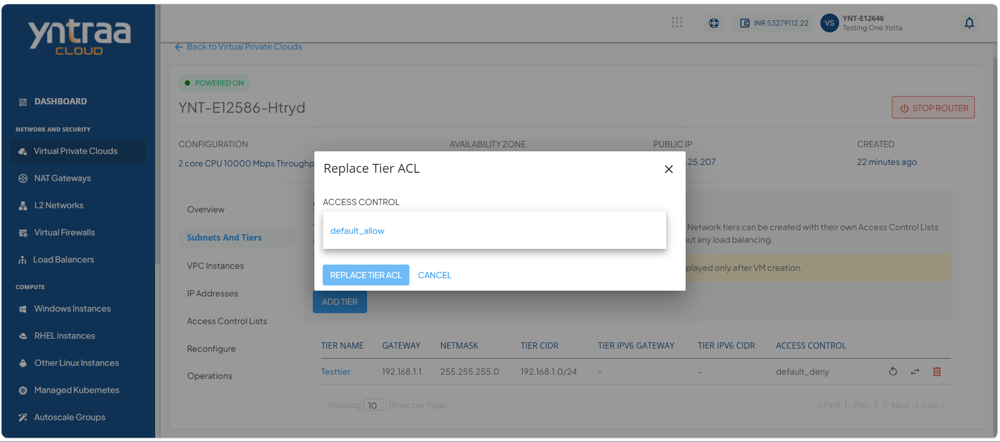
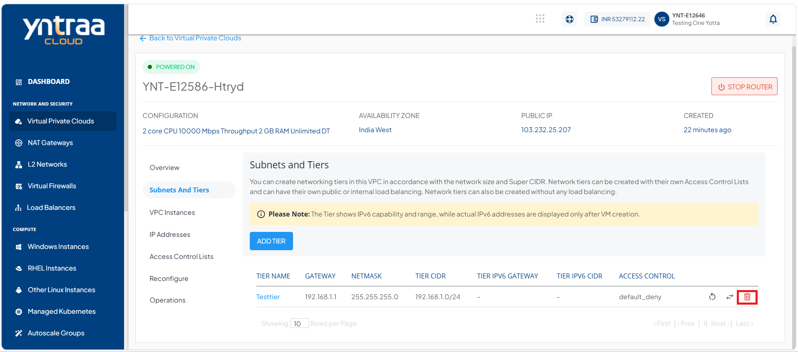
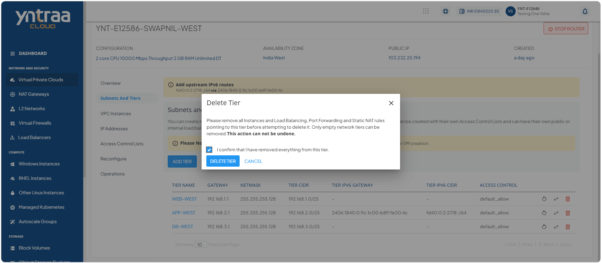

# Creating Subnets and Tiers

A VPC subnet is a smaller, segmented network within a VPC that helps organise and isolate cloud resources, while tiers define how these subnets are structured for different application layers.

Subnets and tiers help efficiently group resources, control traffic flow, and improve security and performance within your cloud environment.

## Creating a Subnet and Tier

A subnet and tier are logical network segments within a Virtual Private Cloud (VPC) that help organize resources based on their purpose. Creating subnets and tiers improves network management, enhances security, and enables better control over communication between resources.

To create a subnet and tier, follow these steps:

1. Navigate to **Network & Security > Virtual Private Clouds**. The following screen appears:
   
2. Click on your created VPC name from the list. The following screen appears:
   
3. Click **Subnet And Tiers**. The following screen appears:
   
4. Click the **Add Tier** button. The following screen appears:
   
5. Click the **Add Network Tier** button. The following screen appears: 
   
   
## Restarting a Network Tier

Restarting a network tier refreshes the selected tier by reapplying its network configuration. Use this option to restore normal network operations, apply recent configuration changes, or resolve temporary connectivity issues within the tier.

To restart a network tier, follow these steps:

1. Navigate to **Network & Security > Virtual Private Clouds**. The following screen appears:
   
2. Click on the VPC name from the list. The following screen appears:
   
3. Click **Subnet And Tiers**. The following screen appears:
   
4. Click the **Add Tier** button. The following screen appears:
   
5. Click the **Add Network Tier** button. The following screen appears: 
   
6. Click the **Restart Network** icon (highlighted in red).    The follow screen appears:
   
7. Click the **Restart Tier** button. 
   
## Replacing an ACL

Replacing an Access Control List (ACL) enables you to assign a different ACL to a tier. Use this option to update the traffic filtering rules and ensure the tier complies with your current security and access requirements.

To replace an ACL, follow these steps:

1. Navigate to **Network & Security > Virtual Private Clouds**. The following screen appears:
   
2. Click on the VPC name from the list. The following screen appears:
   
3. Click **Subnet And Tiers**. The following screen appears:
   
4. Click the **Add Tier** button. The following screen appears:
   
5. Click the **Add Network Tier** button. The following screen appears: 
   
6. Click the **Replace Access Control List** icon (highlighted in red).  The following screen appears:  
   
7. Select a access control from the **Access Control** dropdown, and click the **Replace Tier ACL** button.

## Deleting a Network Tier

Deleting a network tier permanently removes the selected tier from the VPC. Use this option to remove tiers that are no longer required, simplify network management, and maintain a clean and organized network configuration.
:::note
You can delete only the empty network tiers, which means that in order to delete a network tier, ensure that there are no instances and no NAT rule(s) associated with it.
:::

To delete a network tier, follow these steps:

1. Navigate to **Network & Security > Virtual Private Clouds**. The following screen appears:
   
2. Click on the VPC name from the list. The following screen appears:
   
3. Click **Subnet And Tiers**. The following screen appears:
   
4. Click the **Add Tier** button. The following screen appears:
  
5. Click the **Add Network Tier** button. The following screen appears: 
   
6. Click the **Delete Network** icon (highlighted in red). The following screen appears: 
   
7. Select the **I confirm that I have removed everything from this tier** option, and click the **Delete Tier** button. The following screen appears: 

