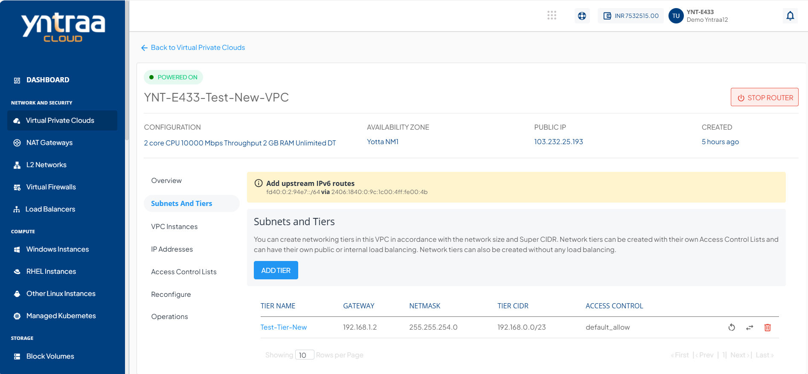
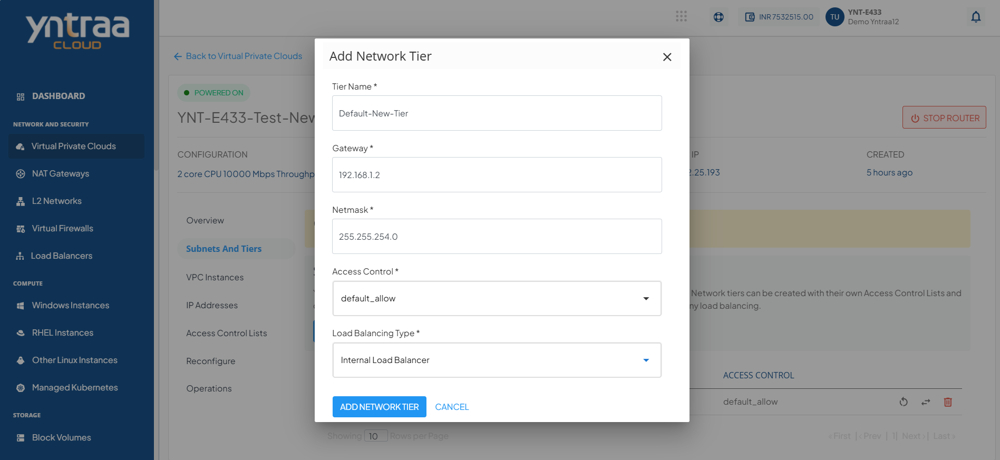

# Creating VPC Subnets and Tiers

A VPC subnet is a smaller, segmented network within a VPC that helps organise and isolate cloud resources, while tiers define how these subnets are structured for different application layers.

Subnets and tiers help efficiently group resources, control traffic flow, and improve security and performance within your cloud environment.

To create a subnet and tier, follow these steps:

1. Navigate to **Network & Security > Virtual Private Clouds**. The following screen appears:

2. Click on the VPC name to which you want a subnet and tier. The following screen appears:

3. Click on **Subnet And Tiers**  from the menu on the left. The following screen appears:

4. Click the **Add Tier** button. The following screen appears:

5. Provide the following details:
    - Tier Name
    - Gateway 
    - Netmask
      
:::note
The gateway should be consistent with the subnet mask.
:::
    - Access Control
    - Load Balancing Type
  
:::note
To set up a public load balancer, you need to select **Public LB** from the **Load Balancing Type** drop-down. There can only be 1 tier of type Public LB in a network.
:::

6. Click the **Add Network Tier** button. The following screen appears:

After the tier is created, three icons appear on the right side for quick actions:

- **Restart** the network
- **Replace** the access control list
- **Delete** the tier

:::note
You can delete only the empty tiers, which means that in order to delete a tier, ensure that there are no Instances and no NAT rule(s) associated with it.
:::

